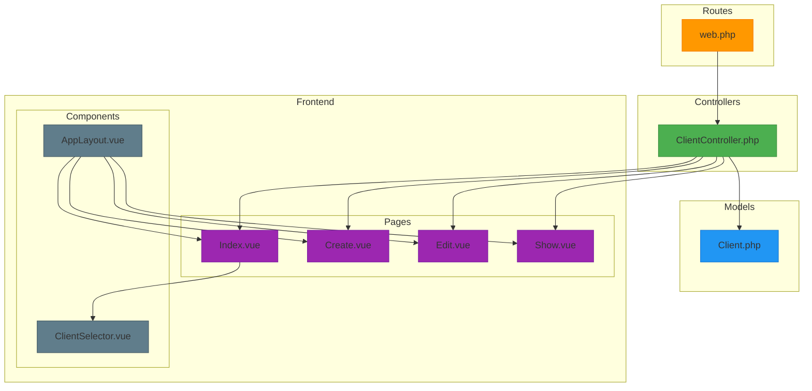
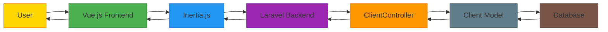
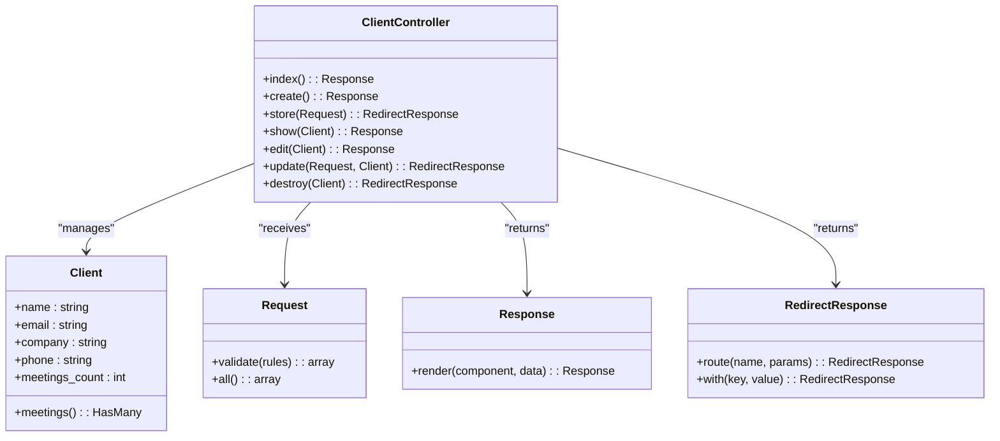
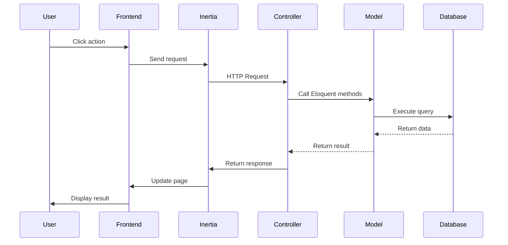
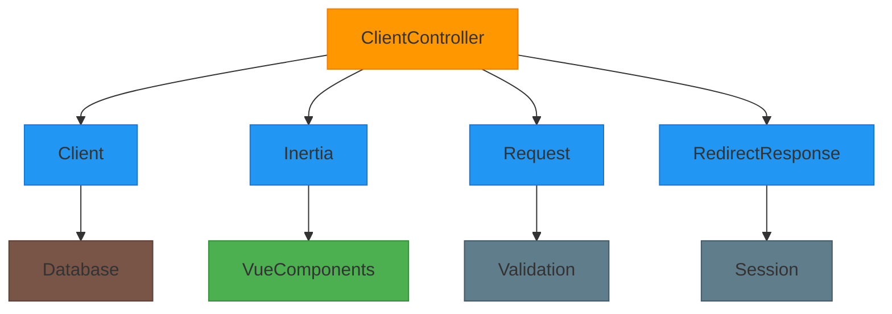

# ClientController


## Table of Contents
1. [Introduction](#introduction)
2. [Project Structure](#project-structure)
3. [Core Components](#core-components)
4. [Architecture Overview](#architecture-overview)
5. [Detailed Component Analysis](#detailed-component-analysis)
6. [Dependency Analysis](#dependency-analysis)
7. [Performance Considerations](#performance-considerations)
8. [Troubleshooting Guide](#troubleshooting-guide)
9. [Conclusion](#conclusion)

## Introduction
The ClientController is a central component in the meetingai platform responsible for managing client organizations. It implements a full CRUD (Create, Read, Update, Delete) interface for client entities, enabling users to organize meetings by client accounts. The controller follows Laravel's resource controller pattern and integrates with the Inertia.js framework to deliver a seamless single-page application experience. This document provides a comprehensive analysis of the ClientController's functionality, including route mappings, request lifecycle, validation logic, and integration with frontend components.

## Project Structure
The meetingai application follows a standard Laravel directory structure with clear separation of concerns. The ClientController resides in the `app/Http/Controllers` directory alongside other controllers. Client-related Vue.js components are organized under `resources/js/pages/Clients`, while shared UI components like ClientSelector.vue are located in `resources/js/lib`. The routing configuration is centralized in `routes/web.php`, and the Client model is defined in `app/Models/Client.php`. This structure promotes maintainability and makes it easy to locate related functionality.





**Diagram sources**
- [ClientController.php](file://app/Http/Controllers/ClientController.php#L1-L94)
- [Client.php](file://app/Models/Client.php#L1-L28)
- [web.php](file://routes/web.php#L1-L47)
- [Index.vue](file://resources/js/pages/Clients/Index.vue#L1-L121)
- [Create.vue](file://resources/js/pages/Clients/Create.vue#L1-L127)
- [Edit.vue](file://resources/js/pages/Clients/Edit.vue#L1-L130)
- [ClientSelector.vue](file://resources/js/lib/ClientSelector.vue#L1-L63)
- [AppLayout.vue](file://resources/js/lib/AppLayout.vue#L1-L200)

**Section sources**
- [ClientController.php](file://app/Http/Controllers/ClientController.php#L1-L94)
- [Client.php](file://app/Models/Client.php#L1-L28)
- [web.php](file://routes/web.php#L1-L47)

## Core Components
The core components of the client management system include the ClientController, Client model, and associated Vue.js components. The ClientController handles all HTTP requests related to client management, implementing the complete CRUD lifecycle. The Client model defines the data structure and relationships, specifically maintaining a one-to-many relationship with meetings. The frontend components provide a user-friendly interface for interacting with client data, with Inertia.js facilitating seamless communication between Laravel and Vue.js. Together, these components enable efficient management of client organizations and their associated meetings.

**Section sources**
- [ClientController.php](file://app/Http/Controllers/ClientController.php#L1-L94)
- [Client.php](file://app/Models/Client.php#L1-L28)
- [Index.vue](file://resources/js/pages/Clients/Index.vue#L1-L121)

## Architecture Overview
The client management architecture follows a clean separation between backend and frontend concerns, connected through the Inertia.js bridge. The Laravel backend exposes a resourceful API through the ClientController, while the Vue.js frontend renders interactive views. When a user interacts with the client interface, Inertia.js handles the request by communicating with the appropriate controller method, which processes the request and returns either a rendered view or a redirect response. This architecture enables a SPA-like experience while maintaining the simplicity of server-side rendering for initial page loads.





**Diagram sources**
- [ClientController.php](file://app/Http/Controllers/ClientController.php#L1-L94)
- [Client.php](file://app/Models/Client.php#L1-L28)
- [Index.vue](file://resources/js/pages/Clients/Index.vue#L1-L121)
- [AppLayout.vue](file://resources/js/lib/AppLayout.vue#L1-L200)

## Detailed Component Analysis

### ClientController Analysis
The ClientController implements a comprehensive set of methods for managing client organizations. Each method corresponds to a specific CRUD operation and follows Laravel's resource controller conventions. The controller leverages Inertia.js to render Vue.js components on the frontend, creating a seamless user experience. All methods that modify data return redirect responses with flash messages, while data retrieval methods return Inertia responses with the necessary data.

#### Method Implementations




**Diagram sources**
- [ClientController.php](file://app/Http/Controllers/ClientController.php#L1-L94)
- [Client.php](file://app/Models/Client.php#L1-L28)

**Section sources**
- [ClientController.php](file://app/Http/Controllers/ClientController.php#L1-L94)

### index() Method
The index() method retrieves all clients from the database along with their meeting counts and returns them to the Clients/Index Vue component for display. It uses the withCount() Eloquent method to efficiently count associated meetings without loading them, then orders the results alphabetically by name.


```php
public function index(): Response
{
    $clients = Client::withCount('meetings')
        ->orderBy('name')
        ->get();

    return Inertia::render('Clients/Index', [
        'clients' => $clients
    ]);
}
```


This method is mapped to the GET /clients route and displays a table of all clients with their basic information and meeting counts. The frontend component renders this data in a responsive table with actions for viewing, editing, and deleting clients.

**Section sources**
- [ClientController.php](file://app/Http/Controllers/ClientController.php#L15-L23)
- [web.php](file://routes/web.php#L1-L47)
- [Index.vue](file://resources/js/pages/Clients/Index.vue#L1-L121)

### create() Method
The create() method returns the Clients/Create Vue component, which renders a form for creating a new client. This method does not require any data from the database, as it simply displays an empty form for user input.


```php
public function create(): Response
{
    return Inertia::render('Clients/Create');
}
```


This method is mapped to the GET /clients/create route and provides a clean interface for adding new client organizations. The form includes fields for name, email, company, and phone, with appropriate validation rules enforced on submission.

**Section sources**
- [ClientController.php](file://app/Http/Controllers/ClientController.php#L25-L29)
- [web.php](file://routes/web.php#L1-L47)
- [Create.vue](file://resources/js/pages/Clients/Create.vue#L1-L127)

### store() Method
The store() method handles the creation of a new client by validating the incoming request data and persisting it to the database. It implements comprehensive validation rules to ensure data integrity.


```php
public function store(Request $request): RedirectResponse
{
    $validated = $request->validate([
        'name' => 'required|string|max:255',
        'email' => 'nullable|email|unique:clients,email',
        'company' => 'nullable|string|max:255',
        'phone' => 'nullable|string|max:255',
    ]);

    Client::create($validated);

    return redirect()->route('clients.index')
        ->with('success', 'Client created successfully.');
}
```


This method is mapped to the POST /clients route and performs the following steps:
1. Validates the request data against defined rules
2. Creates a new Client record in the database
3. Redirects back to the clients index with a success flash message

The validation ensures that the name is required and properly formatted, the email is unique if provided, and all fields stay within reasonable length limits.

**Section sources**
- [ClientController.php](file://app/Http/Controllers/ClientController.php#L31-L44)
- [web.php](file://routes/web.php#L1-L47)
- [Create.vue](file://resources/js/pages/Clients/Create.vue#L1-L127)

### show() Method
The show() method retrieves a specific client along with their associated meetings and returns the data to the Clients/Show Vue component for display.


```php
public function show(Client $client): Response
{
    $client->load(['meetings' => function ($query) {
        $query->orderBy('created_at', 'desc');
    }]);

    return Inertia::render('Clients/Show', [
        'client' => $client
    ]);
}
```


This method is mapped to the GET /clients/{client} route and implements Laravel's route model binding, automatically resolving the client ID from the URL to a Client model instance. It eager loads the client's meetings, ordered by creation date in descending order, to display a history of interactions.

**Section sources**
- [ClientController.php](file://app/Http/Controllers/ClientController.php#L46-L56)
- [web.php](file://routes/web.php#L1-L47)
- [Show.vue](file://resources/js/pages/Clients/Show.vue#L1-L100)

### edit() Method
The edit() method returns the Clients/Edit Vue component pre-populated with the client's current data, allowing users to modify client information.


```php
public function edit(Client $client): Response
{
    return Inertia::render('Clients/Edit', [
        'client' => $client
    ]);
}
```


This method is mapped to the GET /clients/{client}/edit route and leverages route model binding to automatically resolve the client from the URL parameter. The frontend component uses this data to populate the form fields with the client's existing information.

**Section sources**
- [ClientController.php](file://app/Http/Controllers/ClientController.php#L58-L64)
- [web.php](file://routes/web.php#L1-L47)
- [Edit.vue](file://resources/js/pages/Clients/Edit.vue#L1-L130)

### update() Method
The update() method handles the modification of an existing client by validating the request data and updating the client record in the database.


```php
public function update(Request $request, Client $client): RedirectResponse
{
    $validated = $request->validate([
        'name' => 'required|string|max:255',
        'email' => [
            'nullable',
            'email',
            Rule::unique('clients', 'email')->ignore($client->id)
        ],
        'company' => 'nullable|string|max:255',
        'phone' => 'nullable|string|max:255',
    ]);

    $client->update($validated);

    return redirect()->route('clients.index')
        ->with('success', 'Client updated successfully.');
}
```


This method is mapped to the PUT/PATCH /clients/{client} route and includes special validation for the email field to ensure uniqueness while ignoring the current client's email. This prevents validation errors when a client keeps their existing email address.

**Section sources**
- [ClientController.php](file://app/Http/Controllers/ClientController.php#L66-L82)
- [web.php](file://routes/web.php#L1-L47)
- [Edit.vue](file://resources/js/pages/Clients/Edit.vue#L1-L130)

### destroy() Method
The destroy() method handles the deletion of a client, with a business rule preventing deletion if the client has associated meetings.


```php
public function destroy(Client $client): RedirectResponse
{
    // Check if client has meetings
    if ($client->meetings()->count() > 0) {
        return redirect()->route('clients.index')
            ->with('error', 'Cannot delete client with existing meetings.');
    }

    $client->delete();

    return redirect()->route('clients.index')
        ->with('success', 'Client deleted successfully.');
}
```


This method is mapped to the DELETE /clients/{client} route and implements a critical business rule: clients with meetings cannot be deleted. This prevents data integrity issues by ensuring that meetings always have a valid client association. If deletion is attempted on a client with meetings, the user is redirected back to the index with an error message.

**Section sources**
- [ClientController.php](file://app/Http/Controllers/ClientController.php#L84-L94)
- [web.php](file://routes/web.php#L1-L47)
- [Index.vue](file://resources/js/pages/Clients/Index.vue#L1-L121)

### Request Lifecycle
The request lifecycle for client operations follows a consistent pattern across all methods. When a user interacts with the client interface, the request is routed to the appropriate ClientController method based on the HTTP verb and URL path. The controller processes the request, potentially validating input and interacting with the Client model, then returns either a rendered view or a redirect response. Inertia.js handles the communication between the frontend and backend, making it appear as a single-page application while leveraging server-side rendering.





**Diagram sources**
- [ClientController.php](file://app/Http/Controllers/ClientController.php#L1-L94)
- [web.php](file://routes/web.php#L1-L47)
- [Index.vue](file://resources/js/pages/Clients/Index.vue#L1-L121)

## Dependency Analysis
The ClientController has several key dependencies that enable its functionality. It depends on the Client model for data persistence, using Eloquent ORM methods to query and modify client records. The controller also relies on Inertia.js to render Vue.js components and pass data between the backend and frontend. Form validation is handled by Laravel's built-in validation system, with specific rules defined for each field. The controller's methods are exposed through route definitions in web.php, which map HTTP requests to the appropriate controller actions.





**Diagram sources**
- [ClientController.php](file://app/Http/Controllers/ClientController.php#L1-L94)
- [Client.php](file://app/Models/Client.php#L1-L28)
- [web.php](file://routes/web.php#L1-L47)

## Performance Considerations
The ClientController implementation includes several performance optimizations. The index() method uses withCount() to efficiently count associated meetings without loading them, reducing database queries and memory usage. The show() method uses lazy eager loading to retrieve meetings only when needed, with results ordered by creation date for optimal display. Validation is performed server-side to ensure data integrity, with error messages returned to the frontend for display. The use of Inertia.js minimizes full page reloads, improving perceived performance and user experience.

## Troubleshooting Guide
Common issues with the ClientController typically involve validation errors or business rule violations. If a client cannot be created, check that the name field is filled and the email (if provided) is unique and properly formatted. When updating a client, ensure the email field passes validation, which allows the current client's email to be retained. The most common error occurs when attempting to delete a client with associated meetings, which is prevented by the business rule in the destroy() method. In such cases, users should be directed to either reassign or delete the meetings before attempting to remove the client.

Flash messages are used to communicate success and error states to users, with the AppLayout.vue component responsible for displaying these messages. If flash messages are not appearing, verify that the session is properly configured and that the AppLayout component is correctly rendering the $page.props.flash data.

**Section sources**
- [ClientController.php](file://app/Http/Controllers/ClientController.php#L1-L94)
- [AppLayout.vue](file://resources/js/lib/AppLayout.vue#L1-L200)

## Conclusion
The ClientController provides a robust and user-friendly interface for managing client organizations within the meetingai platform. By implementing a complete CRUD interface with proper validation and business rules, it ensures data integrity while providing a seamless user experience through Inertia.js integration. The controller's methods are well-organized and follow Laravel conventions, making them easy to understand and maintain. The integration with Vue.js components creates a responsive frontend that enhances usability, while the backend logic ensures reliable data persistence and business rule enforcement.

**Referenced Files in This Document**   
- [ClientController.php](file://app/Http/Controllers/ClientController.php#L1-L94)
- [web.php](file://routes/web.php#L1-L47)
- [Client.php](file://app/Models/Client.php#L1-L28)
- [Index.vue](file://resources/js/pages/Clients/Index.vue#L1-L121)
- [Create.vue](file://resources/js/pages/Clients/Create.vue#L1-L127)
- [Edit.vue](file://resources/js/pages/Clients/Edit.vue#L1-L130)
- [AppLayout.vue](file://resources/js/lib/AppLayout.vue#L1-L200)
- [ClientSelector.vue](file://resources/js/lib/ClientSelector.vue#L1-L63)