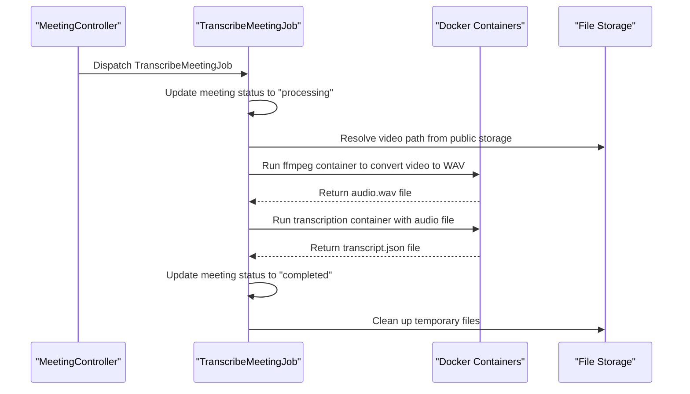
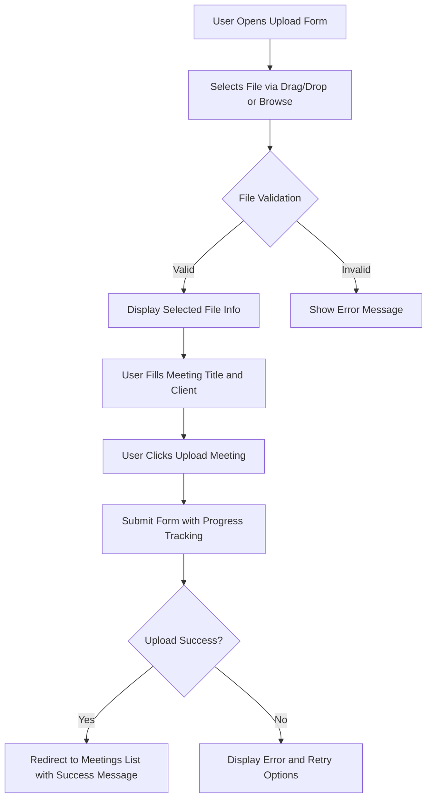
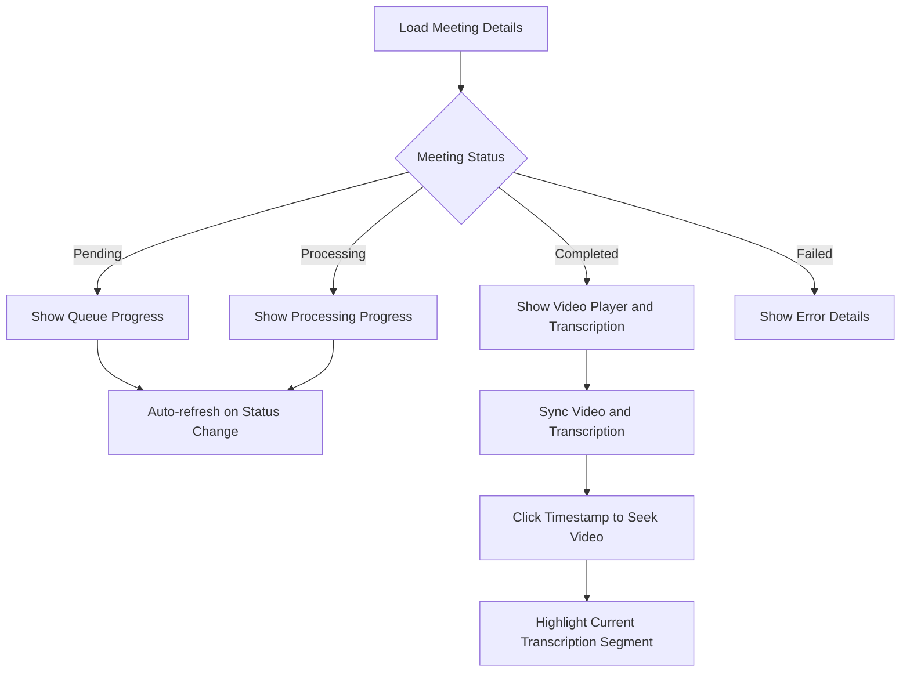
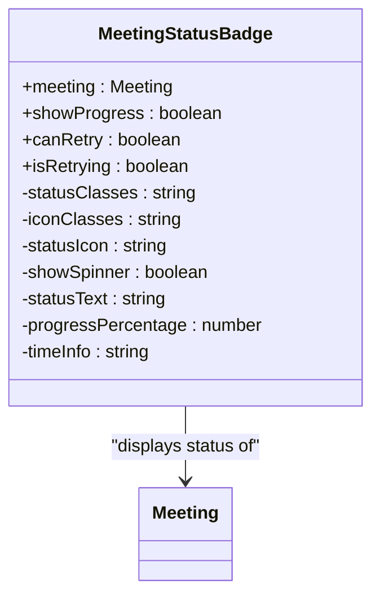
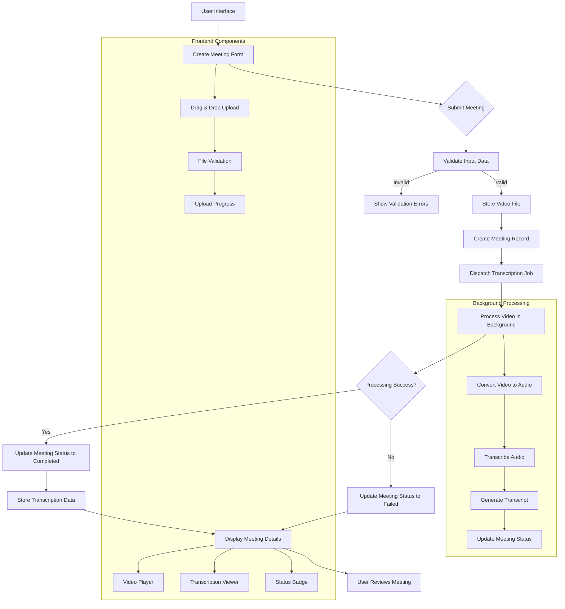

# MeetingController


## Table of Contents
1. [Introduction](#introduction)
2. [Core Methods Overview](#core-methods-overview)
3. [File Upload and Validation](#file-upload-and-validation)
4. [Asynchronous Processing Workflow](#asynchronous-processing-workflow)
5. [Frontend Integration](#frontend-integration)
6. [Error Handling](#error-handling)
7. [Real-time Status Updates](#real-time-status-updates)
8. [Data Flow Diagram](#data-flow-diagram)

## Introduction
The MeetingController is the central component responsible for managing the complete lifecycle of meeting recordings within the application. It handles the creation, storage, processing, and display of meeting data, serving as the bridge between user interactions and backend processing systems. The controller implements a comprehensive workflow that begins with video file upload and concludes with fully transcribed meeting content available for review. This document provides a detailed analysis of the controller's functionality, including its methods, validation rules, error handling strategies, and integration with frontend components.

**Section sources**
- [MeetingController.php](file://app/Http/Controllers/MeetingController.php#L1-L305)

## Core Methods Overview

### create() Method
The `create()` method renders the meeting upload form, providing users with a clean interface to initiate the meeting upload process. It retrieves all available clients from the database and passes them to the Inertia.js frontend for client selection.


```php
public function create(): Response
{
    $clients = Client::orderBy('name')->get(['id', 'name']);
    
    return Inertia::render('Meetings/Create', [
        'clients' => $clients
    ]);
}
```


**Section sources**
- [MeetingController.php](file://app/Http/Controllers/MeetingController.php#L45-L53)

### store() Method
The `store()` method handles the complete video upload and processing initiation workflow. It validates the uploaded file, stores it securely, creates a meeting record, and dispatches the transcription job for asynchronous processing.


```php
public function store(Request $request): RedirectResponse
{
    $validated = $request->validate([
        'title' => 'required|string|max:255',
        'client_id' => 'required|exists:clients,id',
        'video' => [
            'required',
            'file',
            File::types(['mp4', 'mov', 'avi', 'webm'])
                ->max(500 * 1024) // 500MB max
                ->min(1024) // 1MB min
        ]
    ]);
    
    // File storage and job dispatching logic
    // ...
}
```


**Section sources**
- [MeetingController.php](file://app/Http/Controllers/MeetingController.php#L55-L198)

### index() Method
The `index()` method retrieves and displays a paginated list of meetings with comprehensive filtering and sorting capabilities. Users can filter by client, status, and date range, and sort by various attributes including uploaded date, title, status, duration, and client name.


```php
public function index(Request $request): Response
{
    $query = Meeting::query()->with('client');
    
    // Apply filters if provided
    if ($request->filled('client_id')) {
        $query->where('client_id', $request->client_id);
    }
    
    if ($request->filled('status')) {
        $query->where('status', $request->status);
    }
    
    // Sorting logic and pagination
    // ...
}
```


**Section sources**
- [MeetingController.php](file://app/Http/Controllers/MeetingController.php#L10-L43)

### show() Method
The `show()` method retrieves a specific meeting and its associated data for display. It loads the meeting with its client and transcriptions, generates a secure URL for video playback, and handles cases where the video file might be missing.


```php
public function show(Meeting $meeting): Response
{
    $meeting->load(['client', 'transcriptions' => function ($query) {
        $query->orderBy('start_time');
    }]);
    
    // Generate video URL for frontend
    $videoUrl = null;
    $videoError = null;
    
    if ($meeting->video_path) {
        if (Storage::disk('public')->exists($meeting->video_path)) {
            $videoUrl = asset('storage/' . $meeting->video_path);
        } else {
            $videoError = 'Video file not found. It may have been moved or deleted.';
        }
    }
    
    return Inertia::render('Meetings/Show', [
        'meeting' => $meeting,
        'videoUrl' => $videoUrl,
        'videoError' => $videoError
    ]);
}
```


**Section sources**
- [MeetingController.php](file://app/Http/Controllers/MeetingController.php#L199-L235)

## File Upload and Validation

### Validation Rules
The `store()` method implements comprehensive validation rules to ensure data integrity and security. The validation rules are defined with custom error messages to provide clear feedback to users.

:Validation Rules:
- **title**: Required string with maximum 255 characters
- **client_id**: Required and must exist in the clients table
- **video**: Required file with specific type, size, and integrity requirements

:Custom Error Messages:
- "Please enter a meeting title." for title validation
- "Meeting title cannot exceed 255 characters." for title length
- "Please select a client for this meeting." for client selection
- "The video must be a file of type: MP4, MOV, AVI, or WebM." for file type
- "The video file size cannot exceed 500MB." for file size limit
- "The video file must be at least 1MB." for minimum file size

**Section sources**
- [MeetingController.php](file://app/Http/Controllers/MeetingController.php#L57-L82)

### File Integrity Checks
Beyond basic validation, the controller performs additional integrity checks to ensure the uploaded file is valid and can be processed successfully.


```php
// Validate file integrity
$videoFile = $request->file('video');
if (!$videoFile->isValid()) {
    throw new \RuntimeException('The uploaded file is corrupted or invalid.');
}

// Check available disk space
$requiredSpace = $videoFile->getSize() * 1.5;
$availableSpace = disk_free_space(storage_path('app/public'));
if ($availableSpace !== false && $availableSpace < $requiredSpace) {
    throw new \RuntimeException('Insufficient storage space available.');
}
```


**Section sources**
- [MeetingController.php](file://app/Http/Controllers/MeetingController.php#L84-L97)

### File Storage Strategy
The controller implements an organized file storage strategy that structures files by client and meeting ID for better organization and security.


```php
// Store video file with organized structure
$originalExtension = $videoFile->getClientOriginalExtension();
$fileName = "video.{$originalExtension}";
$storagePath = "meetings/{$validated['client_id']}/{$meeting->id}";

// Store the file in public disk so it can be served
$videoPath = $videoFile->storeAs($storagePath, $fileName, 'public');
```


**Section sources**
- [MeetingController.php](file://app/Http/Controllers/MeetingController.php#L106-L113)

## Asynchronous Processing Workflow

### Transcription Job Dispatch
After successfully storing the video file, the controller dispatches the TranscribeMeetingJob to process the video asynchronously, ensuring the user interface remains responsive.


```php
// Dispatch transcription job
TranscribeMeetingJob::dispatch($meeting);
```


**Section sources**
- [MeetingController.php](file://app/Http/Controllers/MeetingController.php#L148)

### Job Processing Flow
The TranscribeMeetingJob implements a multi-step processing workflow that converts the video to audio and then transcribes it using external services.





**Diagram sources**
- [TranscribeMeetingJob.php](file://app/Jobs/TranscribeMeetingJob.php#L1-L400)
- [MeetingController.php](file://app/Http/Controllers/MeetingController.php#L148)

**Section sources**
- [TranscribeMeetingJob.php](file://app/Jobs/TranscribeMeetingJob.php#L1-L400)

### Processing Steps
The job executes the following processing steps:

1. **Status Update**: Changes meeting status to "processing" and records processing start time
2. **Video to Audio Conversion**: Uses ffmpeg in a Docker container to extract audio from the video file
3. **Transcription**: Uses a specialized transcription service in a Docker container to convert audio to text with speaker diarization
4. **Status Completion**: Updates meeting status to "completed" upon successful processing
5. **Error Handling**: Updates status to "failed" and records error details if processing fails

**Section sources**
- [TranscribeMeetingJob.php](file://app/Jobs/TranscribeMeetingJob.php#L1-L400)

## Frontend Integration

### Create.vue Component
The frontend Create.vue component provides a user-friendly interface for uploading meeting videos with drag-and-drop functionality, file validation, and upload progress indicators.





**Diagram sources**
- [Create.vue](file://resources/js/pages/Meetings/Create.vue#L1-L439)

**Section sources**
- [Create.vue](file://resources/js/pages/Meetings/Create.vue#L1-L439)

### Show.vue Component
The Show.vue component displays meeting details with synchronized video playback and transcription viewing. It implements real-time status updates for pending and processing meetings.





**Diagram sources**
- [Show.vue](file://resources/js/pages/Meetings/Show.vue#L1-L344)

**Section sources**
- [Show.vue](file://resources/js/pages/Meetings/Show.vue#L1-L344)

### Status Badge Component
The MeetingStatusBadge component provides visual indicators for meeting status with appropriate colors, icons, and interactive elements for failed meetings.





**Diagram sources**
- [MeetingStatusBadge.vue](file://resources/js/lib/MeetingStatusBadge.vue#L1-L284)

**Section sources**
- [MeetingStatusBadge.vue](file://resources/js/lib/MeetingStatusBadge.vue#L1-L284)

## Error Handling

### Controller Error Handling
The MeetingController implements comprehensive error handling with different strategies for validation errors, runtime exceptions, and unexpected errors.


```php
try {
    // File storage and processing logic
    // ...
} catch (\Illuminate\Validation\ValidationException $e) {
    // Re-throw validation exceptions to be handled by Laravel
    throw $e;
} catch (\RuntimeException $e) {
    // Clean up meeting record if created
    if ($meeting) {
        $meeting->delete();
    }
    return redirect()->back()
        ->withInput()
        ->with('error', $e->getMessage());
} catch (\Exception $e) {
    // Clean up meeting record if created
    if ($meeting) {
        $meeting->delete();
    }
    // Log the error for debugging
    \Log::error('Meeting upload failed', [
        'error' => $e->getMessage(),
        'trace' => $e->getTraceAsString(),
        'user_input' => $request->only(['title', 'client_id'])
    ]);
    return redirect()->back()
        ->withInput()
        ->with('error', 'Failed to upload meeting video. Please try again or contact support if the problem persists.');
}
```


**Section sources**
- [MeetingController.php](file://app/Http/Controllers/MeetingController.php#L150-L197)

### Job Error Handling
The TranscribeMeetingJob implements robust error handling with retry mechanisms and user-friendly error messages.


```php
public function failed(\Throwable $exception): void
{
    Log::error("TranscribeMeetingJob failed for meeting {$this->meeting->id}", [
        'error' => $exception->getMessage(),
        'trace' => $exception->getTraceAsString(),
        'meeting_id' => $this->meeting->id,
        'video_path' => $this->meeting->video_path,
        'attempts' => $this->attempts()
    ]);
    
    // Update meeting status to failed with error details
    $this->meeting->update([
        'status' => 'failed',
        'processing_completed_at' => now(),
        'error_message' => $this->getUserFriendlyErrorMessage($exception),
        'technical_error' => $exception->getMessage()
    ]);
    
    // Clean up any temporary files
    $this->cleanupTempFiles();
}
```


**Section sources**
- [TranscribeMeetingJob.php](file://app/Jobs/TranscribeMeetingJob.php#L300-L330)

### User-Friendly Error Messages
The system converts technical errors into user-friendly messages that help users understand what went wrong and how to proceed.

:Error Message Mapping:
- **Video file not found**: "The video file could not be found. It may have been moved or deleted."
- **WAV conversion failure**: "Failed to process the video file. The file may be corrupted or in an unsupported format."
- **Docker-related errors**: "Transcription service is temporarily unavailable. Please try again later."
- **Timeout errors**: "Transcription took too long to complete. This may happen with very large files."
- **Disk space errors**: "Insufficient storage space available for processing."

**Section sources**
- [TranscribeMeetingJob.php](file://app/Jobs/TranscribeMeetingJob.php#L332-L358)

## Real-time Status Updates

### Status Endpoint
The controller provides a dedicated endpoint for retrieving real-time meeting status updates, which is used by the frontend to display progress indicators.


```php
public function status(Meeting $meeting)
{
    try {
        return response()->json([
            'success' => true,
            'data' => [
                'id' => $meeting->id,
                'status' => $meeting->status,
                'elapsed_time' => $meeting->elapsed_time,
                'estimated_remaining_time' => $meeting->estimated_remaining_time,
                'processing_progress' => $meeting->processing_progress,
                'formatted_elapsed_time' => $meeting->formatted_elapsed_time,
                'formatted_estimated_remaining_time' => $meeting->formatted_estimated_remaining_time,
                'queue_progress' => $meeting->queue_progress,
                'formatted_estimated_processing_time' => $meeting->formatted_estimated_processing_time,
            ]
        ]);
    } catch (\Exception $e) {
        \Log::error('Failed to get meeting status', [
            'meeting_id' => $meeting->id,
            'error' => $e->getMessage()
        ]);
        
        return response()->json([
            'success' => false,
            'error' => 'Failed to retrieve meeting status'
        ], 500);
    }
}
```


**Section sources**
- [MeetingController.php](file://app/Http/Controllers/MeetingController.php#L237-L275)

### Frontend Polling
The Show.vue component implements polling to check for status updates every 2 seconds when a meeting is pending or processing.


```javascript
// Poll for status updates when meeting is pending or processing
const pollStatus = async () => {
    if (props.meeting.status === 'pending' || props.meeting.status === 'processing') {
        try {
            const response = await fetch(`/meetings/${props.meeting.id}/status`)
            const data = await response.json()
            
            // Reload page if status changed to completed or failed
            if (data.data.status !== props.meeting.status) {
                window.location.reload()
            }
        } catch (error) {
            console.error('Failed to fetch meeting status:', error)
        }
    }
}

onMounted(() => {
    // Start polling for status updates every 2 seconds
    if (props.meeting.status === 'pending' || props.meeting.status === 'processing') {
        statusInterval = setInterval(pollStatus, 2000)
        // Initial poll
        pollStatus()
    }
})
```


**Section sources**
- [Show.vue](file://resources/js/pages/Meetings/Show.vue#L250-L285)

## Data Flow Diagram





**Diagram sources**
- [MeetingController.php](file://app/Http/Controllers/MeetingController.php#L1-L305)
- [TranscribeMeetingJob.php](file://app/Jobs/TranscribeMeetingJob.php#L1-L400)
- [Create.vue](file://resources/js/pages/Meetings/Create.vue#L1-L439)
- [Show.vue](file://resources/js/pages/Meetings/Show.vue#L1-L344)

**Section sources**
- [MeetingController.php](file://app/Http/Controllers/MeetingController.php#L1-L305)
- [TranscribeMeetingJob.php](file://app/Jobs/TranscribeMeetingJob.php#L1-L400)
- [Create.vue](file://resources/js/pages/Meetings/Create.vue#L1-L439)
- [Show.vue](file://resources/js/pages/Meetings/Show.vue#L1-L344)

**Referenced Files in This Document**   
- [MeetingController.php](file://app/Http/Controllers/MeetingController.php#L1-L305)
- [TranscribeMeetingJob.php](file://app/Jobs/TranscribeMeetingJob.php#L1-L400)
- [Meeting.php](file://app/Models/Meeting.php#L1-L179)
- [Create.vue](file://resources/js/pages/Meetings/Create.vue#L1-L439)
- [Show.vue](file://resources/js/pages/Meetings/Show.vue#L1-L344)
- [MeetingStatusBadge.vue](file://resources/js/lib/MeetingStatusBadge.vue#L1-L284)
- [MeetingProgressIndicator.vue](file://resources/js/lib/MeetingProgressIndicator.vue#L1-L200)