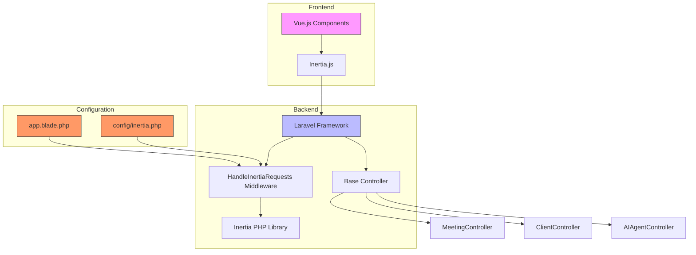

# Base Controller


## Table of Contents
1. [Introduction](#introduction)
2. [Base Controller Overview](#base-controller-overview)
3. [Inheritance and Middleware Integration](#inheritance-and-middleware-integration)
4. [Shared Data and Flash Message Handling](#shared-data-and-flash-message-handling)
5. [Inertia.js Integration and Data Transfer](#inertiajs-integration-and-data-transfer)
6. [Child Controller Implementation Example](#child-controller-implementation-example)
7. [Application Bootstrapping and Configuration](#application-bootstrapping-and-configuration)
8. [Architecture Diagram](#architecture-diagram)

## Introduction
This document provides a comprehensive analysis of the base Controller class in the Laravel application, which serves as the foundational component for all HTTP controllers. It explains how the controller integrates with Inertia.js to enable seamless communication between the Laravel backend and Vue.js frontend, ensuring a consistent and responsive user experience. The documentation covers inheritance patterns, shared functionality, middleware integration, and data flow mechanisms.

## Base Controller Overview

The base Controller class is defined as an abstract class that extends Laravel's default controller foundation. It acts as a shared parent for all application-specific controllers, enabling centralized management of common behaviors and dependencies.


```php
<?php

namespace App\Http\Controllers;

abstract class Controller
{
    //
}
```


Despite its minimal implementation, this class plays a critical role in the application architecture by establishing a consistent inheritance hierarchy. All controllers in the system, such as `MeetingController`, `ClientController`, and `AIAgentController`, extend this base class, ensuring uniform access to shared functionality and middleware.

**Section sources**
- [Controller.php](file://app/Http/Controllers/Controller.php#L1-L9)

## Inheritance and Middleware Integration

All controllers in the application inherit from the base Controller class, creating a unified structure for request handling. This inheritance pattern enables consistent behavior across different controller implementations while allowing specialized functionality in child classes.

The integration with Inertia.js is achieved through the `HandleInertiaRequests` middleware, which is automatically applied to all web routes. This middleware extends Inertia's base Middleware class and configures the root view template used for initial page loads.


```php
class HandleInertiaRequests extends Middleware
{
    protected $rootView = 'app';
}
```


The middleware is registered in the application's bootstrap process, ensuring it wraps all web requests and enables Inertia's server-side rendering and client-side hydration capabilities.

**Section sources**
- [HandleInertiaRequests.php](file://app/Http/Middleware/HandleInertiaRequests.php#L1-L15)
- [Controller.php](file://app/Http/Controllers/Controller.php#L1-L9)

## Shared Data and Flash Message Handling

The `HandleInertiaRequests` middleware defines a `share` method that specifies data automatically passed from the Laravel backend to the Vue.js frontend on every request. This shared data includes flash messages, CSRF tokens, application configuration, and user information.


```php
public function share(Request $request): array
{
    return array_merge(parent::share($request), [
        'flash' => [
            'success' => fn () => $request->session()->get('success'),
            'error' => fn () => $request->session()->get('error'),
            'warning' => fn () => $request->session()->get('warning'),
            'info' => fn () => $request->session()->get('info'),
        ],
        'errors' => function () use ($request) {
            return $request->session()->get('errors')
                ? $request->session()->get('errors')->getBag('default')->getMessages()
                : (object) [];
        },
        'csrf_token' => fn () => csrf_token(),
        'app' => [
            'name' => config('app.name'),
            'url' => config('app.url'),
            'environment' => config('app.env'),
        ],
        'ziggy' => [
            ...(new Ziggy)->toArray(),
            'location' => $request->url(),
        ],
        'user' => fn () => $request->user()
            ? $request->user()->only('id', 'name', 'email')
            : null,
    ]);
}
```


This mechanism enables automatic flash message display in the frontend by making session-based messages available as `$page.props.flash` in Vue components.

**Section sources**
- [HandleInertiaRequests.php](file://app/Http/Middleware/HandleInertiaRequests.php#L30-L67)

## Inertia.js Integration and Data Transfer

The application uses Inertia.js to create a seamless bridge between Laravel and Vue.js, enabling server-side rendering with client-side interactivity. The integration is centered around the `app.blade.php` layout file, which serves as the root template for all Inertia responses.


```html
<!DOCTYPE html>
<html lang="{{ str_replace('_', '-', app()->getLocale()) }}"  @class(['dark' => ($appearance ?? 'system') == 'dark'])>
    <head>
        <title inertia>{{ config('app.name', 'Laravel') }}</title>
        @routes
        @vite(['resources/js/app.ts', "resources/js/pages/{$page['component']}.vue"])
        @inertiaHead
    </head>
    <body class="font-sans antialiased">
        @inertia
    </body>
</html>
```


When a controller returns an Inertia response, it specifies a Vue component to render and passes data as props:


```php
return Inertia::render('Meetings/Index', [
    'meetings' => $meetings,
    'clients' => $clients,
    'filters' => $request->only(['client_id', 'status', 'date_from', 'date_to', 'sort', 'direction']),
]);
```


This data becomes available in the Vue component as `props` and can be accessed directly in the template or script sections.

**Section sources**
- [app.blade.php](file://resources/views/app.blade.php#L1-L22)
- [MeetingController.php](file://app/Http/Controllers/MeetingController.php#L20-L35)

## Child Controller Implementation Example

Child controllers leverage the base Controller class to implement specific functionality while benefiting from the shared Inertia integration. The `MeetingController` demonstrates this pattern by using `Inertia::render()` to return responses that seamlessly integrate with the Vue frontend.


```php
class MeetingController extends Controller
{
    public function index(Request $request): Response
    {
        $meetings = Meeting::query()->with('client')->paginate(15)->withQueryString();
        $clients = Client::orderBy('name')->get(['id', 'name']);

        return Inertia::render('Meetings/Index', [
            'meetings' => $meetings,
            'clients' => $clients,
            'filters' => $request->only(['client_id', 'status', 'date_from', 'date_to', 'sort', 'direction']),
        ]);
    }
}
```


Error handling is implemented using Laravel's session flashing mechanism, which works in conjunction with the shared flash data to display messages in the frontend:


```php
return redirect()->back()
    ->withInput()
    ->with('error', $e->getMessage());
```


The corresponding Vue component can then access this data through `$page.props.flash.error`.

**Section sources**
- [MeetingController.php](file://app/Http/Controllers/MeetingController.php#L1-L305)

## Application Bootstrapping and Configuration

The Inertia integration is configured at multiple levels in the application. The `AppServiceProvider` does not contain specific Inertia bootstrapping code, as the integration is handled automatically by the Inertia service provider.

The `bootstrap/app.php` file registers the `HandleInertiaRequests` middleware for all web routes:


```php
->withMiddleware(function (Middleware $middleware) {
    $middleware->web(append: [
        HandleInertiaRequests::class,
        AddLinkHeadersForPreloadedAssets::class,
    ]);
})
```


Additional configuration is provided in `config/inertia.php`, which enables server-side rendering and specifies testing parameters for locating Inertia components:


```php
'ssr' => [
    'enabled' => true,
    'url' => 'http://127.0.0.1:13714',
],

'testing' => [
    'ensure_pages_exist' => true,
    'page_paths' => [resource_path('js/pages')],
    'page_extensions' => ['js', 'jsx', 'svelte', 'ts', 'tsx', 'vue'],
],
```


The Inertia service provider is automatically registered in the application's service container, as evidenced by its presence in the cached services configuration.

**Section sources**
- [AppServiceProvider.php](file://app/Providers/AppServiceProvider.php#L1-L23)
- [config/inertia.php](file://config/inertia.php#L1-L51)
- [bootstrap/app.php](file://bootstrap/app.php#L1-L23)

## Architecture Diagram





**Diagram sources**
- [Controller.php](file://app/Http/Controllers/Controller.php)
- [HandleInertiaRequests.php](file://app/Http/Middleware/HandleInertiaRequests.php)
- [app.blade.php](file://resources/views/app.blade.php)
- [config/inertia.php](file://config/inertia.php)
- [MeetingController.php](file://app/Http/Controllers/MeetingController.php)

**Referenced Files in This Document**   
- [Controller.php](file://app/Http/Controllers/Controller.php)
- [HandleInertiaRequests.php](file://app/Http/Middleware/HandleInertiaRequests.php)
- [app.blade.php](file://resources/views/app.blade.php)
- [AppServiceProvider.php](file://app/Providers/AppServiceProvider.php)
- [MeetingController.php](file://app/Http/Controllers/MeetingController.php)
- [config/inertia.php](file://config/inertia.php)