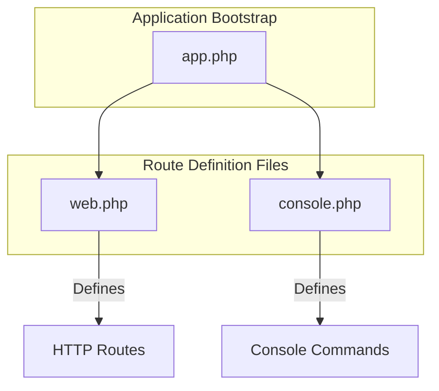
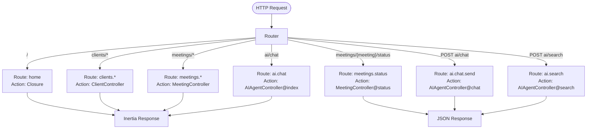
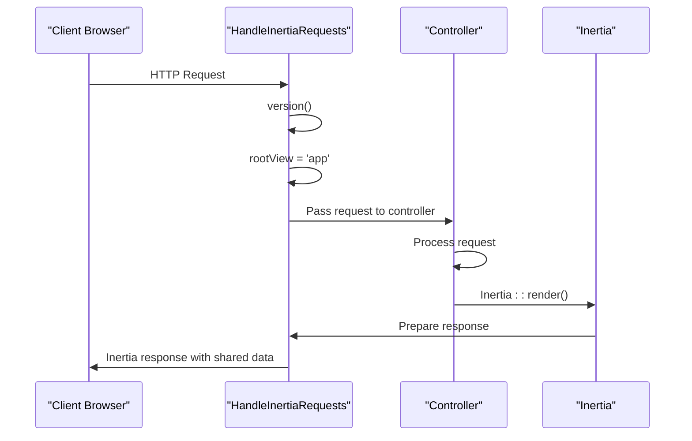
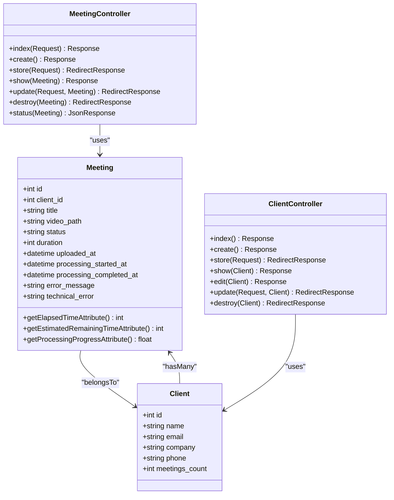
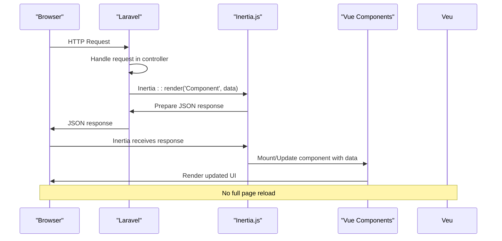

# Routing System


## Table of Contents
1. [Introduction](#introduction)
2. [Route Definition Files](#route-definition-files)
3. [Web Routes Analysis](#web-routes-analysis)
4. [Console Commands](#console-commands)
5. [Route Grouping and Middleware](#route-grouping-and-middleware)
6. [Route Parameters and Model Binding](#route-parameters-and-model-binding)
7. [Inertia.js Integration](#inertiajs-integration)
8. [Route Reference Table](#route-reference-table)
9. [Conclusion](#conclusion)

## Introduction
The Laravel routing system in the meetingai application serves as the central nervous system for handling HTTP requests and directing them to appropriate controller actions. This document provides a comprehensive analysis of the routing configuration, covering all defined routes, their HTTP methods, URI patterns, named routes, and associated controller actions. The system leverages Laravel's resource routing, route model binding, and Inertia.js integration to create a seamless full-stack experience. Special attention is given to middleware application, particularly the HandleInertiaRequests middleware for Inertia.js integration, namespace organization, and parameter validation. The documentation also covers console commands and their relationship to scheduled tasks or administrative operations.

**Section sources**
- [web.php](file://routes/web.php)
- [console.php](file://routes/console.php)

## Route Definition Files
The Laravel application defines its routes in two primary files located in the `routes` directory: `web.php` for web interface routes and `console.php` for Artisan console commands. The `web.php` file contains all HTTP routes for the application's user interface, utilizing Inertia.js for seamless page transitions without full reloads. The `console.php` file defines Artisan commands that can be executed from the command line for various administrative tasks. These files are automatically registered in the application bootstrap process through the `Application::configure()` method in `bootstrap/app.php`, which specifies the paths to these route files.





**Diagram sources**
- [web.php](file://routes/web.php)
- [console.php](file://routes/console.php)
- [app.php](file://bootstrap/app.php)

**Section sources**
- [web.php](file://routes/web.php)
- [console.php](file://routes/console.php)
- [app.php](file://bootstrap/app.php)

## Web Routes Analysis
The `web.php` file defines all HTTP routes for the meetingai application, organized into logical groups for different resources and functionalities. The routing system uses Laravel's expressive syntax to map URIs to controller actions with named routes for easy reference throughout the application. The routes are categorized into several groups: dashboard routes, resource routes for clients and meetings, API endpoints for real-time updates, and AI agent functionality routes.

### Dashboard Route
The root route (`/`) is defined as a closure that retrieves dashboard data including recent meetings, statistical information, and top clients. This route returns an Inertia response that renders the Dashboard component with the collected data.

### Resource Routes
The application leverages Laravel's resource routing for both clients and meetings, automatically creating RESTful routes for CRUD operations:
- `clients` resource: Handles client management (index, create, store, show, edit, update, destroy)
- `meetings` resource: Handles meeting management (index, create, store, show, edit, update, destroy)

### API Endpoint
A dedicated API endpoint is defined for real-time meeting status updates at `meetings/{meeting}/status`, which returns JSON data about a meeting's processing status.

### AI Agent Routes
The AI functionality is exposed through three routes:
- `ai/chat`: GET route to display the AI chat interface
- `ai/chat`: POST route to send messages to the AI agent
- `ai/search`: POST route to perform searches through meeting transcriptions





**Diagram sources**
- [web.php](file://routes/web.php)

**Section sources**
- [web.php](file://routes/web.php)

## Console Commands
The `console.php` file defines Artisan console commands that can be executed from the command line. Currently, the application defines a single command `inspire` that displays an inspiring quote. This command is registered using the `Artisan::command()` method, which accepts the command signature and a closure that defines the command's behavior. The command is given a purpose description that appears in the Artisan command list.


```php
Artisan::command('inspire', function () {
    $this->comment(Inspiring::quote());
})->purpose('Display an inspiring quote');
```


While the current implementation only includes a simple example command, the structure is in place for adding more complex administrative commands, such as scheduled tasks for processing meetings, cleaning up old files, or generating reports. These commands can be scheduled using Laravel's task scheduler in the `App\Console\Kernel` class, although this file is not present in the current codebase.

**Section sources**
- [console.php](file://routes/console.php)

## Route Grouping and Middleware
The application applies middleware globally to all web routes through the application bootstrap configuration in `bootstrap/app.php`. The `HandleInertiaRequests` middleware is appended to the web middleware group, ensuring that all web requests are processed with Inertia.js integration. This middleware extends Inertia's base middleware and specifies the root view as 'app', which corresponds to the main layout file `resources/views/app.blade.php`.

The middleware configuration is set up in the `withMiddleware()` callback of the Application configuration:


```php
->withMiddleware(function (Middleware $middleware) {
    $middleware->web(append: [
        HandleInertiaRequests::class,
        AddLinkHeadersForPreloadedAssets::class,
    ]);
})
```


This approach ensures that every web request passes through the `HandleInertiaRequests` middleware, which handles the server-side rendering setup, asset versioning, and sharing of data with Inertia components. The middleware also integrates with Ziggy for route generation in JavaScript, allowing Vue components to generate URLs using named routes.





**Diagram sources**
- [HandleInertiaRequests.php](file://app/Http/Middleware/HandleInertiaRequests.php)
- [app.php](file://bootstrap/app.php)

**Section sources**
- [HandleInertiaRequests.php](file://app/Http/Middleware/HandleInertiaRequests.php)
- [app.php](file://bootstrap/app.php)

## Route Parameters and Model Binding
The application extensively uses route model binding to automatically resolve route parameters to Eloquent model instances. This feature eliminates the need for manual model retrieval in controller methods, reducing boilerplate code and improving security by automatically returning 404 responses for non-existent models.

### Implicit Model Binding
Laravel's implicit model binding is used throughout the application by type-hinting controller method parameters with Eloquent model classes. When a route parameter name matches a route segment (e.g., `{meeting}` in the URI), Laravel automatically injects the corresponding model instance:


```php
public function show(Meeting $meeting): Response
{
    // $meeting is automatically injected
    return Inertia::render('Meetings/Show', ['meeting' => $meeting]);
}
```


This binding works for all resource routes (`clients/{client}`, `meetings/{meeting}`) and the status endpoint (`meetings/{meeting}/status`). The framework automatically resolves the model based on the route parameter value, using the model's primary key by default.

### Parameter Validation
Route parameters are validated through Laravel's validation system in controller methods. The validation rules ensure data integrity and provide user-friendly error messages:


```php
$validated = $request->validate([
    'title' => 'required|string|max:255',
    'client_id' => 'required|exists:clients,id',
    'video' => [
        'required',
        'file',
        File::types(['mp4', 'mov', 'avi', 'webm'])
            ->max(500 * 1024)
            ->min(1024)
    ]
]);
```


Custom error messages are provided for each validation rule to improve user experience. The application also implements additional business logic validation, such as checking available disk space before storing uploaded files and validating file integrity.

### Model Relationships
The `Meeting` and `Client` models define their relationships, which are leveraged in route handling:


```php
// In Meeting model
public function client(): BelongsTo
{
    return $this->belongsTo(Client::class);
}

// In Client model
public function meetings(): HasMany
{
    return $this->hasMany(Meeting::class);
}
```


These relationships allow for eager loading of related data in controller methods using the `with()` method, reducing database queries and improving performance.





**Diagram sources**
- [Meeting.php](file://app/Models/Meeting.php)
- [Client.php](file://app/Models/Client.php)
- [MeetingController.php](file://app/Http/Controllers/MeetingController.php)
- [ClientController.php](file://app/Http/Controllers/ClientController.php)

**Section sources**
- [Meeting.php](file://app/Models/Meeting.php)
- [Client.php](file://app/Models/Client.php)
- [MeetingController.php](file://app/Http/Controllers/MeetingController.php)
- [ClientController.php](file://app/Http/Controllers/ClientController.php)

## Inertia.js Integration
The application uses Inertia.js to create a seamless single-page application experience while maintaining the simplicity of server-side routing. Inertia.js acts as a bridge between the Laravel backend and the Vue.js frontend, allowing server-side controllers to return responses that are rendered as client-side components without full page reloads.

### Response Structure
Controller methods return Inertia responses using the `Inertia::render()` method, specifying the component name and data to be passed to the frontend:


```php
return Inertia::render('Dashboard', [
    'recentMeetings' => $recentMeetings,
    'stats' => $stats,
    'topClients' => $topClients,
]);
```


The component name corresponds to files in the `resources/js/pages` directory, following a directory structure that mirrors the route hierarchy (e.g., `Dashboard.vue`, `Meetings/Index.vue`, `Clients/Show.vue`).

### Shared Data
The `HandleInertiaRequests` middleware automatically shares common data with all Inertia responses, including authentication state, CSRF token, and flash messages. This eliminates the need to manually pass this data in every controller method.

### Error Handling
Inertia responses preserve Laravel's error handling mechanisms. Validation errors are automatically converted to JSON format and sent to the frontend, where they can be displayed in the Vue components. Flash messages (success, error) are also automatically available in the frontend components.

### API Endpoints
While most routes return Inertia responses, API endpoints return standard JSON responses for AJAX requests:


```php
return response()->json([
    'success' => true,
    'data' => [
        'id' => $meeting->id,
        'status' => $meeting->status,
        // ... other data
    ]
]);
```


This hybrid approach allows the application to serve both traditional server-rendered pages and API endpoints for real-time updates and AJAX functionality.





**Diagram sources**
- [HandleInertiaRequests.php](file://app/Http/Middleware/HandleInertiaRequests.php)
- [MeetingController.php](file://app/Http/Controllers/MeetingController.php)
- [ClientController.php](file://app/Http/Controllers/ClientController.php)

**Section sources**
- [HandleInertiaRequests.php](file://app/Http/Middleware/HandleInertiaRequests.php)
- [MeetingController.php](file://app/Http/Controllers/MeetingController.php)
- [ClientController.php](file://app/Http/Controllers/ClientController.php)

## Route Reference Table
The following table provides a comprehensive reference of all routes defined in the application, including their HTTP methods, URI patterns, named routes, controller actions, and access requirements.

| HTTP Method | URI Pattern | Named Route | Controller Action | Parameters | Description | Access Control |
|-----------|-----------|-----------|------------------|-----------|------------|----------------|
| GET | / | home | Closure | None | Renders dashboard with recent meetings, statistics, and top clients | Public |
| GET | /clients | clients.index | ClientController@index | None | Displays list of all clients with meeting counts | Public |
| GET | /clients/create | clients.create | ClientController@create | None | Displays form to create a new client | Public |
| POST | /clients | clients.store | ClientController@store | name (required), email (optional), company (optional), phone (optional) | Creates a new client record | Public |
| GET | /clients/{client} | clients.show | ClientController@show | client (Meeting model) | Displays details of a specific client and their meetings | Public |
| GET | /clients/{client}/edit | clients.edit | ClientController@edit | client (Client model) | Displays form to edit an existing client | Public |
| PUT/PATCH | /clients/{client} | clients.update | ClientController@update | client (Client model), name (required), email (optional), company (optional), phone (optional) | Updates an existing client record | Public |
| DELETE | /clients/{client} | clients.destroy | ClientController@destroy | client (Client model) | Deletes a client record (only if no meetings exist) | Public |
| GET | /meetings | meetings.index | MeetingController@index | client_id (optional), status (optional), date_from (optional), date_to (optional), sort (optional), direction (optional) | Displays paginated list of meetings with filtering and sorting | Public |
| GET | /meetings/create | meetings.create | MeetingController@create | None | Displays form to upload a new meeting video | Public |
| POST | /meetings | meetings.store | MeetingController@store | title (required), client_id (required), video (required file) | Uploads a new meeting video and creates processing job | Public |
| GET | /meetings/{meeting} | meetings.show | MeetingController@show | meeting (Meeting model) | Displays details of a specific meeting, including video and transcription | Public |
| GET | /meetings/{meeting}/edit | meetings.edit | MeetingController@edit | meeting (Meeting model) | Displays form to edit meeting details | Public |
| PUT/PATCH | /meetings/{meeting} | meetings.update | MeetingController@update | meeting (Meeting model), title (required), client_id (required) | Updates meeting details | Public |
| DELETE | /meetings/{meeting} | meetings.destroy | MeetingController@destroy | meeting (Meeting model) | Deletes a meeting record and associated video file | Public |
| GET | /meetings/{meeting}/status | meetings.status | MeetingController@status | meeting (Meeting model) | Returns JSON with real-time processing status of a meeting | Public |
| GET | /ai/chat | ai.chat | AIAgentController@index | None | Displays AI chat interface | Public |
| POST | /ai/chat | ai.chat.send | AIAgentController@chat | message (required), conversation_history (optional) | Sends a message to the AI agent and returns response | Public |
| POST | /ai/search | ai.search | AIAgentController@search | query (required), client_id (optional), speaker (optional), limit (optional) | Searches through meeting transcriptions for relevant content | Public |

**Section sources**
- [web.php](file://routes/web.php)
- [MeetingController.php](file://app/Http/Controllers/MeetingController.php)
- [ClientController.php](file://app/Http/Controllers/ClientController.php)
- [AIAgentController.php](file://app/Http/Controllers/AIAgentController.php)

## Conclusion
The Laravel routing system in the meetingai application demonstrates a well-structured and maintainable approach to handling HTTP requests and console commands. By leveraging Laravel's built-in features such as resource routing, route model binding, and middleware, the application achieves a clean separation of concerns while maintaining developer productivity. The integration with Inertia.js provides a modern single-page application experience without sacrificing the benefits of server-side rendering and traditional web architecture.

Key strengths of the routing system include:
- Comprehensive resource routing for CRUD operations on clients and meetings
- Effective use of route model binding to reduce boilerplate code
- Seamless Inertia.js integration for a responsive user interface
- Proper validation and error handling in controller methods
- Clear separation between web interface routes and API endpoints
- Well-organized route definition files

The system could be enhanced by implementing authentication and authorization middleware to protect routes, adding rate limiting for API endpoints, and expanding the console commands for administrative tasks and scheduled operations. Overall, the routing architecture provides a solid foundation for the application's functionality and scalability.

**Referenced Files in This Document**   
- [web.php](file://routes/web.php)
- [console.php](file://routes/console.php)
- [HandleInertiaRequests.php](file://app/Http/Middleware/HandleInertiaRequests.php)
- [MeetingController.php](file://app/Http/Controllers/MeetingController.php)
- [ClientController.php](file://app/Http/Controllers/ClientController.php)
- [AIAgentController.php](file://app/Http/Controllers/AIAgentController.php)
- [Meeting.php](file://app/Models/Meeting.php)
- [Client.php](file://app/Models/Client.php)