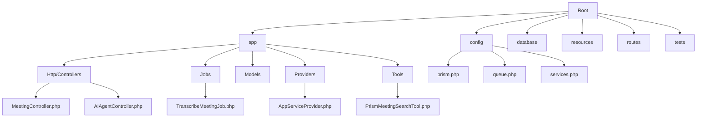
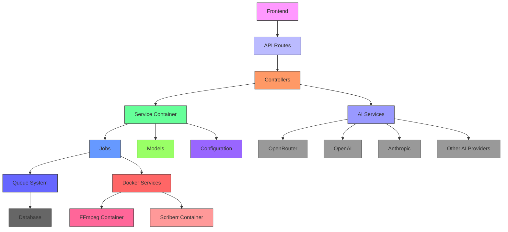
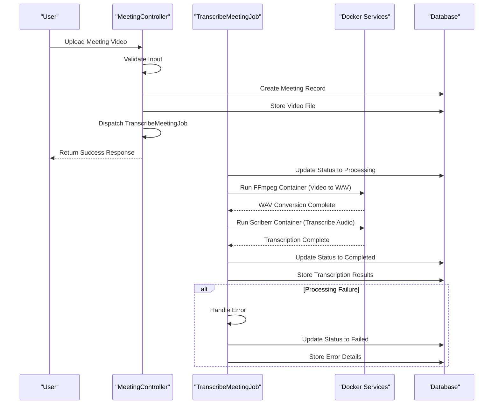
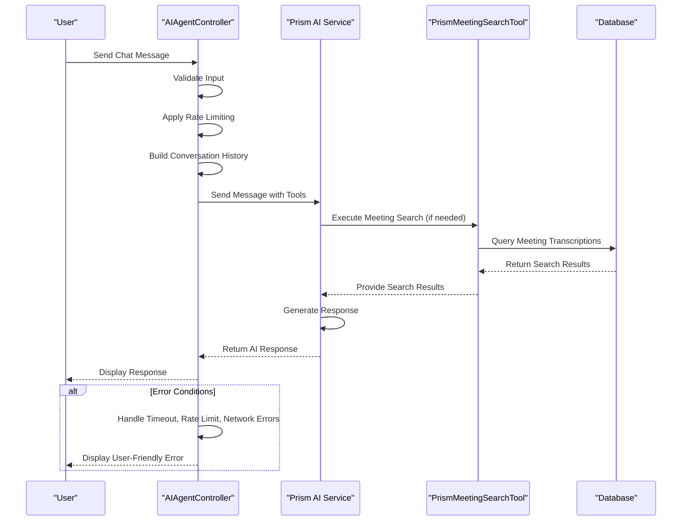
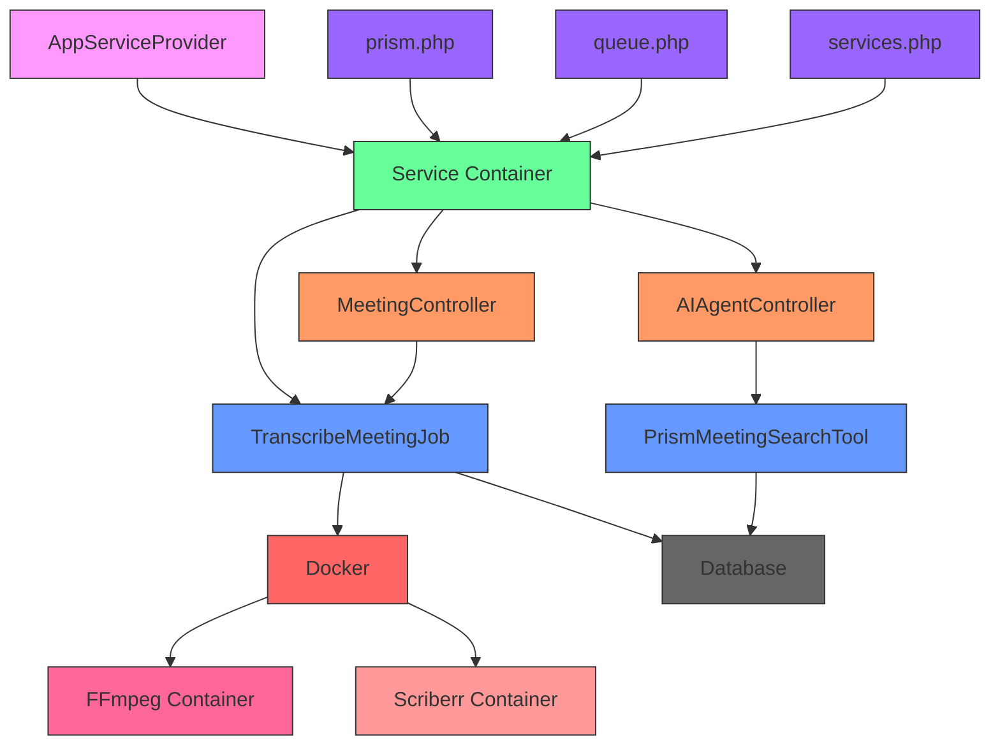

# Service Architecture and Dependency Management


## Table of Contents
1. [Introduction](#introduction)
2. [Project Structure](#project-structure)
3. [Service Provider and Dependency Injection System](#service-provider-and-dependency-injection-system)
4. [Configuration System and Environment Management](#configuration-system-and-environment-management)
5. [Service Container and Dependency Resolution](#service-container-and-dependency-resolution)
6. [Job Processing and Queue System](#job-processing-and-queue-system)
7. [Custom Service Classes and Third-Party Abstractions](#custom-service-classes-and-third-party-abstractions)
8. [Architecture Overview](#architecture-overview)
9. [Detailed Component Analysis](#detailed-component-analysis)
10. [Dependency Analysis](#dependency-analysis)
11. [Conclusion](#conclusion)

## Introduction
This document provides a comprehensive analysis of the service architecture and dependency management system in the meetingai Laravel backend application. It details how the application uses Laravel's service container for dependency injection, manages configuration across environments, processes background jobs, and integrates with third-party AI services. The documentation is designed to be accessible to both technical and non-technical users, providing clear explanations of complex architectural concepts and implementation details.

## Project Structure
The meetingai application follows a standard Laravel project structure with well-organized directories for different types of components. The application is structured around core Laravel concepts including service providers, configuration files, jobs, and controllers. The project uses a modular approach with clear separation of concerns between different components.





**Diagram sources**
- [app/Providers/AppServiceProvider.php](file://app/Providers/AppServiceProvider.php)
- [config/prism.php](file://config/prism.php)
- [config/queue.php](file://config/queue.php)
- [config/services.php](file://config/services.php)
- [app/Jobs/TranscribeMeetingJob.php](file://app/Jobs/TranscribeMeetingJob.php)
- [app/Http/Controllers/MeetingController.php](file://app/Http/Controllers/MeetingController.php)
- [app/Http/Controllers/AIAgentController.php](file://app/Http/Controllers/AIAgentController.php)
- [app/Tools/PrismMeetingSearchTool.php](file://app/Tools/PrismMeetingSearchTool.php)

**Section sources**
- [app/Providers/AppServiceProvider.php](file://app/Providers/AppServiceProvider.php)
- [config/prism.php](file://config/prism.php)
- [config/queue.php](file://config/queue.php)
- [config/services.php](file://config/services.php)

## Service Provider and Dependency Injection System
The service provider system in Laravel is the foundation for bootstrapping application services and registering bindings in the service container. The AppServiceProvider serves as the primary service provider for custom application logic.


```php
class AppServiceProvider extends ServiceProvider
{
    public function register(): void
    {
        // Service bindings would be registered here
    }

    public function boot(): void
    {
        // Service bootstrapping would occur here
    }
}
```


Currently, the AppServiceProvider does not register any custom bindings or boot services, indicating that the application relies primarily on Laravel's default service providers and configuration-based service instantiation. This approach simplifies the codebase by using configuration files to define service parameters rather than programmatic service registration.

**Section sources**
- [app/Providers/AppServiceProvider.php](file://app/Providers/AppServiceProvider.php#L1-L25)

## Configuration System and Environment Management
The application uses Laravel's configuration system to manage environment-specific settings across multiple configuration files. The configuration system allows for flexible deployment across different environments by using environment variables and default values.

### AI Integration Configuration (prism.php)
The prism.php configuration file manages settings for multiple AI service providers, enabling the application to integrate with various AI platforms:


```php
return [
    'prism_server' => [
        'middleware' => [],
        'enabled' => env('PRISM_SERVER_ENABLED', false),
    ],
    'providers' => [
        'openai' => [
            'url' => env('OPENAI_URL', 'https://api.openai.com/v1'),
            'api_key' => env('OPENAI_API_KEY', ''),
            'organization' => env('OPENAI_ORGANIZATION', null),
            'project' => env('OPENAI_PROJECT', null),
        ],
        'anthropic' => [
            'api_key' => env('ANTHROPIC_API_KEY', ''),
            'version' => env('ANTHROPIC_API_VERSION', '2023-06-01'),
            'default_thinking_budget' => env('ANTHROPIC_DEFAULT_THINKING_BUDGET', 1024),
            'anthropic_beta' => env('ANTHROPIC_BETA', null),
        ],
        // Additional providers: ollama, mistral, groq, xai, gemini, deepseek, voyageai, openrouter
    ],
];
```


This configuration allows the application to support multiple AI providers with environment-specific credentials and settings, providing flexibility in AI service selection and failover capabilities.

### Job Processing Configuration (queue.php)
The queue.php configuration file defines the job processing system settings:


```php
return [
    'default' => env('QUEUE_CONNECTION', 'database'),
    'connections' => [
        'sync' => ['driver' => 'sync'],
        'database' => [
            'driver' => 'database',
            'connection' => env('DB_QUEUE_CONNECTION'),
            'table' => env('DB_QUEUE_TABLE', 'jobs'),
            'queue' => env('DB_QUEUE', 'default'),
            'retry_after' => (int) env('DB_QUEUE_RETRY_AFTER', 90),
            'after_commit' => false,
        ],
        // Additional connections: beanstalkd, sqs, redis
    ],
    'batching' => [
        'database' => env('DB_CONNECTION', 'sqlite'),
        'table' => 'job_batches',
    ],
    'failed' => [
        'driver' => env('QUEUE_FAILED_DRIVER', 'database-uuids'),
        'database' => env('DB_CONNECTION', 'sqlite'),
        'table' => 'failed_jobs',
    ],
];
```


The configuration uses the database as the default queue connection, storing jobs in a database table for persistence and reliability. This approach ensures that jobs are not lost if the application restarts and provides visibility into job processing status.

### Third-Party Services Configuration (services.php)
The services.php configuration file manages credentials and settings for third-party services:


```php
return [
    'postmark' => ['token' => env('POSTMARK_TOKEN')],
    'ses' => [
        'key' => env('AWS_ACCESS_KEY_ID'),
        'secret' => env('AWS_SECRET_ACCESS_KEY'),
        'region' => env('AWS_DEFAULT_REGION', 'us-east-1'),
    ],
    'resend' => ['key' => env('RESEND_KEY')],
    'slack' => [
        'notifications' => [
            'bot_user_oauth_token' => env('SLACK_BOT_USER_OAUTH_TOKEN'),
            'channel' => env('SLACK_BOT_USER_DEFAULT_CHANNEL'),
        ],
    ],
    'ffmpeg' => [
        'image' => env('FFMPEG_DOCKER_IMAGE', 'jrottenberg/ffmpeg:latest'),
    ],
    'scriberr' => [
        'image' => env('SCRIBERR_DOCKER_IMAGE', 'scriberr-local:latest'),
    ],
];
```


This configuration abstracts Docker image names for the FFmpeg and Scriberr services, allowing environment-specific overrides while providing sensible defaults.

**Section sources**
- [config/prism.php](file://config/prism.php#L1-L56)
- [config/queue.php](file://config/queue.php#L1-L113)
- [config/services.php](file://config/services.php#L1-L46)

## Service Container and Dependency Resolution
Laravel's service container is a powerful tool for managing class dependencies and performing dependency injection. The container automatically resolves dependencies for controllers, jobs, and other components that are resolved through the container.

### Controller Dependency Resolution
The MeetingController demonstrates how Laravel resolves dependencies through method injection:


```php
public function index(Request $request): Response
{
    // Request object is automatically resolved by the service container
    $query = Meeting::query()->with('client');
    // ...
}
```


The Request object is automatically injected into the controller method by the service container, eliminating the need for manual instantiation. This pattern is used throughout the application for Request objects and other services.

### Configuration Access via config() Helper
The application uses the config() helper function to access configuration values throughout the codebase. In the TranscribeMeetingJob, configuration values are accessed to determine Docker image names:


```php
$ffmpegImage = config('services.ffmpeg.image', 'jrottenberg/ffmpeg:latest');
$scriberrImage = config('services.scriberr.image', 'scriberr-local:latest');
```


This approach allows for environment-specific configuration while providing default values as fallbacks. The config() helper retrieves values from the configuration files, enabling flexible deployment across different environments.

**Section sources**
- [app/Http/Controllers/MeetingController.php](file://app/Http/Controllers/MeetingController.php#L1-L305)
- [app/Jobs/TranscribeMeetingJob.php](file://app/Jobs/TranscribeMeetingJob.php#L73-L74)

## Job Processing and Queue System
The application uses Laravel's queue system to process long-running tasks asynchronously, particularly for meeting transcription processing.

### TranscribeMeetingJob Implementation
The TranscribeMeetingJob class implements the ShouldQueue interface, allowing it to be dispatched to the queue system:


```php
class TranscribeMeetingJob implements ShouldQueue
{
    use Queueable, InteractsWithQueue, SerializesModels;

    public $timeout = 3600; // 1 hour timeout
    public $tries = 3; // Allow 3 attempts
    public $maxExceptions = 3;
    
    public function __construct(public Meeting $meeting) {}
    
    public function handle(): void
    {
        // Job processing logic
    }
    
    public function failed(\Throwable $exception): void
    {
        // Error handling logic
    }
}
```


The job has a one-hour timeout and allows three retry attempts, providing resilience against temporary failures. The job processes meeting transcription by:

1. Converting video to WAV format using FFmpeg in Docker
2. Transcribing the audio using the Scriberr transcription service
3. Updating the meeting status based on processing outcome

### Job Dispatching
The job is dispatched from the MeetingController when a new meeting is uploaded:


```php
// Dispatch transcription job
TranscribeMeetingJob::dispatch($meeting);
```


This asynchronous processing pattern ensures that the web request completes quickly while the resource-intensive transcription process runs in the background.

### Error Handling and Retry Logic
The job implements comprehensive error handling with user-friendly error messages and cleanup logic:


```php
public function failed(\Throwable $exception): void
{
    $this->meeting->update([
        'status' => 'failed',
        'error_message' => $this->getUserFriendlyErrorMessage($exception),
        'technical_error' => $exception->getMessage()
    ]);
    
    $this->cleanupTempFiles();
}

private function getUserFriendlyErrorMessage(\Throwable $exception): string
{
    $message = $exception->getMessage();
    
    if (str_contains($message, 'Video file not found')) {
        return 'The video file could not be found. It may have been moved or deleted.';
    }
    
    if (str_contains($message, 'docker')) {
        return 'Transcription service is temporarily unavailable. Please try again later.';
    }
    
    // Additional error mappings
}
```


The job also implements retry logic with increasing backoff intervals:


```php
public function backoff(): array
{
    return [60, 300, 900]; // 1 minute, 5 minutes, 15 minutes
}
```


This ensures that transient failures are handled gracefully with progressively longer wait times between retries.

**Section sources**
- [app/Jobs/TranscribeMeetingJob.php](file://app/Jobs/TranscribeMeetingJob.php#L1-L400)
- [app/Http/Controllers/MeetingController.php](file://app/Http/Controllers/MeetingController.php#L150-L153)

## Custom Service Classes and Third-Party Abstractions
The application includes custom service classes that abstract interactions with third-party services, providing a clean interface for business logic.

### AI Agent Integration
The AIAgentController integrates with the Prism AI system to provide conversational AI capabilities:


```php
public function chat(Request $request)
{
    // Build conversation history with system, user, and assistant messages
    $messages = [];
    $messages[] = new SystemMessage('You are an AI assistant for a meeting transcription platform...');
    
    // Add conversation history
    if ($request->has('conversation_history') && is_array($request->conversation_history)) {
        foreach ($request->conversation_history as $msg) {
            if ($msg['role'] === 'user') {
                $messages[] = new UserMessage($msg['content']);
            } elseif ($msg['role'] === 'assistant') {
                $messages[] = new AssistantMessage($msg['content']);
            }
        }
    }
    
    // Add current user message
    $messages[] = new UserMessage($request->message);
    
    // Make the AI request with tools
    $response = Prism::text()
        ->using(Provider::OpenRouter, 'openai/gpt-oss-120b')
        ->withMessages($messages)
        ->withTools([new PrismMeetingSearchTool()])
        ->generate();
}
```


The controller uses the Prism service to generate AI responses, incorporating conversation history and specialized tools for meeting search functionality.

### Meeting Search Tool
The PrismMeetingSearchTool (referenced in AIAgentController) provides a specialized tool for searching meeting transcriptions:


```php
// In AIAgentController
->withTools([new PrismMeetingSearchTool()])
```


This tool abstraction allows the AI system to search through meeting content when responding to user queries, enhancing the conversational capabilities with domain-specific functionality.

**Section sources**
- [app/Http/Controllers/AIAgentController.php](file://app/Http/Controllers/AIAgentController.php#L1-L183)
- [app/Tools/PrismMeetingSearchTool.php](file://app/Tools/PrismMeetingSearchTool.php)

## Architecture Overview
The meetingai application follows a layered architecture with clear separation of concerns between different components. The architecture is designed to handle meeting uploads, transcription processing, and AI-powered search functionality.





**Diagram sources**
- [app/Http/Controllers/MeetingController.php](file://app/Http/Controllers/MeetingController.php)
- [app/Jobs/TranscribeMeetingJob.php](file://app/Jobs/TranscribeMeetingJob.php)
- [config/prism.php](file://config/prism.php)
- [config/queue.php](file://config/queue.php)
- [config/services.php](file://config/services.php)

## Detailed Component Analysis

### Meeting Processing Workflow
The meeting processing workflow demonstrates the integration of multiple components in the application:





**Diagram sources**
- [app/Http/Controllers/MeetingController.php](file://app/Http/Controllers/MeetingController.php#L1-L305)
- [app/Jobs/TranscribeMeetingJob.php](file://app/Jobs/TranscribeMeetingJob.php#L1-L400)

### AI Integration Flow
The AI integration flow shows how the application leverages third-party AI services for conversational capabilities:





**Diagram sources**
- [app/Http/Controllers/AIAgentController.php](file://app/Http/Controllers/AIAgentController.php#L1-L183)
- [app/Tools/PrismMeetingSearchTool.php](file://app/Tools/PrismMeetingSearchTool.php)

## Dependency Analysis
The application's dependency structure shows how components are interconnected through Laravel's service container and configuration system.





**Diagram sources**
- [app/Providers/AppServiceProvider.php](file://app/Providers/AppServiceProvider.php)
- [config/prism.php](file://config/prism.php)
- [config/queue.php](file://config/queue.php)
- [config/services.php](file://config/services.php)
- [app/Http/Controllers/MeetingController.php](file://app/Http/Controllers/MeetingController.php)
- [app/Jobs/TranscribeMeetingJob.php](file://app/Jobs/TranscribeMeetingJob.php)
- [app/Http/Controllers/AIAgentController.php](file://app/Http/Controllers/AIAgentController.php)
- [app/Tools/PrismMeetingSearchTool.php](file://app/Tools/PrismMeetingSearchTool.php)

## Conclusion
The meetingai Laravel backend demonstrates a well-structured service architecture that effectively leverages Laravel's dependency injection system, configuration management, and queue processing capabilities. The application uses a clean separation of concerns between controllers, jobs, and service classes, with configuration files providing flexibility for different deployment environments.

Key architectural strengths include:
- Use of Laravel's service container for dependency resolution
- Comprehensive configuration system with environment-specific settings
- Asynchronous job processing for resource-intensive tasks
- Abstraction of third-party services through configuration and custom classes
- Robust error handling and retry mechanisms

The architecture supports the application's core functionality of meeting transcription and AI-powered search while providing flexibility for future enhancements and integration with additional AI services. By following Laravel best practices, the codebase maintains readability and maintainability while delivering complex functionality.

**Referenced Files in This Document**   
- [AppServiceProvider.php](file://app/Providers/AppServiceProvider.php)
- [prism.php](file://config/prism.php)
- [queue.php](file://config/queue.php)
- [services.php](file://config/services.php)
- [TranscribeMeetingJob.php](file://app/Jobs/TranscribeMeetingJob.php)
- [MeetingController.php](file://app/Http/Controllers/MeetingController.php)
- [AIAgentController.php](file://app/Http/Controllers/AIAgentController.php)
- [PrismMeetingSearchTool.php](file://app/Tools/PrismMeetingSearchTool.php)