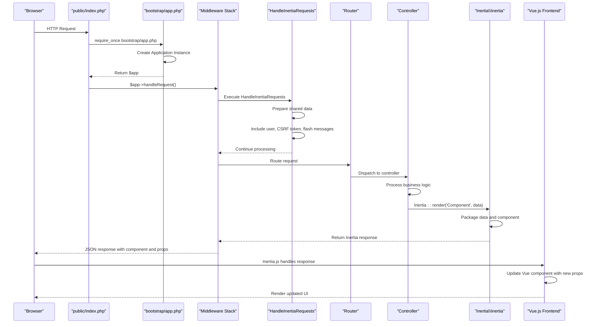

# Request Lifecycle and Middleware


## Table of Contents
1. [Introduction](#introduction)
2. [Request Lifecycle Overview](#request-lifecycle-overview)
3. [Entry Point and Bootstrap Process](#entry-point-and-bootstrap-process)
4. [Service Container and Application Initialization](#service-container-and-application-initialization)
5. [Middleware Execution Flow](#middleware-execution-flow)
6. [HandleInertiaRequests Middleware Analysis](#handleinertiarequests-middleware-analysis)
7. [Session Management Configuration](#session-management-configuration)
8. [Authentication System and Guards](#authentication-system-and-guards)
9. [Routing and Controller Dispatch](#routing-and-controller-dispatch)
10. [CSRF Protection Mechanism](#csrf-protection-mechanism)
11. [Sequence Diagram: Request Processing Flow](#sequence-diagram-request-processing-flow)

## Introduction
This document provides a comprehensive analysis of the Laravel request lifecycle within the meetingai application. It traces the complete journey of an HTTP request from the entry point through the bootstrap process, service container initialization, middleware execution, routing, and controller handling. Special focus is given to the integration with Inertia.js for frontend rendering, session management, authentication mechanisms, and security features such as CSRF protection. The documentation includes detailed configuration analysis and visual representations of the processing flow to aid understanding for both technical and non-technical stakeholders.

## Request Lifecycle Overview
The Laravel request lifecycle in the meetingai application follows a standardized flow from initial request reception to response generation. The process begins at the public/index.php file, which serves as the single entry point for all HTTP requests. From there, the application bootstraps the Laravel framework, initializes the service container, applies global and route-specific middleware, routes the request to the appropriate controller, and finally generates a response—typically through Inertia.js for seamless Vue.js frontend integration. Throughout this process, critical components such as session management, authentication, and CSRF protection are enforced to maintain application security and user state consistency.

## Entry Point and Bootstrap Process
The request lifecycle begins in the public/index.php file, which acts as the front controller for the application. This file performs three essential functions: checking for maintenance mode, registering the Composer autoloader, and bootstrapping the Laravel application.


```php
<?php

use Illuminate\Foundation\Application;
use Illuminate\Http\Request;

define('LARAVEL_START', microtime(true));

// Determine if the application is in maintenance mode...
if (file_exists($maintenance = __DIR__.'/../storage/framework/maintenance.php')) {
    require $maintenance;
}

// Register the Composer autoloader...
require __DIR__.'/../vendor/autoload.php';

// Bootstrap Laravel and handle the request...
/** @var Application $app */
$app = require_once __DIR__.'/../bootstrap/app.php';

$app->handleRequest(Request::capture());
```


The entry point captures the incoming HTTP request using Request::capture() and delegates processing to the application instance. Before handling the request, it checks for a maintenance mode flag file, allowing administrators to temporarily disable the application during updates or maintenance.

**Section sources**
- [public/index.php](file://public/index.php#L1-L21)

## Service Container and Application Initialization
The bootstrap/app.php file is responsible for creating and configuring the Laravel application instance. This file uses the Illuminate\Foundation\Application class to set up the service container, define routing configuration, and register middleware.


```php
<?php

use App\Http\Middleware\HandleInertiaRequests;
use Illuminate\Foundation\Application;
use Illuminate\Foundation\Configuration\Exceptions;
use Illuminate\Foundation\Configuration\Middleware;
use Illuminate\Http\Middleware\AddLinkHeadersForPreloadedAssets;
use Symfony\Component\HttpFoundation\Response;

return Application::configure(basePath: dirname(__DIR__))
    ->withRouting(
        web: __DIR__.'/../routes/web.php',
        commands: __DIR__.'/../routes/console.php',
        health: '/up',
    )
    ->withMiddleware(function (Middleware $middleware) {
        $middleware->web(append: [
            HandleInertiaRequests::class,
            AddLinkHeadersForPreloadedAssets::class,
        ]);
    })
    ->withExceptions(function (Exceptions $exceptions) {
        
    })->create();
```


The application is configured with:
- Base path set to the project root directory
- Web routes defined in routes/web.php
- Console routes defined in routes/console.php
- Health check endpoint at '/up'
- Global web middleware stack with HandleInertiaRequests and AddLinkHeadersForPreloadedAssets

The service container is initialized with all core Laravel services, enabling dependency injection throughout the application. The withMiddleware method appends custom middleware to the default web middleware group, ensuring they are executed for all web requests.

**Section sources**
- [bootstrap/app.php](file://bootstrap/app.php#L1-L25)

## Middleware Execution Flow
Middleware in Laravel provides a convenient mechanism for filtering HTTP requests entering the application. The meetingai application uses a layered middleware approach to handle cross-cutting concerns such as authentication, session management, and frontend integration.

The middleware execution order follows this sequence:
1. Global middleware (defined in bootstrap/app.php)
2. Route middleware (applied to specific routes)
3. Controller middleware (applied within controllers)

In this application, the primary middleware of interest is HandleInertiaRequests, which is appended to the web middleware group. This ensures it executes for all web requests, preparing the environment for Inertia.js server-side rendering and shared data injection.

Additional middleware implicitly included in Laravel's web middleware group (not explicitly shown but present by default) includes:
- \Illuminate\Cookie\Middleware\EncryptCookies
- \Illuminate\Cookie\Middleware\AddQueuedCookiesToResponse
- \Illuminate\Session\Middleware\StartSession
- \Illuminate\View\Middleware\ShareErrorsFromSession
- \Illuminate\Foundation\Http\Middleware\ValidatePostSize
- \Illuminate\Foundation\Http\Middleware\CheckForMaintenanceMode

These middleware components handle essential functions such as session initialization, cookie encryption, and error sharing between requests.

**Section sources**
- [bootstrap/app.php](file://bootstrap/app.php#L15-L19)

## HandleInertiaRequests Middleware Analysis
The HandleInertiaRequests middleware is a critical component for integrating Laravel with the Vue.js frontend via Inertia.js. This middleware extends the base Inertia\Middleware class and customizes the shared data that is passed to the frontend on each request.


```php
<?php

namespace App\Http\Middleware;

use Illuminate\Http\Request;
use Inertia\Middleware;
use Tighten\Ziggy\Ziggy;

class HandleInertiaRequests extends Middleware
{
    protected $rootView = 'app';

    public function version(Request $request): ?string
    {
        return parent::version($request);
    }

    public function share(Request $request): array
    {
        return array_merge(parent::share($request), [
            'flash' => [
                'success' => fn () => $request->session()->get('success'),
                'error' => fn () => $request->session()->get('error'),
                'warning' => fn () => $request->session()->get('warning'),
                'info' => fn () => $request->session()->get('info'),
            ],
            'errors' => function () use ($request) {
                return $request->session()->get('errors')
                    ? $request->session()->get('errors')->getBag('default')->getMessages()
                    : (object) [];
            },
            'csrf_token' => fn () => csrf_token(),
            'app' => [
                'name' => config('app.name'),
                'url' => config('app.url'),
                'environment' => config('app.env'),
            ],
            'ziggy' => [
                ...(new Ziggy)->toArray(),
                'location' => $request->url(),
            ],
    
            'user' => fn () => $request->user()
                ? $request->user()->only('id', 'name', 'email')
                : null,
        ]);
    }
}
```


Key features of this middleware:

**Root View Configuration**: The $rootView property is set to 'app', which corresponds to resources/views/app.blade.php—the main layout file that loads the Vue.js application.

**Shared Data**: The share method returns an array of data that is automatically serialized and made available to the Inertia.js frontend. This includes:
- **Flash Messages**: Success, error, warning, and info messages from the session
- **Validation Errors**: Error messages from the session's error bag
- **CSRF Token**: Security token for form submissions
- **Application Metadata**: Name, URL, and environment
- **Ziggy Routes**: JavaScript-friendly route definitions for client-side navigation
- **Authenticated User**: Basic user information (id, name, email) if logged in

The middleware uses lazy evaluation (closures) for data retrieval, ensuring values are only computed when actually needed, improving performance.

**Section sources**
- [app/Http/Middleware/HandleInertiaRequests.php](file://app/Http/Middleware/HandleInertiaRequests.php#L1-L68)

## Session Management Configuration
Session management in the meetingai application is configured through the config/session.php file, which defines how user sessions are stored, secured, and maintained across requests.


```php
<?php

use Illuminate\Support\Str;

return [
    'driver' => env('SESSION_DRIVER', 'database'),
    'lifetime' => (int) env('SESSION_LIFETIME', 120),
    'expire_on_close' => env('SESSION_EXPIRE_ON_CLOSE', false),
    'encrypt' => env('SESSION_ENCRYPT', false),
    'files' => storage_path('framework/sessions'),
    'connection' => env('SESSION_CONNECTION'),
    'table' => env('SESSION_TABLE', 'sessions'),
    'store' => env('SESSION_STORE'),
    'lottery' => [2, 100],
    'cookie' => env(
        'SESSION_COOKIE',
        Str::slug(env('APP_NAME', 'laravel'), '_').'_session'
    ),
    'path' => env('SESSION_PATH', '/'),
    'domain' => env('SESSION_DOMAIN'),
    'secure' => env('SESSION_SECURE_COOKIE'),
    'http_only' => env('SESSION_HTTP_ONLY', true),
    'same_site' => env('SESSION_SAME_SITE', 'lax'),
    'partitioned' => env('SESSION_PARTITIONED_COOKIE', false),
];
```


**Configuration Details**:

:Driver: The session driver is set to 'database' by default, storing session data in the database rather than files. This provides better scalability and reliability in production environments.

:Lifetime: Sessions expire after 120 minutes of inactivity, configurable via the SESSION_LIFETIME environment variable.

:Encryption: Session data is not encrypted by default (SESSION_ENCRYPT=false), though this can be enabled for enhanced security.

:Cookie Security: The session cookie is configured with important security settings:
- :HttpOnly: True (prevents JavaScript access to the cookie)
- :Secure: Configurable (should be true in production with HTTPS)
- :SameSite: 'lax' (provides CSRF protection by restricting cross-site cookie sending)

:Storage: When using the database driver, sessions are stored in the 'sessions' table, which must be created via migration.

The database session driver is particularly appropriate for this application as it provides reliable session storage that can be easily monitored and managed, especially important for an application handling meeting data and user interactions.

**Section sources**
- [config/session.php](file://config/session.php#L1-L218)

## Authentication System and Guards
The authentication system in meetingai is configured through the config/auth.php file, which defines the guards, providers, and password reset mechanisms used by the application.


```php
<?php

return [
    'defaults' => [
        'guard' => env('AUTH_GUARD', 'web'),
        'passwords' => env('AUTH_PASSWORD_BROKER', 'users'),
    ],

    'guards' => [
        'web' => [
            'driver' => 'session',
            'provider' => 'users',
        ],
    ],

    'providers' => [
        'users' => [
            'driver' => 'eloquent',
            'model' => env('AUTH_MODEL', App\Models\User::class),
        ],
    ],

    'passwords' => [
        'users' => [
            'provider' => 'users',
            'table' => env('AUTH_PASSWORD_RESET_TOKEN_TABLE', 'password_reset_tokens'),
            'expire' => 60,
            'throttle' => 60,
        ],
    ],

    'password_timeout' => env('AUTH_PASSWORD_TIMEOUT', 10800),
];
```


**Authentication Configuration**:

:Default Guard: The 'web' guard is used by default, which utilizes session-based authentication. This is appropriate for traditional web applications where users log in and maintain state across requests.

:Guard Configuration: The 'web' guard uses the 'session' driver with the 'users' provider. The session driver stores authentication state in the user's session, validated on each request.

:User Provider: The 'users' provider uses the Eloquent driver with the App\Models\User model. This allows authentication against the users database table using Laravel's Eloquent ORM.

:Password Reset: Password reset tokens are stored in the 'password_reset_tokens' table and expire after 60 minutes. A throttle of 60 seconds prevents abuse of the password reset functionality.

The authentication system integrates seamlessly with the session management configuration, maintaining user state across requests. When a user logs in, their authentication state is stored in the session, and on subsequent requests, the session is checked to determine if the user is authenticated.

The HandleInertiaRequests middleware leverages this system by including the authenticated user's basic information in the shared data, making it immediately available to the Vue.js frontend without requiring a separate API call.

**Section sources**
- [config/auth.php](file://config/auth.php#L1-L116)

## Routing and Controller Dispatch
Routing in the meetingai application is defined in the routes/web.php file, which maps HTTP requests to controller actions. The application uses both closure-based routes and resourceful controllers to handle different types of requests.


```php
<?php

use App\Http\Controllers\AIAgentController;
use App\Http\Controllers\ClientController;
use App\Http\Controllers\MeetingController;
use Illuminate\Support\Facades\Route;
use Inertia\Inertia;

Route::get('/', function () {
    // Dashboard data
    $recentMeetings = \App\Models\Meeting::with('client')
        ->orderBy('created_at', 'desc')
        ->limit(5)
        ->get();

    $stats = [
        'total_clients' => \App\Models\Client::count(),
        'total_meetings' => \App\Models\Meeting::count(),
        'completed_meetings' => \App\Models\Meeting::where('status', 'completed')->count(),
        'processing_meetings' => \App\Models\Meeting::where('status', 'processing')->count(),
        'pending_meetings' => \App\Models\Meeting::where('status', 'pending')->count(),
        'failed_meetings' => \App\Models\Meeting::where('status', 'failed')->count(),
    ];

    $topClients = \App\Models\Client::withCount('meetings')
        ->orderBy('meetings_count', 'desc')
        ->limit(5)
        ->get(['id', 'name']);

    return Inertia::render('Dashboard', [
        'recentMeetings' => $recentMeetings,
        'stats' => $stats,
        'topClients' => $topClients,
    ]);
})->name('home');

Route::resource('clients', ClientController::class);
Route::resource('meetings', MeetingController::class);

// API endpoint for real-time meeting status updates
Route::get('meetings/{meeting}/status', [MeetingController::class, 'status'])->name('meetings.status');

// AI Agent routes
Route::get('ai/chat', [AIAgentController::class, 'index'])->name('ai.chat');
Route::post('ai/chat', [AIAgentController::class, 'chat'])->name('ai.chat.send');
Route::post('ai/search', [AIAgentController::class, 'search'])->name('ai.search');
```


**Routing Patterns**:

:Closure Route: The root route ('/') uses a closure to fetch dashboard data and render the Dashboard component via Inertia::render(). This approach is suitable for simple routes that don't require a dedicated controller.

:Resourceful Routes: The clients and meetings resources use Route::resource(), which automatically creates RESTful routes for CRUD operations (index, create, store, show, edit, update, destroy).

:API Endpoints: Specific API endpoints like meetings/{meeting}/status provide real-time data updates without full page reloads.

:AI Agent Routes: Dedicated routes for AI functionality, including chat and search capabilities.

All routes implicitly use the web middleware group (including HandleInertiaRequests), ensuring that Inertia.js integration and shared data are available throughout the application. The Inertia::render() method returns an Inertia response that is interpreted by the frontend to update the Vue.js application state without a full page refresh.

**Section sources**
- [routes/web.php](file://routes/web.php#L1-L47)

## CSRF Protection Mechanism
Cross-Site Request Forgery (CSRF) protection in the meetingai application is implemented through Laravel's built-in CSRF middleware and token generation system. Although the specific CSRF middleware is not explicitly listed in the application's configuration, it is automatically included in Laravel's default web middleware stack.

The application implements CSRF protection through multiple mechanisms:

**CSRF Token Generation**: The HandleInertiaRequests middleware includes the CSRF token in the shared data:

```php
'csrf_token' => fn () => csrf_token(),
```


This makes the CSRF token automatically available to the Vue.js frontend as $page.props.csrf_token, allowing it to be included in all AJAX requests.

**Form Integration**: Laravel's csrf_token() helper function generates a cryptographically secure token that should be included in all forms. While not explicitly shown in the code, this would typically be implemented as:

```html
<input type="hidden" name="_token" value="{{ csrf_token() }}">
```


**AJAX Requests**: The Inertia.js library automatically includes the CSRF token in the X-CSRF-TOKEN header for all AJAX requests, using the token provided in the shared data.

**Cookie Configuration**: The session configuration enhances CSRF protection through:
- :SameSite: 'lax' setting prevents the session cookie from being sent in cross-site requests
- :HttpOnly: true prevents JavaScript access to the session cookie
- :Secure: Configurable for HTTPS-only transmission in production

The combination of these mechanisms provides robust protection against CSRF attacks by ensuring that only requests originating from the same origin can successfully perform state-changing operations.

**Section sources**
- [app/Http/Middleware/HandleInertiaRequests.php](file://app/Http/Middleware/HandleInertiaRequests.php#L51)
- [config/session.php](file://config/session.php#L158-L184)

## Sequence Diagram: Request Processing Flow
The following sequence diagram illustrates the complete request processing flow in the meetingai application, from the initial HTTP request to the final response generation.





**Diagram sources**
- [public/index.php](file://public/index.php#L1-L21)
- [bootstrap/app.php](file://bootstrap/app.php#L1-L25)
- [app/Http/Middleware/HandleInertiaRequests.php](file://app/Http/Middleware/HandleInertiaRequests.php#L1-L68)
- [routes/web.php](file://routes/web.php#L1-L47)

**Section sources**
- [public/index.php](file://public/index.php#L1-L21)
- [bootstrap/app.php](file://bootstrap/app.php#L1-L25)
- [app/Http/Middleware/HandleInertiaRequests.php](file://app/Http/Middleware/HandleInertiaRequests.php#L1-L68)
- [routes/web.php](file://routes/web.php#L1-L47)

The sequence diagram demonstrates how the request flows through the Laravel application, highlighting the integration between server-side PHP components and client-side Vue.js rendering via Inertia.js. The process maintains user state through session management and authentication, while ensuring security through CSRF protection and proper middleware execution order.

**Referenced Files in This Document**   
- [public/index.php](file://public/index.php)
- [bootstrap/app.php](file://bootstrap/app.php)
- [app/Http/Middleware/HandleInertiaRequests.php](file://app/Http/Middleware/HandleInertiaRequests.php)
- [config/session.php](file://config/session.php)
- [config/auth.php](file://config/auth.php)
- [routes/web.php](file://routes/web.php)