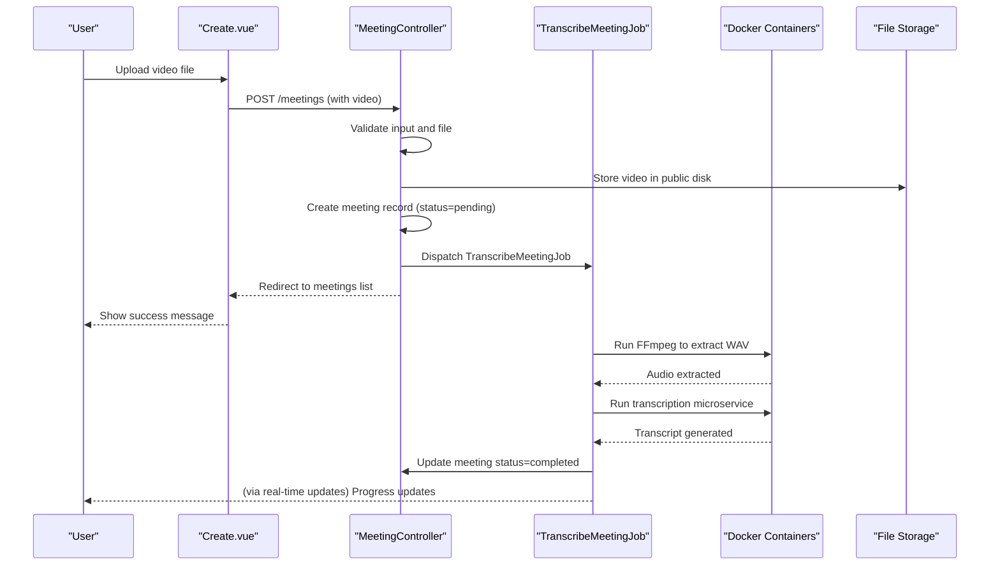
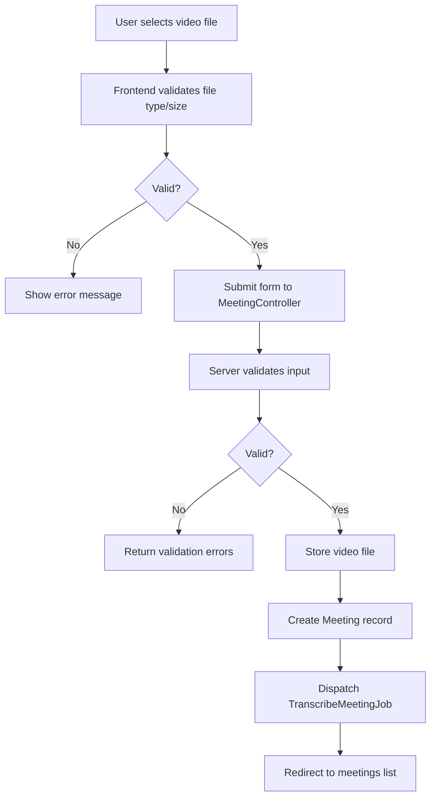
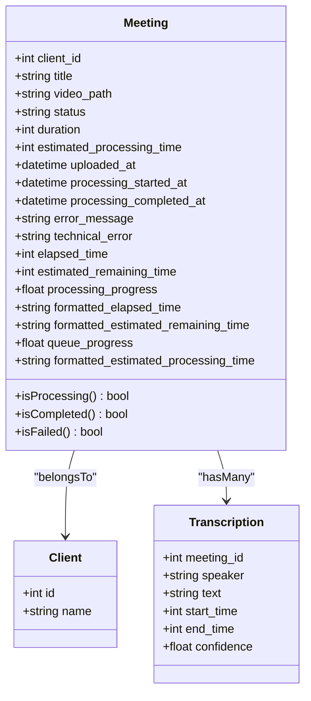
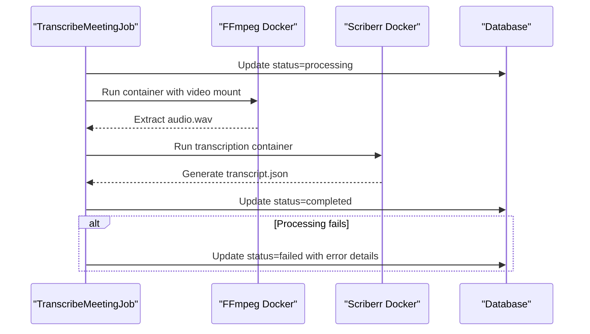
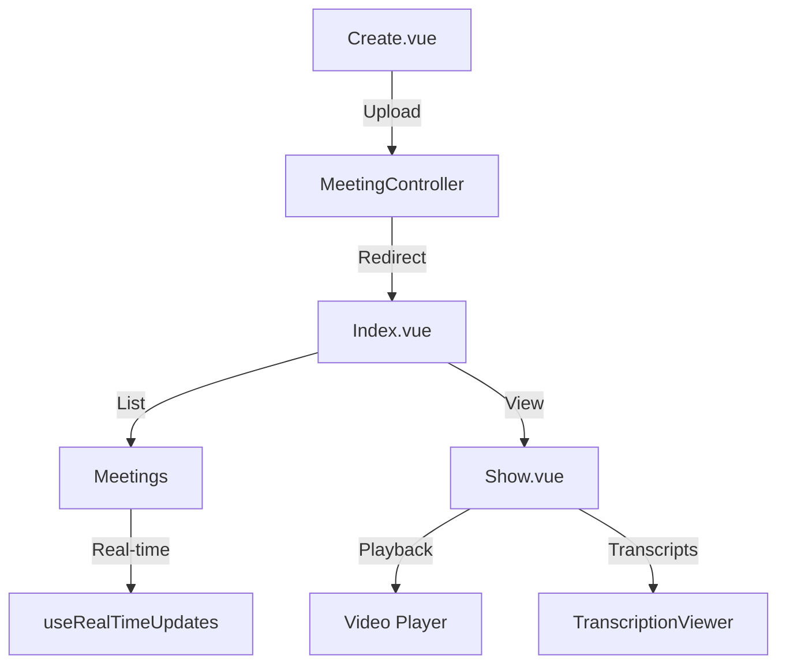
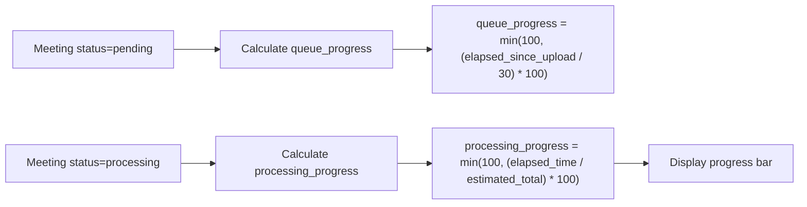
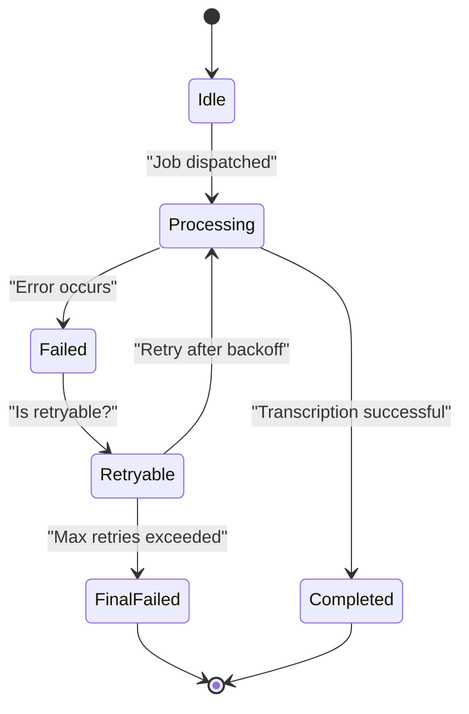
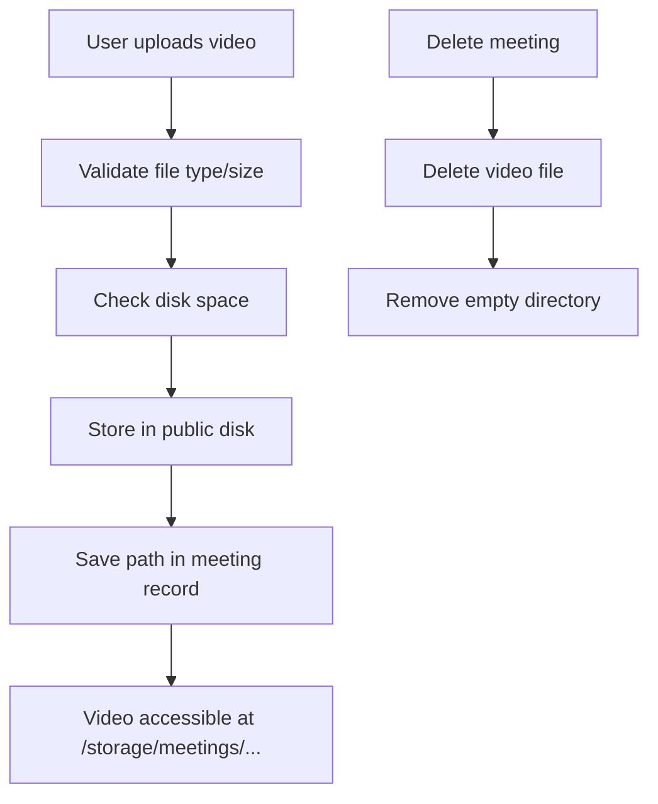

# Meeting Management

## Table of Contents
1. [Meeting Lifecycle Overview](#meeting-lifecycle-overview)
2. [Meeting Creation and Upload](#meeting-creation-and-upload)
3. [Meeting Model and Database Structure](#meeting-model-and-database-structure)
4. [Asynchronous Transcription Processing](#asynchronous-transcription-processing)
5. [Frontend Components](#frontend-components)
6. [Status Tracking and Progress Calculation](#status-tracking-and-progress-calculation)
7. [Error Handling and Recovery](#error-handling-and-recovery)
8. [Video Upload and Storage Strategy](#video-upload-and-storage-strategy)

## Meeting Lifecycle Overview

The meeting management system follows a complete lifecycle from user upload to transcription and playback. The process begins with the user uploading a video file through the frontend **Create.vue** component. The request is handled by the **MeetingController**, which validates and stores the meeting metadata and video file. Once stored, a **TranscribeMeetingJob** is dispatched to process the video asynchronously. The job extracts audio using FFmpeg in Docker, transcribes the content via a microservice, and updates the meeting status accordingly. Users can monitor progress in real time through the **Index.vue** listing and view the final transcription and video in **Show.vue**.

**Diagram sources**
- [MeetingController.php](file://app/Http/Controllers/MeetingController.php#L1-L305)
- [TranscribeMeetingJob.php](file://app/Jobs/TranscribeMeetingJob.php#L1-L400)
- [Create.vue](file://resources/js/pages/Meetings/Create.vue#L1-L439)

**Section sources**
- [MeetingController.php](file://app/Http/Controllers/MeetingController.php#L1-L305)
- [TranscribeMeetingJob.php](file://app/Jobs/TranscribeMeetingJob.php#L1-L400)
- [Create.vue](file://resources/js/pages/Meetings/Create.vue#L1-L439)

## Meeting Creation and Upload

The meeting upload process begins in the **Create.vue** frontend component, which provides a drag-and-drop interface for video upload. The component performs client-side validation on file type, size (1MB minimum, 500MB maximum), and format (MP4, MOV, AVI, WebM).

When the form is submitted, the data is sent to the **MeetingController@store** method. This method performs server-side validation and creates a new **Meeting** record with initial status "pending". The video file is stored in a structured path: `meetings/{client_id}/{meeting_id}/video.{extension}` on the public disk for direct access.

**Diagram sources**
- [MeetingController.php](file://app/Http/Controllers/MeetingController.php#L1-L305)
- [Create.vue](file://resources/js/pages/Meetings/Create.vue#L1-L439)

**Section sources**
- [MeetingController.php](file://app/Http/Controllers/MeetingController.php#L1-L305)
- [Create.vue](file://resources/js/pages/Meetings/Create.vue#L1-L439)

## Meeting Model and Database Structure

The **Meeting** model represents the core entity in the system, storing metadata and processing state. The database schema is defined across multiple migrations:

- `2025_08_10_135205_create_meetings_table.php`: Initial meeting table with basic fields
- `2025_08_10_145951_add_estimated_processing_time_to_meetings_table.php`: Adds estimated processing time
- `2025_08_10_160251_add_error_fields_to_meetings_table.php`: Adds error tracking fields

The model includes the following key attributes:

- **status**: Current state of the meeting (pending, processing, completed, failed)
- **estimated_processing_time**: Estimated duration of transcription in seconds
- **processing_started_at**: Timestamp when processing began
- **processing_completed_at**: Timestamp when processing ended
- **error_message**: User-friendly error description
- **technical_error**: Detailed technical error message
- **elapsed_time**: Computed attribute showing time elapsed since processing started
- **estimated_remaining_time**: Computed attribute showing estimated time remaining
- **processing_progress**: Computed attribute showing progress as percentage

**Diagram sources**
- [Meeting.php](file://app/Models/Meeting.php#L1-L179)
- [create_meetings_table.php](file://database/migrations/2025_08_10_135205_create_meetings_table.php)
- [add_estimated_processing_time_to_meetings_table.php](file://database/migrations/2025_08_10_145951_add_estimated_processing_time_to_meetings_table.php)
- [add_error_fields_to_meetings_table.php](file://database/migrations/2025_08_10_160251_add_error_fields_to_meetings_table.php)

**Section sources**
- [Meeting.php](file://app/Models/Meeting.php#L1-L179)

## Asynchronous Transcription Processing

The **TranscribeMeetingJob** handles the asynchronous processing of meeting videos. The job runs in a queue with a 1-hour timeout and allows up to 3 retry attempts. It follows a two-step Docker-based processing pipeline:

1. **Audio Extraction**: Uses FFmpeg in a Docker container to extract WAV audio from the video
2. **Transcription**: Uses a custom transcription microservice (scriberr-local) to generate the transcript

The job updates the meeting status to "processing" when it starts and "completed" or "failed" when it finishes. It dynamically determines the number of CPU threads available on the host system to optimize transcription performance.

**Diagram sources**
- [TranscribeMeetingJob.php](file://app/Jobs/TranscribeMeetingJob.php#L1-L400)

**Section sources**
- [TranscribeMeetingJob.php](file://app/Jobs/TranscribeMeetingJob.php#L1-L400)

## Frontend Components

The frontend consists of three main Vue components for meeting management:

### Create.vue
The upload interface with drag-and-drop functionality, file validation, and upload progress tracking. It prevents navigation during upload and provides retry functionality for failed uploads.

### Index.vue
The meeting listing page with filtering by client, status, and date range. It supports sorting by multiple criteria and displays real-time status updates using the **useRealTimeUpdates** composable. The component renders status badges and progress indicators for each meeting.

### Show.vue
The meeting playback and transcription viewer. It displays the video player and synchronized transcription segments. The component handles video URL generation and error states when files are missing.

**Diagram sources**
- [Create.vue](file://resources/js/pages/Meetings/Create.vue#L1-L439)
- [Index.vue](file://resources/js/pages/Meetings/Index.vue#L1-L357)
- [Show.vue](file://resources/js/pages/Meetings/Show.vue#L1-L320)

**Section sources**
- [Create.vue](file://resources/js/pages/Meetings/Create.vue#L1-L439)
- [Index.vue](file://resources/js/pages/Meetings/Index.vue#L1-L357)
- [Show.vue](file://resources/js/pages/Meetings/Show.vue#L1-L320)

## Status Tracking and Progress Calculation

The system provides real-time status tracking through computed attributes on the **Meeting** model:

- **queue_progress**: For pending meetings, simulates progress based on time since upload (assumes 30-second queue wait)
- **processing_progress**: For processing meetings, calculates percentage based on elapsed time vs. estimated processing time
- **estimated_remaining_time**: Calculates remaining seconds based on estimated total processing time

The frontend components use these values to display progress bars and time estimates. The **MeetingController@status** endpoint provides a JSON API for real-time status updates, which the frontend polls or receives via real-time connections.

Example progress calculation:
- Video duration: 1200 seconds (20 minutes)
- Estimated processing time: max(10, 1200/60) = 20 seconds
- Elapsed processing time: 8 seconds
- Processing progress: (8/20) * 100 = 40%
- Estimated remaining time: 20 - 8 = 12 seconds

**Section sources**
- [Meeting.php](file://app/Models/Meeting.php#L1-L179)
- [MeetingController.php](file://app/Http/Controllers/MeetingController.php#L277-L305)

## Error Handling and Recovery

The system implements comprehensive error handling at multiple levels:

### Frontend
- Client-side validation with immediate feedback
- Upload retry mechanism with exponential backoff
- Prevention of navigation during upload
- Toast notifications for success and error states

### Backend
- Validation exceptions with user-friendly messages
- Runtime exceptions for file system and storage issues
- Comprehensive logging of errors
- Transactional cleanup (deleting meeting records on failure)

### Job Processing
- Retry mechanism with configurable backoff (60s, 300s, 900s)
- Failure handling with user-friendly error mapping
- Temporary file cleanup after failures
- Technical error logging for debugging

Common error scenarios and handling:

- **File not found**: User message "The video file could not be found"
- **WAV conversion failure**: User message "Failed to process the video file"
- **Docker service unavailable**: User message "Transcription service is temporarily unavailable"
- **Timeout**: User message "Transcription took too long to complete"
- **Insufficient storage**: User message "Insufficient storage space available"

**Section sources**
- [TranscribeMeetingJob.php](file://app/Jobs/TranscribeMeetingJob.php#L1-L400)
- [MeetingController.php](file://app/Http/Controllers/MeetingController.php#L1-L305)
- [Create.vue](file://resources/js/pages/Meetings/Create.vue#L1-L439)

## Video Upload and Storage Strategy

The system implements a structured approach to video storage and access:

### Storage Configuration
- Uses Laravel's "public" disk for video storage
- Files are stored in `storage/app/public/meetings/` directory
- Organized by client ID and meeting ID: `meetings/{client_id}/{meeting_id}/video.{ext}`
- Direct URL access via `asset('storage/' . $video_path)`

### File Validation
- Server-side validation using Laravel's File rule with types, min, and max constraints
- File integrity check using `$file->isValid()`
- Disk space check (requires 1.5x file size for processing overhead)
- Post-storage verification to ensure file was saved

### Security Considerations
- File path is stored in database, not user-controlled
- Direct file access only through authenticated routes
- Directory structure prevents path traversal
- File deletion handled through controller with proper authorization

### Cleanup Process
- Video files are deleted when meetings are deleted
- Empty directories are removed after file deletion
- Temporary processing files (WAV, JSON) are cleaned up after job completion or failure

**Section sources**
- [MeetingController.php](file://app/Http/Controllers/MeetingController.php#L1-L305)
- [TranscribeMeetingJob.php](file://app/Jobs/TranscribeMeetingJob.php#L1-L400)

**Referenced Files in This Document**   
- [MeetingController.php](file://app/Http/Controllers/MeetingController.php#L1-L305)
- [Meeting.php](file://app/Models/Meeting.php#L1-L179)
- [TranscribeMeetingJob.php](file://app/Jobs/TranscribeMeetingJob.php#L1-L400)
- [Create.vue](file://resources/js/pages/Meetings/Create.vue#L1-L439)
- [Index.vue](file://resources/js/pages/Meetings/Index.vue#L1-L357)
- [Show.vue](file://resources/js/pages/Meetings/Show.vue#L1-L320)
- [create_meetings_table.php](file://database/migrations/2025_08_10_135205_create_meetings_table.php)
- [add_estimated_processing_time_to_meetings_table.php](file://database/migrations/2025_08_10_145951_add_estimated_processing_time_to_meetings_table.php)
- [add_error_fields_to_meetings_table.php](file://database/migrations/2025_08_10_160251_add_error_fields_to_meetings_table.php)