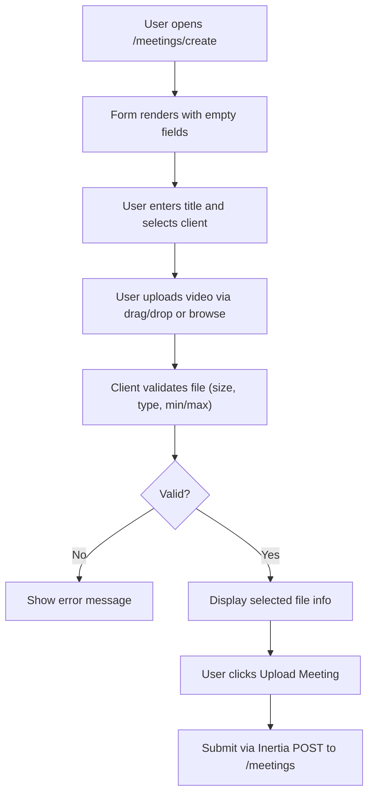
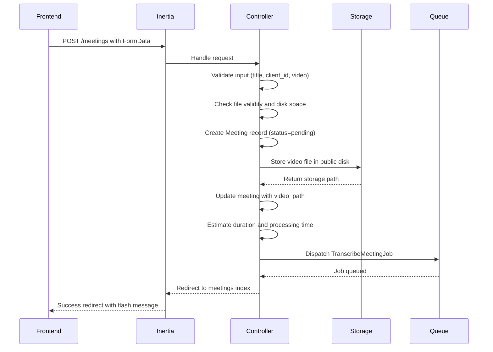
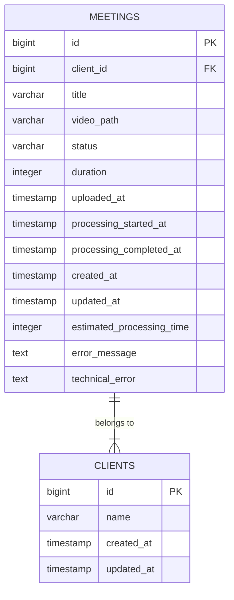
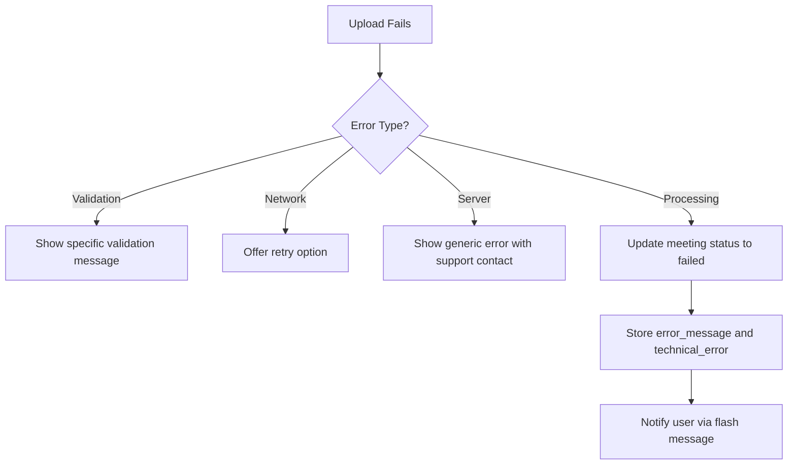

# Meeting Upload


## Table of Contents
1. [Meeting Upload](#meeting-upload)
2. [Frontend: Create.vue Component](#frontend-createvue-component)
3. [Backend: MeetingController Handling](#backend-meetingcontroller-handling)
4. [Meeting Model and Database Schema](#meeting-model-and-database-schema)
5. [File Validation Rules](#file-validation-rules)
6. [Storage Strategy Using Laravel Filesystem](#storage-strategy-using-laravel-filesystem)
7. [Meeting Record Creation and Initial State](#meeting-record-creation-and-initial-state)
8. [Form Handling with Inertia.js](#form-handling-with-inertiajs)
9. [Error Feedback and User Experience](#error-feedback-and-user-experience)
10. [Security Considerations](#security-considerations)
11. [Common Issues and Troubleshooting](#common-issues-and-troubleshooting)
12. [Processing Workflow and Job Dispatch](#processing-workflow-and-job-dispatch)

## Frontend: Create.vue Component

The `Create.vue` component located at `resources/js/pages/Meetings/Create.vue` serves as the user interface for uploading new meeting videos. It is built using Vue 3 with TypeScript and leverages Inertia.js for seamless page transitions within the Laravel application.

The form includes three primary input fields:
- **Meeting Title**: A required text input with client-side validation
- **Client Selection**: A dropdown populated with existing clients
- **Video Upload**: A drag-and-drop interface supporting MP4, MOV, AVI, and WebM formats

The component implements real-time feedback through:
- Visual drag-and-drop indicators
- File size and format validation
- Upload progress tracking
- Error recovery with retry functionality
- Prevention of accidental navigation during upload





**Diagram sources**
- [Create.vue](file://resources/js/pages/Meetings/Create.vue#L1-L439)

**Section sources**
- [Create.vue](file://resources/js/pages/Meetings/Create.vue#L1-L439)

## Backend: MeetingController Handling

The `MeetingController@store` method handles the submission of meeting uploads from the frontend. It performs server-side validation, stores the video file, creates a database record, and dispatches a background job for processing.

Key responsibilities of the `store` method:
- Validates all input data including file integrity
- Creates a meeting record before file storage
- Stores the video file in a structured directory
- Updates the meeting with file path and metadata
- Dispatches the `TranscribeMeetingJob` for asynchronous processing





**Diagram sources**
- [MeetingController.php](file://app/Http/Controllers/MeetingController.php#L1-L305)

**Section sources**
- [MeetingController.php](file://app/Http/Controllers/MeetingController.php#L1-L305)

## Meeting Model and Database Schema

The `Meeting` model defines the structure and behavior of meeting records in the application. It includes relationships, attribute casting, and computed properties for status tracking.

### Database Schema
The meetings table is created through migration `2025_08_10_135205_create_meetings_table.php` and subsequently modified by two additional migrations.





**Diagram sources**
- [2025_08_10_135205_create_meetings_table.php](file://database/migrations/2025_08_10_135205_create_meetings_table.php#L1-L41)
- [2025_08_10_145951_add_estimated_processing_time_to_meetings_table.php](file://database/migrations/2025_08_10_145951_add_estimated_processing_time_to_meetings_table.php#L1-L29)
- [2025_08_10_160251_add_error_fields_to_meetings_table.php](file://database/migrations/2025_08_10_160251_add_error_fields_to_meetings_table.php#L1-L29)

### Model Properties
- **Fillable attributes**: client_id, title, video_path, status, duration, estimated_processing_time, uploaded_at, processing_started_at, processing_completed_at, error_message, technical_error
- **Casted attributes**: Dates as datetime, duration and estimated_processing_time as integers
- **Appended attributes**: Computed values like elapsed_time, processing_progress, formatted times

**Section sources**
- [Meeting.php](file://app/Models/Meeting.php#L1-L179)

## File Validation Rules

The system enforces strict validation rules for uploaded video files to ensure compatibility and prevent abuse.

### Client-Side Validation (Create.vue)
- **File types**: MP4, MOV, AVI, WebM (via MIME types: video/mp4, video/quicktime, video/x-msvideo, video/webm)
- **Maximum size**: 500MB (524,288KB)
- **Minimum size**: 1MB (1,024 bytes)
- **Required fields**: title, client_id, video


```typescript
const validateFile = (file: File): boolean => {
  const maxSize = 500 * 1024 * 1024 // 500MB
  const minSize = 1024 * 1024 // 1MB
  const allowedTypes = ['video/mp4', 'video/quicktime', 'video/x-msvideo', 'video/webm']
  
  if (!allowedTypes.includes(file.type)) {
    uploadError.value = 'Please select a valid video file (MP4, MOV, AVI, or WebM)'
    return false
  }
  
  if (file.size > maxSize) {
    uploadError.value = 'File size must be less than 500MB'
    return false
  }
  
  if (file.size < minSize) {
    uploadError.value = 'File size must be at least 1MB'
    return false
  }
  
  return true
}
```


### Server-Side Validation (MeetingController.php)

```php
$validated = $request->validate([
    'title' => 'required|string|max:255',
    'client_id' => 'required|exists:clients,id',
    'video' => [
        'required',
        'file',
        File::types(['mp4', 'mov', 'avi', 'webm'])
            ->max(500 * 1024) // 500MB max
            ->min(1024) // 1MB min
    ]
]);
```


Additional server-side checks:
- File integrity (`$videoFile->isValid()`)
- Available disk space (requires 1.5x file size)
- File existence after storage

**Section sources**
- [Create.vue](file://resources/js/pages/Meetings/Create.vue#L1-L439)
- [MeetingController.php](file://app/Http/Controllers/MeetingController.php#L1-L305)

## Storage Strategy Using Laravel Filesystem

The application uses Laravel's filesystem abstraction to manage video storage with the `public` disk configuration.

### Filesystem Configuration

```php
'public' => [
    'driver' => 'local',
    'root' => storage_path('app/public'),
    'url' => env('APP_URL').'/storage',
    'visibility' => 'public',
],
```


### Storage Implementation
- **Disk**: `public` (allows direct web access via symbolic link)
- **Path structure**: `meetings/{client_id}/{meeting_id}/video.{extension}`
- **Symbolic link**: `public/storage` → `storage/app/public` (created via `php artisan storage:link`)

### File Storage Process
1. Extract original file extension
2. Create directory path using client_id and meeting_id
3. Store file as `video.{extension}` in the designated path
4. Return relative path for database storage


```php
$storagePath = "meetings/{$validated['client_id']}/{$meeting->id}";
$videoPath = $videoFile->storeAs($storagePath, $fileName, 'public');
```


This strategy provides:
- Organized file structure by client and meeting
- Public accessibility for video playback
- Protection against filename conflicts
- Easy cleanup when meetings are deleted

**Section sources**
- [filesystems.php](file://config/filesystems.php#L1-L81)
- [MeetingController.php](file://app/Http/Controllers/MeetingController.php#L1-L305)

## Meeting Record Creation and Initial State

When a meeting is uploaded, a database record is created with specific default values and initial state.

### Initial Database Record
Upon creation, the meeting record contains:
- **status**: `pending` (default from database schema)
- **uploaded_at**: Current timestamp
- **video_path**: Empty string (updated after file storage)
- **processing_progress**: Null (computed attribute)
- **client association**: Set from form input (client_id)

### Default Values in Database Schema

```php
$table->string('status', 50)->default('pending');
$table->timestamp('uploaded_at')->nullable();
$table->string('video_path', 500);
```


### Post-Storage Updates
After successful file storage, the record is updated with:
- **video_path**: Relative path in public storage
- **duration**: Estimated duration (5-60 minutes, random for demo)
- **estimated_processing_time**: Calculated as max(10, duration/60) seconds

The initial state represents a meeting that has been uploaded but not yet processed for transcription.

**Section sources**
- [MeetingController.php](file://app/Http/Controllers/MeetingController.php#L1-L305)
- [2025_08_10_135205_create_meetings_table.php](file://database/migrations/2025_08_10_135205_create_meetings_table.php#L1-L41)
- [Meeting.php](file://app/Models/Meeting.php#L1-L179)

## Form Handling with Inertia.js

The meeting upload form uses Inertia.js for a SPA-like experience without full page reloads.

### Form Submission Process

```typescript
const submit = () => {
  if (!form.video || !validateFile(form.video)) return

  processing.value = true
  uploadProgress.value = 0
  uploadError.value = ''

  const formData = new FormData()
  formData.append('title', form.title)
  formData.append('client_id', form.client_id)
  formData.append('video', form.video)

  router.post(route('meetings.store'), formData, {
    onProgress: (progress) => {
      if (progress?.percentage !== undefined) {
        uploadProgress.value = Math.round(progress.percentage)
      }
    },
    onSuccess: () => {
      // Handle success
    },
    onError: (errors) => {
      // Handle validation errors
    }
  })
}
```


### Key Features
- **FormData**: Used to send file uploads with text fields
- **Progress tracking**: Real-time upload progress via `onProgress` callback
- **Validation errors**: Automatic population of error messages
- **Flash messages**: Success/error messages persisted across redirects
- **Prevent navigation**: `beforeunload` event prevents accidental page exit during upload

**Section sources**
- [Create.vue](file://resources/js/pages/Meetings/Create.vue#L1-L439)

## Error Feedback and User Experience

The system provides comprehensive error handling and user feedback at multiple levels.

### Client-Side Error Handling
- **Form validation**: Immediate feedback for missing title, client, or video
- **File validation**: Specific messages for invalid type, size too large/small
- **Upload progress**: Visual progress bar and percentage
- **Upload errors**: Display error message with retry options
- **Toast notifications**: Success/error messages using `window.toast`

### Server-Side Error Handling

```php
try {
    // Processing logic
} catch (\Illuminate\Validation\ValidationException $e) {
    throw $e; // Re-thrown for Inertia to handle
} catch (\RuntimeException $e) {
    // Clean up and redirect with error
    return redirect()->back()->withInput()->with('error', $e->getMessage());
} catch (\Exception $e) {
    // Log error and show generic message
    \Log::error('Meeting upload failed', [...]);
    return redirect()->back()->withInput()->with('error', 'Failed to upload meeting video...');
}
```


### Error Recovery Options
- **Retry upload**: Automatic retry with exponential backoff
- **Choose different file**: Clear current file and select new one
- **Maximum retries**: Limited to 3 attempts
- **Navigation prevention**: Warning when trying to leave during upload

**Section sources**
- [Create.vue](file://resources/js/pages/Meetings/Create.vue#L1-L439)
- [MeetingController.php](file://app/Http/Controllers/MeetingController.php#L1-L305)

## Security Considerations

The application implements multiple security measures to protect against common vulnerabilities.

### File Type Validation
- **Client-side**: Restricts file input to video MIME types
- **Server-side**: Uses Laravel's `File::types()` rule to validate extensions
- **Additional check**: Validates file integrity with `$videoFile->isValid()`

### File Path Security
- **Structured storage**: Predictable path structure prevents path traversal
- **Controlled filenames**: Files stored as `video.{extension}` without user input
- **Public disk**: Files served through Laravel's storage system, not direct access

### Input Validation
- **Title**: Limited to 255 characters
- **Client ID**: Must exist in clients table
- **File size**: Enforced limits (1MB-500MB)

### Additional Protections
- **CSRF protection**: Inherited from Laravel/Inertia
- **Authentication**: Assumed to be protected by middleware (not shown)
- **Error handling**: Generic error messages to avoid information disclosure
- **File cleanup**: Temporary files removed on job failure

**Section sources**
- [Create.vue](file://resources/js/pages/Meetings/Create.vue#L1-L439)
- [MeetingController.php](file://app/Http/Controllers/MeetingController.php#L1-L305)

## Common Issues and Troubleshooting

### Large File Uploads
**Issue**: Files near 500MB limit may fail due to timeout or memory constraints
**Solution**: 
- Increase PHP upload limits in php.ini
- Optimize server timeout settings
- Implement chunked uploads for very large files

### Network Interruptions
**Issue**: Uploads may fail due to unstable connections
**Mitigation**:
- Client-side retry mechanism (3 attempts)
- Progress tracking to resume from breakpoint
- Prevention of accidental navigation

### Invalid File Formats
**Issue**: Corrupted or unsupported video files
**Detection**:
- Client-side validation of MIME type and extension
- Server-side validation of file integrity
- Docker container validation during processing

### Storage Space Issues
**Issue**: Insufficient disk space for processing
**Prevention**:

```php
$requiredSpace = $videoFile->getSize() * 1.5;
$availableSpace = disk_free_space(storage_path('app/public'));
if ($availableSpace !== false && $availableSpace < $requiredSpace) {
    throw new \RuntimeException('Insufficient storage space available.');
}
```


### Processing Failures
**Common causes**:
- Docker service not running
- Insufficient CPU/memory for transcription
- Corrupted video files

**Error handling**:
- Job retries with exponential backoff
- User-friendly error messages
- Technical error logging for debugging





**Diagram sources**
- [TranscribeMeetingJob.php](file://app/Jobs/TranscribeMeetingJob.php#L1-L400)
- [MeetingController.php](file://app/Http/Controllers/MeetingController.php#L1-L305)

**Section sources**
- [TranscribeMeetingJob.php](file://app/Jobs/TranscribeMeetingJob.php#L1-L400)
- [MeetingController.php](file://app/Http/Controllers/MeetingController.php#L1-L305)

## Processing Workflow and Job Dispatch

After successful upload, the system initiates a background processing workflow.

### Job Dispatch

```php
TranscribeMeetingJob::dispatch($meeting);
```


### Job Configuration
- **Timeout**: 3600 seconds (1 hour)
- **Retry attempts**: 3
- **Backoff**: 60, 300, 900 seconds (exponential)
- **Max exceptions**: 3

### Processing Steps
1. Update meeting status to `processing`
2. Convert video to WAV using ffmpeg in Docker
3. Transcribe audio using Scriberr microservice
4. Store transcript and update meeting status to `completed`
5. On failure, update status to `failed` with error details

### Failure Handling
- **Cleanup**: Remove temporary processing files
- **Error classification**: Convert technical errors to user-friendly messages
- **Logging**: Comprehensive error logging with context
- **Status updates**: Real-time status available via `/meetings/{id}/status` endpoint

The workflow ensures that resource-intensive processing occurs asynchronously, providing a responsive user experience while handling complex media processing tasks.

**Section sources**
- [TranscribeMeetingJob.php](file://app/Jobs/TranscribeMeetingJob.php#L1-L400)
- [MeetingController.php](file://app/Http/Controllers/MeetingController.php#L1-L305)

**Referenced Files in This Document**   
- [Create.vue](file://resources/js/pages/Meetings/Create.vue#L1-L439)
- [MeetingController.php](file://app/Http/Controllers/MeetingController.php#L1-L305)
- [Meeting.php](file://app/Models/Meeting.php#L1-L179)
- [2025_08_10_135205_create_meetings_table.php](file://database/migrations/2025_08_10_135205_create_meetings_table.php#L1-L41)
- [2025_08_10_145951_add_estimated_processing_time_to_meetings_table.php](file://database/migrations/2025_08_10_145951_add_estimated_processing_time_to_meetings_table.php#L1-L29)
- [2025_08_10_160251_add_error_fields_to_meetings_table.php](file://database/migrations/2025_08_10_160251_add_error_fields_to_meetings_table.php#L1-L29)
- [filesystems.php](file://config/filesystems.php#L1-L81)
- [TranscribeMeetingJob.php](file://app/Jobs/TranscribeMeetingJob.php#L1-L400)