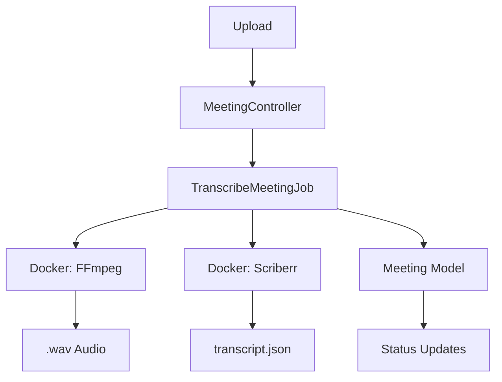
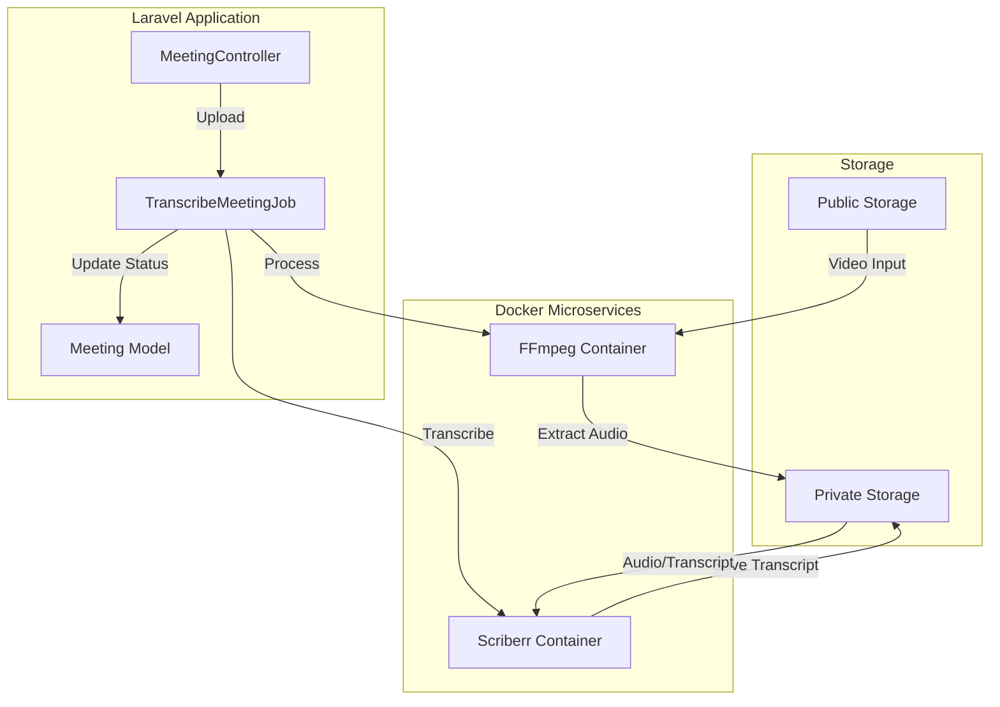
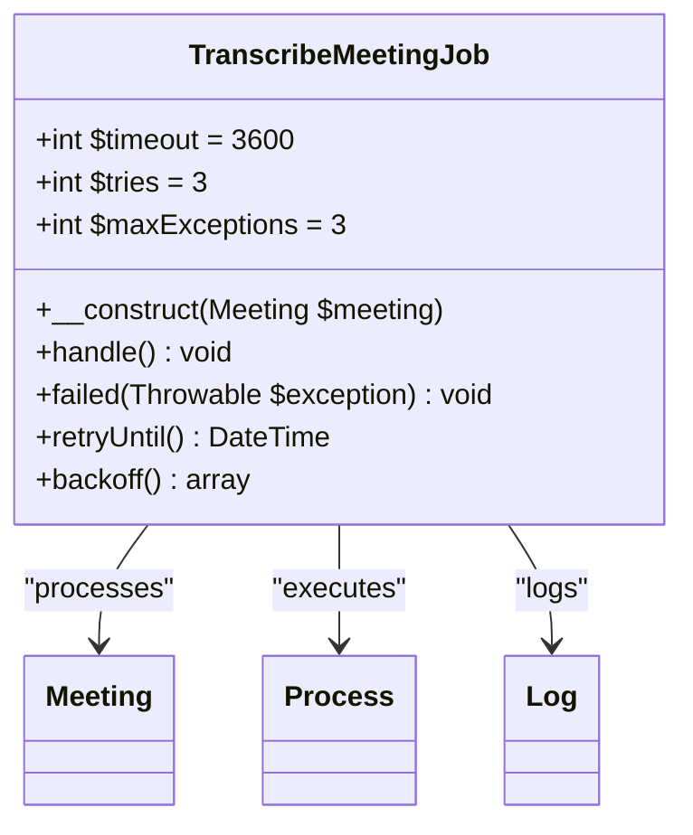
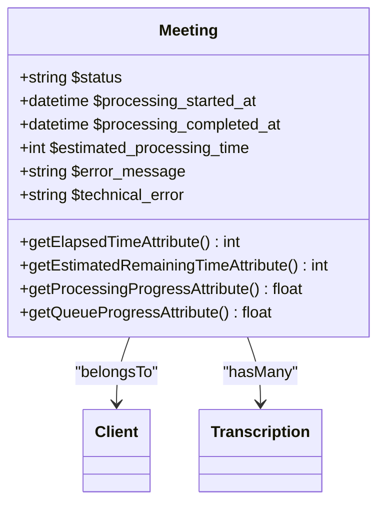
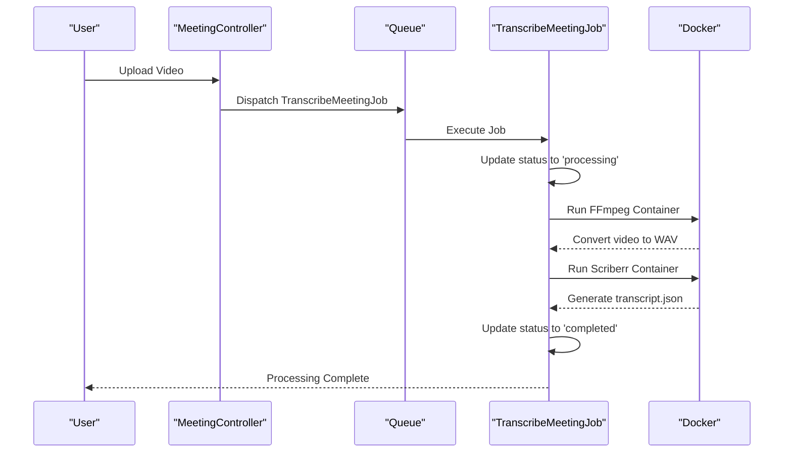
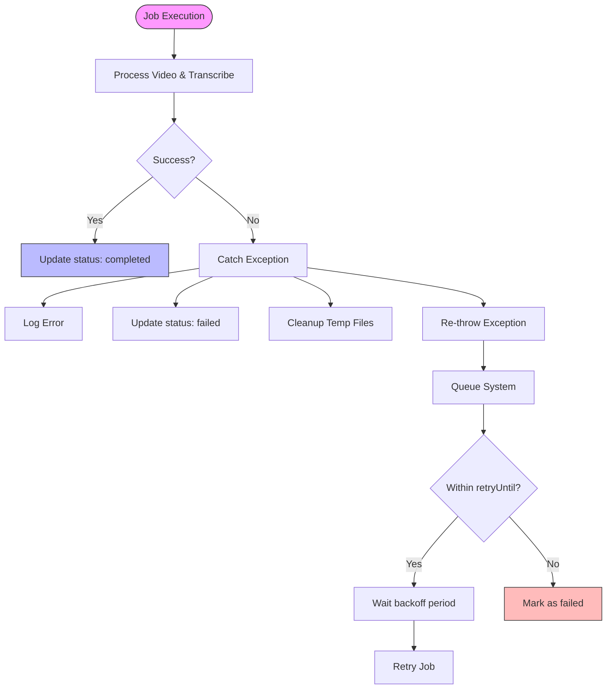
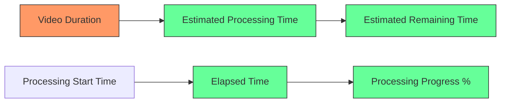
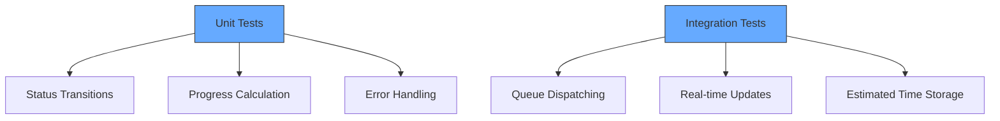

# Meeting Processing


## Table of Contents
1. [Introduction](#introduction)
2. [Project Structure](#project-structure)
3. [Core Components](#core-components)
4. [Architecture Overview](#architecture-overview)
5. [Detailed Component Analysis](#detailed-component-analysis)
6. [Processing Pipeline Workflow](#processing-pipeline-workflow)
7. [Error Handling and Retry Mechanisms](#error-handling-and-retry-mechanisms)
8. [Performance Considerations](#performance-considerations)
9. [Testing and Validation](#testing-and-validation)
10. [Conclusion](#conclusion)

## Introduction
The Meeting Processing system is responsible for transcribing uploaded meeting videos into text with speaker diarization. The pipeline leverages Laravel's queue system to process meetings asynchronously, using Dockerized microservices for audio extraction and transcription. This document details the end-to-end workflow, from upload to completion, including error handling, performance tracking, and retry mechanisms.

## Project Structure
The project follows a standard Laravel MVC architecture with additional components for queue processing and microservices. Key directories include:
- `app/Jobs`: Contains the `TranscribeMeetingJob` for asynchronous processing
- `app/Models`: Includes `Meeting` and `Transcription` models
- `transcribe-microservice`: Python-based transcription service with Docker support
- `tests/Feature`: Integration tests for the transcription workflow
- `database/migrations`: Schema definitions for meeting processing metadata





**Diagram sources**
- [TranscribeMeetingJob.php](file://app/Jobs/TranscribeMeetingJob.php#L1-L400)
- [Meeting.php](file://app/Models/Meeting.php#L1-L179)

**Section sources**
- [TranscribeMeetingJob.php](file://app/Jobs/TranscribeMeetingJob.php#L1-L400)
- [Meeting.php](file://app/Models/Meeting.php#L1-L179)

## Core Components
The system's core functionality revolves around the `TranscribeMeetingJob`, which orchestrates the transcription process. The job interacts with the `Meeting` model to track status and progress, and uses Docker to execute external services for audio processing and transcription.

**Section sources**
- [TranscribeMeetingJob.php](file://app/Jobs/TranscribeMeetingJob.php#L1-L400)
- [Meeting.php](file://app/Models/Meeting.php#L1-L179)

## Architecture Overview
The meeting processing pipeline follows a microservices-based architecture where the Laravel application acts as the orchestrator. Upon upload, a job is dispatched to the queue, which then executes a series of Dockerized operations to extract audio and generate transcripts.





**Diagram sources**
- [TranscribeMeetingJob.php](file://app/Jobs/TranscribeMeetingJob.php#L1-L400)
- [Dockerfile](file://transcribe-microservice/Dockerfile#L1-L15)

## Detailed Component Analysis

### TranscribeMeetingJob Analysis
The `TranscribeMeetingJob` class implements Laravel's `ShouldQueue` interface and handles the entire transcription workflow. It manages Docker container execution, file system operations, and database updates.

#### Job Configuration




**Diagram sources**
- [TranscribeMeetingJob.php](file://app/Jobs/TranscribeMeetingJob.php#L1-L400)

**Section sources**
- [TranscribeMeetingJob.php](file://app/Jobs/TranscribeMeetingJob.php#L1-L400)

### Meeting Model Analysis
The `Meeting` model contains attributes for tracking processing status and progress. It includes computed properties for real-time progress monitoring.

#### Model Attributes and Accessors




**Diagram sources**
- [Meeting.php](file://app/Models/Meeting.php#L1-L179)

**Section sources**
- [Meeting.php](file://app/Models/Meeting.php#L1-L179)

## Processing Pipeline Workflow
The transcription pipeline executes in a well-defined sequence of steps, with comprehensive status tracking throughout.

### Processing Sequence




**Diagram sources**
- [TranscribeMeetingJob.php](file://app/Jobs/TranscribeMeetingJob.php#L1-L400)
- [transcribe.py](file://transcribe-microservice/transcribe.py#L1-L201)

**Section sources**
- [TranscribeMeetingJob.php](file://app/Jobs/TranscribeMeetingJob.php#L1-L400)

### Audio Extraction Process
The job uses FFmpeg in a Docker container to extract audio from the uploaded video file:

1. Resolves the video path from the public storage disk
2. Creates a Docker command with volume mounts for input and output
3. Executes the container with parameters for WAV conversion (16kHz, mono)
4. Validates the output file creation

### Transcription Process
The transcription service runs in a separate Docker container with the following parameters:
- Model size: medium
- Language: Romanian (ro)
- Features: diarization, alignment
- Device: CPU with int8 compute type
- Thread count: dynamically determined from host CPU cores

## Error Handling and Retry Mechanisms
The system implements comprehensive error handling at multiple levels to ensure reliability.

### Error Handling Flow




**Diagram sources**
- [TranscribeMeetingJob.php](file://app/Jobs/TranscribeMeetingJob.php#L1-L400)

**Section sources**
- [TranscribeMeetingJob.php](file://app/Jobs/TranscribeMeetingJob.php#L1-L400)

### Error Classification
The system categorizes errors and provides user-friendly messages:

| Error Type | User Message | Technical Cause |
|------------|--------------|-----------------|
| **File Not Found** | "The video file could not be found..." | Missing video_path in storage |
| **WAV Conversion** | "Failed to process the video file..." | FFmpeg command failure |
| **Docker Service** | "Transcription service is temporarily unavailable..." | Container execution failure |
| **Timeout** | "Transcription took too long to complete..." | Process exceeding timeout |
| **Storage** | "Insufficient storage space available..." | Disk space exhaustion |

The job is configured with:
- **Timeout**: 3600 seconds (1 hour)
- **Max attempts**: 3 retries
- **Retry window**: 30 minutes from first attempt
- **Backoff strategy**: 60, 300, 900 seconds (exponential)

## Performance Considerations
The system includes several performance optimizations and monitoring features.

### Queue Configuration
The queue system is configured in `config/queue.php` with:
- Default driver: database
- Retry after: 90 seconds
- Failed job storage: database-uuids


```php
'connections' => [
    'database' => [
        'driver' => 'database',
        'connection' => env('DB_QUEUE_CONNECTION'),
        'table' => env('DB_QUEUE_TABLE', 'jobs'),
        'queue' => env('DB_QUEUE', 'default'),
        'retry_after' => (int) env('DB_QUEUE_RETRY_AFTER', 90),
    ],
]
```


### Resource Management
The system optimizes resource usage through:

1. **CPU Thread Management**: Dynamically detects host CPU cores and passes thread count to containers
2. **Memory Cleanup**: Explicit garbage collection and CUDA cache clearing for GPU operations
3. **File System**: Temporary files are cleaned up after processing
4. **Progress Estimation**: Estimated processing time is calculated as 1 second per minute of video (minimum 10 seconds)

### Progress Tracking
The Meeting model provides several computed attributes for real-time progress monitoring:





**Diagram sources**
- [Meeting.php](file://app/Models/Meeting.php#L1-L179)

**Section sources**
- [Meeting.php](file://app/Models/Meeting.php#L1-L179)

## Testing and Validation
The system includes comprehensive tests to ensure reliability and correct behavior.

### Test Coverage
The `TranscribeMeetingJobTest.php` file contains tests for:
- Status transitions (pending → processing → completed)
- Queue dispatching on upload
- Progress tracking calculations
- Real-time status endpoint
- Queue progress simulation
- Estimated processing time storage





**Diagram sources**
- [TranscribeMeetingJobTest.php](file://tests/Feature/TranscribeMeetingJobTest.php#L1-L120)

**Section sources**
- [TranscribeMeetingJobTest.php](file://tests/Feature/TranscribeMeetingJobTest.php#L1-L120)

## Conclusion
The Meeting Processing system provides a robust pipeline for transcribing uploaded videos with comprehensive error handling, progress tracking, and performance optimization. By leveraging Laravel's queue system and Dockerized microservices, it achieves reliable asynchronous processing with clear status reporting. The system is designed to handle various failure scenarios gracefully while providing meaningful feedback to users. Key strengths include dynamic resource allocation, detailed progress metrics, and a well-tested architecture that ensures reliability in production environments.

**Referenced Files in This Document**   
- [TranscribeMeetingJob.php](file://app/Jobs/TranscribeMeetingJob.php#L1-L400)
- [Meeting.php](file://app/Models/Meeting.php#L1-L179)
- [transcribe.py](file://transcribe-microservice/transcribe.py#L1-L201)
- [diarize.py](file://transcribe-microservice/diarize.py#L1-L131)
- [TranscribeMeetingJobTest.php](file://tests/Feature/TranscribeMeetingJobTest.php#L1-L120)
- [2025_08_10_145951_add_estimated_processing_time_to_meetings_table.php](file://database/migrations/2025_08_10_145951_add_estimated_processing_time_to_meetings_table.php#L1-L29)
- [2025_08_10_160251_add_error_fields_to_meetings_table.php](file://database/migrations/2025_08_10_160251_add_error_fields_to_meetings_table.php#L1-L29)
- [Dockerfile](file://transcribe-microservice/Dockerfile#L1-L15)
- [queue.php](file://config/queue.php#L1-L111)