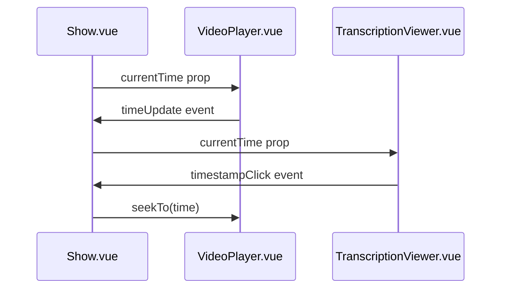
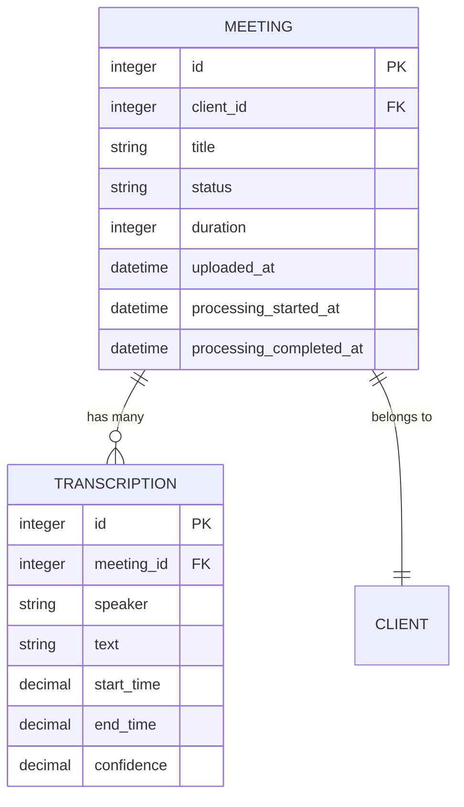
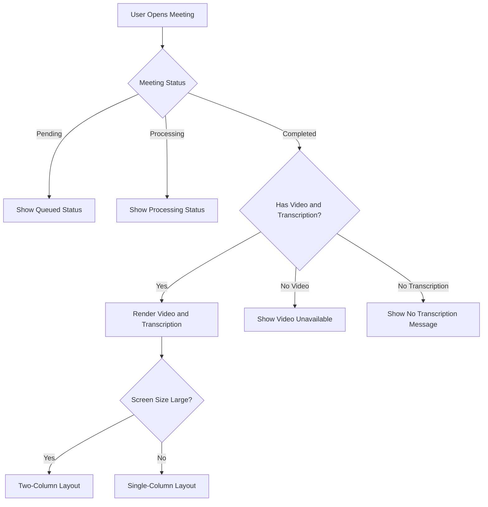

# Meeting Display


## Table of Contents
1. [Meeting Display](#meeting-display)
2. [Meeting Data Retrieval and Inertia.js Integration](#meeting-data-retrieval-and-inertiajs-integration)
3. [Synchronized Video and Transcription Rendering](#synchronized-video-and-transcription-rendering)
4. [Transcription Data Structure and Model Relationships](#transcription-data-structure-and-model-relationships)
5. [User Interaction and Navigation](#user-interaction-and-navigation)
6. [Real-Time Status Indicators](#real-time-status-indicators)
7. [Error Handling and Edge Cases](#error-handling-and-edge-cases)
8. [Accessibility and Performance Optimization](#accessibility-and-performance-optimization)

## Meeting Data Retrieval and Inertia.js Integration

The **Show.vue** component is responsible for displaying a single meeting, including its video and transcription. It receives meeting data via Inertia.js from the **MeetingController.php** backend.

The **MeetingController::show()** method prepares the meeting data by eagerly loading the associated client and transcriptions, ordered by start time. It then passes this data to the frontend using Inertia::render(), which sends a JSON payload to the Vue component.


```php
public function show(Meeting $meeting): Response
{
    $meeting->load(['client', 'transcriptions' => function ($query) {
        $query->orderBy('start_time');
    }]);

    $videoUrl = $meeting->video_path ? Storage::disk('public')->url($meeting->video_path) : null;

    return Inertia::render('Meetings/Show', [
        'meeting' => $meeting,
        'videoUrl' => $videoUrl
    ]);
}
```


The frontend **Show.vue** component defines a TypeScript interface for the meeting data, ensuring type safety and clear data structure expectations.


```typescript
interface Meeting {
    id: number
    title: string
    client: Client
    status: 'pending' | 'processing' | 'completed' | 'failed'
    uploaded_at: string
    duration?: number
    estimated_processing_time?: number
    queue_progress?: number
    processing_progress?: number
    formatted_estimated_processing_time?: string
    formatted_elapsed_time?: string
    formatted_estimated_remaining_time?: string
    transcriptions?: Transcription[]
}
```


**Section sources**
- [MeetingController.php](file://app/Http/Controllers/MeetingController.php#L200-L220)
- [Show.vue](file://resources/js/pages/Meetings/Show.vue#L200-L343)

## Synchronized Video and Transcription Rendering

The meeting display integrates the **VideoPlayer.vue** and **TranscriptionViewer.vue** components to provide synchronized playback and transcription viewing.

### VideoPlayer Component

The **VideoPlayer.vue** component wraps the native HTML5 video element and emits events for time updates, play, pause, and errors. It synchronizes with the transcription by exposing a `seekTo` method and responding to the `currentTime` prop.


```typescript
watch(() => props.currentTime, (newTime) => {
  if (videoElement.value && Math.abs(videoElement.value.currentTime - newTime) > 1) {
    videoElement.value.currentTime = newTime
  }
})
```


When the video time updates, it emits a `timeUpdate` event that the parent component uses to update the current time state.


```typescript
const onTimeUpdate = () => {
  if (videoElement.value) {
    currentTime.value = videoElement.value.currentTime
    emit('timeUpdate', currentTime.value)
  }
}
```


### TranscriptionViewer Component

The **TranscriptionViewer.vue** component renders transcription segments with speaker labels, timestamps, and text. It highlights the current segment based on the video's current time.


```typescript
const currentSegment = computed(() => {
  return props.transcriptions.find(t =>
    props.currentTime >= t.start_time && props.currentTime <= t.end_time
  )
})
```


When a user clicks on a timestamp in the transcription, the component emits a `timestampClick` event with the corresponding time.


```typescript
const onTimestampClick = (time: number) => {
  emit('timestampClick', time)
}
```


**Diagram sources**
- [VideoPlayer.vue](file://resources/js/lib/VideoPlayer.vue#L0-L247)
- [TranscriptionViewer.vue](file://resources/js/lib/TranscriptionViewer.vue#L0-L245)





**Section sources**
- [Show.vue](file://resources/js/pages/Meetings/Show.vue#L0-L343)
- [VideoPlayer.vue](file://resources/js/lib/VideoPlayer.vue#L0-L247)
- [TranscriptionViewer.vue](file://resources/js/lib/TranscriptionViewer.vue#L0-L245)

## Transcription Data Structure and Model Relationships

The transcription system is built on two primary models: **Meeting** and **Transcription**, with a one-to-many relationship.

### Meeting Model

The **Meeting.php** model defines a relationship with transcriptions and includes several computed attributes for display purposes.


```php
public function transcriptions(): HasMany
{
    return $this->hasMany(Transcription::class);
}
```


It also provides formatted time attributes for the frontend:


```php
protected $appends = [
    'formatted_elapsed_time',
    'formatted_estimated_remaining_time',
    'formatted_estimated_processing_time',
];
```


### Transcription Model

The **Transcription.php** model represents a single segment of the meeting transcription with precise timing.


```php
class Transcription extends Model
{
    protected $fillable = [
        'meeting_id',
        'speaker',
        'text',
        'start_time',
        'end_time',
        'confidence',
    ];

    protected $casts = [
        'start_time' => 'decimal:3',
        'end_time' => 'decimal:3',
        'confidence' => 'decimal:2',
    ];
}
```


The model includes accessors for formatted timestamps and duration:


```php
public function getDurationAttribute(): float
{
    return $this->end_time - $this->start_time;
}
```


The frontend receives this data as an array of transcription segments, each with the following structure:


```json
{
  "id": 1,
  "speaker": "John Doe",
  "text": "Hello, welcome to the meeting.",
  "start_time": 0.000,
  "end_time": 5.234,
  "confidence": 0.98
}
```


**Diagram sources**
- [Meeting.php](file://app/Models/Meeting.php#L0-L178)
- [Transcription.php](file://app/Models/Transcription.php#L0-L50)





**Section sources**
- [Meeting.php](file://app/Models/Meeting.php#L0-L178)
- [Transcription.php](file://app/Models/Transcription.php#L0-L50)

## User Interaction and Navigation

The meeting display provides several user interaction features for navigating the transcription and video.

### Timestamp Navigation

Users can click on any timestamp in the transcription to jump to that point in the video.


```typescript
const onTranscriptionTimestampClick = (time: number) => {
    videoCurrentTime.value = time
    if (videoPlayerRef.value) {
        videoPlayerRef.value.seekTo(time)
    }
}
```


### Keyboard Navigation

The interface provides Previous and Next buttons that allow users to navigate between transcription segments.


```typescript
const goToPrevious = () => {
    if (transcriptionViewerRef.value) {
        transcriptionViewerRef.value.scrollToPrevious()
    }
}

const goToNext = () => {
    if (transcriptionViewerRef.value) {
        transcriptionViewerRef.value.scrollToNext()
    }
}
```


The **TranscriptionViewer** component exposes these methods via `defineExpose`:


```typescript
defineExpose({
  scrollToPrevious,
  scrollToNext,
  hasPrevious,
  hasNext,
  currentSegmentIndex,
  filteredTranscriptions
})
```


### Search Functionality

Users can search within the transcription, which filters the displayed segments and highlights matching text.


```typescript
const filteredTranscriptions = computed(() => {
  if (!searchQuery.value.trim()) {
    return props.transcriptions
  }

  const query = searchQuery.value.toLowerCase()
  return props.transcriptions.filter(t =>
    t.text.toLowerCase().includes(query) ||
    t.speaker.toLowerCase().includes(query)
  )
})
```


Search terms are highlighted using HTML mark tags:


```typescript
const highlightSearchTerm = (text: string): string => {
  if (!searchQuery.value.trim()) return text

  const query = searchQuery.value.trim()
  const regex = new RegExp(`(${query})`, 'gi')
  return text.replace(regex, '<mark class="bg-yellow-200 px-1 rounded">$1</mark>')
}
```


**Section sources**
- [Show.vue](file://resources/js/pages/Meetings/Show.vue#L0-L343)
- [TranscriptionViewer.vue](file://resources/js/lib/TranscriptionViewer.vue#L0-L245)

## Real-Time Status Indicators

The system provides real-time status indicators for meetings that are pending or processing.

### Status Badge

The **MeetingStatusBadge** component displays the current status of the meeting with appropriate styling.

### Progress Indicators

For processing meetings, the system shows elapsed time, estimated remaining time, and a progress indicator.


```vue
<div v-else-if="meeting.status === 'processing'" class="bg-yellow-50 border border-yellow-200 rounded-lg p-6 mb-6">
    <div class="flex items-center justify-between">
        <div>
            <h3 class="text-lg font-semibold text-yellow-900">Processing Meeting</h3>
            <p class="text-yellow-700 text-sm">
                Elapsed: {{ meeting.formatted_elapsed_time || '0:00' }} | 
                Remaining: {{ meeting.formatted_estimated_remaining_time || 'Calculating...' }}
            </p>
        </div>
        <div class="animate-spin rounded-full h-8 w-8 border-b-2 border-yellow-600"></div>
    </div>
</div>
```


### Status Polling

The frontend polls the server every 2 seconds for status updates when a meeting is pending or processing.


```typescript
const pollStatus = async () => {
    if (props.meeting.status === 'pending' || props.meeting.status === 'processing') {
        try {
            const response = await fetch(`/meetings/${props.meeting.id}/status`)
            const data = await response.json()
            
            // Reload page if status changed to completed or failed
            if (data.data.status !== props.meeting.status) {
                window.location.reload()
            }
        } catch (error) {
            console.error('Failed to fetch meeting status:', error)
        }
    }
}

onMounted(() => {
    if (props.meeting.status === 'pending' || props.meeting.status === 'processing') {
        statusInterval = setInterval(pollStatus, 2000)
        pollStatus()
    }
})
```


**Section sources**
- [Show.vue](file://resources/js/pages/Meetings/Show.vue#L0-L343)

## Error Handling and Edge Cases

The system handles various error states and edge cases to provide a robust user experience.

### Video Loading Errors

The **VideoPlayer** component displays an error overlay when video loading fails and provides a retry mechanism.


```typescript
const onError = (error: Event) => {
  isLoading.value = false
  hasError.value = true
  
  // Log detailed error information
  const videoError = videoElement.value?.error
  if (videoError) {
    console.error('Video error:', {
      code: videoError.code,
      message: videoError.message,
      url: props.videoUrl
    })
    
    // Show user-friendly error toast
    if (window.toast) {
      let errorMessage = 'Unable to load video'
      let suggestions = ['Try refreshing the page', 'Check your internet connection']
      
      switch (videoError.code) {
        case MediaError.MEDIA_ERR_ABORTED:
          errorMessage = 'Video loading was aborted'
          suggestions = ['Try refreshing the page', 'Check if the video file exists']
          break
        case MediaError.MEDIA_ERR_NETWORK:
          errorMessage = 'Network error while loading video'
          suggestions = ['Check your internet connection', 'Try again in a few moments']
          break
        case MediaError.MEDIA_ERR_DECODE:
          errorMessage = 'Video format not supported or corrupted'
          suggestions = ['The video file may be corrupted', 'Contact support for assistance']
          break
        case MediaError.MEDIA_ERR_SRC_NOT_SUPPORTED:
          errorMessage = 'Video format not supported'
          suggestions = ['The video format is not supported by your browser', 'Try a different browser']
          break
      }
      
      window.toast.error(
        errorMessage,
        suggestions.join(' • '),
        {
          actions: [
            {
              label: 'Retry',
              handler: retryLoad,
              primary: true
            }
          ]
        }
      )
    }
  }
  
  emit('error', error)
}
```


### Incomplete Transcriptions

When a meeting is completed but has no transcriptions, the system displays an appropriate message:


```vue
<div v-if="!meeting.transcriptions || meeting.transcriptions.length === 0" 
     class="text-center py-8 text-gray-500">
    <p>No transcription available for this meeting.</p>
</div>
```


### Responsive Layout

The interface adapts to screen size, using a two-column layout on large screens and a single-column layout on smaller screens.


```typescript
const isLargeScreen = computed(() => {
    if (typeof window === 'undefined') return true
    return window.innerWidth >= 1024 // lg breakpoint
})
```


**Section sources**
- [VideoPlayer.vue](file://resources/js/lib/VideoPlayer.vue#L0-L247)
- [Show.vue](file://resources/js/pages/Meetings/Show.vue#L0-L343)

## Accessibility and Performance Optimization

The meeting display system incorporates several accessibility and performance features.

### Accessibility Features

- **Keyboard Navigation**: The Previous and Next buttons are fully keyboard accessible.
- **Semantic HTML**: The transcription uses proper heading structure and semantic elements.
- **ARIA Labels**: Interactive elements include appropriate ARIA attributes.
- **Color Contrast**: The UI maintains sufficient color contrast for readability.
- **Focus Management**: The active transcription segment is scrolled into view and focused.

### Performance Optimization

#### Large Transcription Files

For large transcription files, the system implements:

- **Virtual Scrolling**: Not implemented in current code but recommended for large datasets.
- **Search Optimization**: The search functionality uses computed properties with caching.
- **Efficient Rendering**: Vue's reactivity system ensures only changed segments are re-rendered.

#### Code-Level Optimizations

- **Computed Properties**: Used for expensive operations like filtering and current segment detection.
- **Event Delegation**: Click events are handled at the component level.
- **Memory Management**: Event listeners are properly cleaned up in `onUnmounted`.

#### Recommended Improvements

For very large transcription files, consider implementing:

1. **Virtual Scrolling**: Render only visible transcription segments.
2. **Debounced Search**: Prevent excessive re-rendering during typing.
3. **Web Workers**: Process search and filtering in background threads.
4. **Pagination**: Split transcription into pages for extremely long meetings.





**Section sources**
- [Show.vue](file://resources/js/pages/Meetings/Show.vue#L0-L343)
- [TranscriptionViewer.vue](file://resources/js/lib/TranscriptionViewer.vue#L0-L245)
- [VideoPlayer.vue](file://resources/js/lib/VideoPlayer.vue#L0-L247)

**Referenced Files in This Document**   
- [Show.vue](file://resources/js/pages/Meetings/Show.vue#L0-L343)
- [TranscriptionViewer.vue](file://resources/js/lib/TranscriptionViewer.vue#L0-L245)
- [VideoPlayer.vue](file://resources/js/lib/VideoPlayer.vue#L0-L247)
- [Meeting.php](file://app/Models/Meeting.php#L0-L178)
- [Transcription.php](file://app/Models/Transcription.php#L0-L50)
- [MeetingController.php](file://app/Http/Controllers/MeetingController.php#L0-L304)