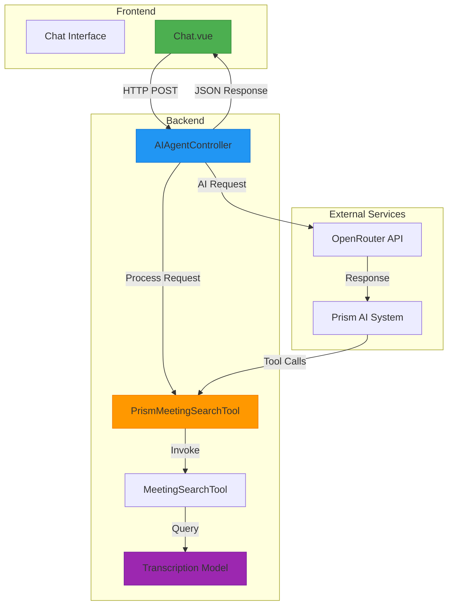
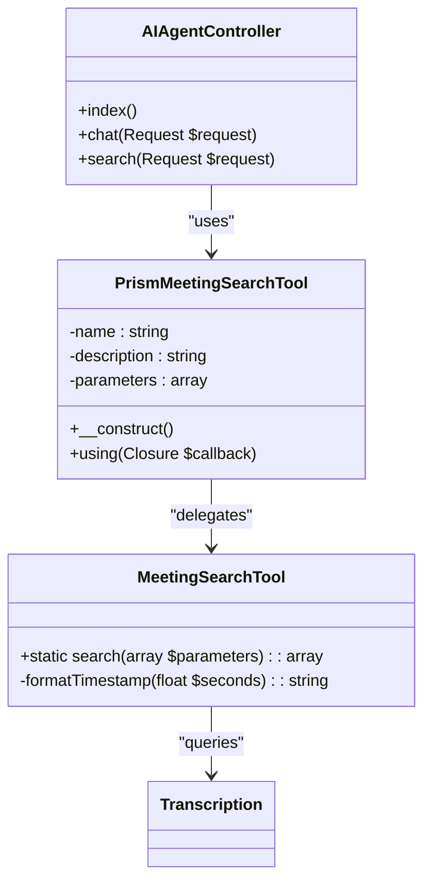
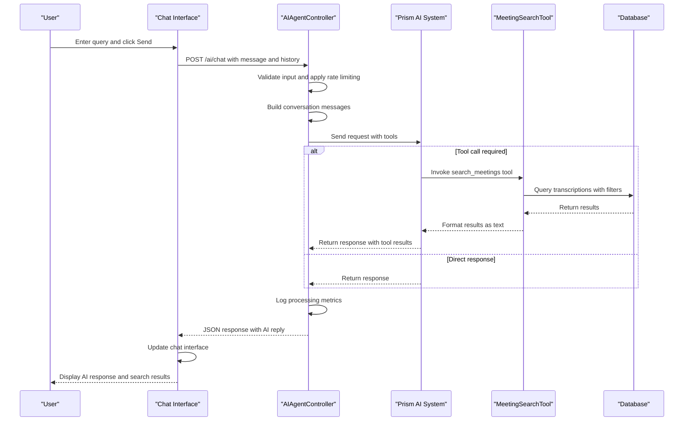
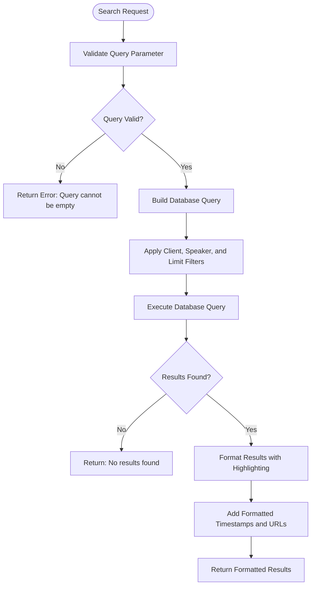
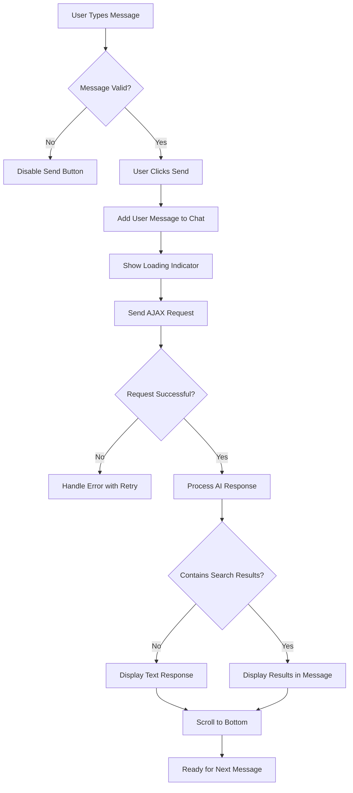
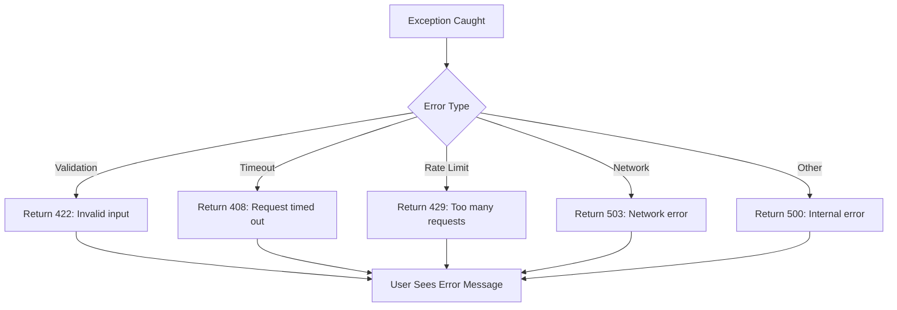

# AI Integration


## Table of Contents
1. [AI Integration Overview](#ai-integration-overview)
2. [System Architecture](#system-architecture)
3. [Core Components](#core-components)
4. [Request Flow Analysis](#request-flow-analysis)
5. [Tool System Implementation](#tool-system-implementation)
6. [Configuration Details](#configuration-details)
7. [Frontend Interface](#frontend-interface)
8. [Usage Examples](#usage-examples)
9. [Error Handling and Limitations](#error-handling-and-limitations)

## AI Integration Overview

The AI integration feature enables users to query meeting content through natural language using an AI agent powered by the Prism AI system via the OpenRouter API. This system allows users to search transcriptions by client, speaker, or keyword through a conversational interface. The integration connects the frontend chat interface with backend AI processing capabilities, providing relevant excerpts with timestamps and contextual information.

The system is built around an agent-based architecture where the AI agent uses specialized tools to search through meeting data. When a user submits a query, the system validates input, applies rate limiting, constructs a conversation context, and routes the request to the AI service. The AI service can invoke the MeetingSearchTool to retrieve relevant transcription segments, which are then formatted into a natural language response.

**Section sources**
- [AIAgentController.php](file://app/Http/Controllers/AIAgentController.php#L1-L182)
- [Chat.vue](file://resources/js/pages/AI/Chat.vue#L1-L306)

## System Architecture

The AI integration follows a client-server architecture with a Vue.js frontend communicating with a Laravel backend that interfaces with external AI services. The system components work together to process natural language queries about meeting content and return relevant information with context.





**Diagram sources**
- [AIAgentController.php](file://app/Http/Controllers/AIAgentController.php#L1-L182)
- [PrismMeetingSearchTool.php](file://app/Tools/PrismMeetingSearchTool.php#L1-L49)
- [MeetingSearchTool.php](file://app/Tools/MeetingSearchTool.php#L1-L85)
- [Chat.vue](file://resources/js/pages/AI/Chat.vue#L1-L306)

## Core Components

The AI integration consists of several core components that work together to enable natural language queries about meeting content. These components include the AIAgentController, tool implementations, and the frontend chat interface.

### AIAgentController

The AIAgentController handles all AI-related requests and serves as the bridge between the frontend interface and the AI service. It has three main methods:

- `index()`: Renders the chat interface
- `chat()`: Processes natural language queries and interacts with the AI service
- `search()`: Handles direct search requests

The controller implements input validation, rate limiting, error handling, and request routing. It constructs conversation context with system, user, and assistant messages before sending requests to the AI service.





**Diagram sources**
- [AIAgentController.php](file://app/Http/Controllers/AIAgentController.php#L1-L182)
- [PrismMeetingSearchTool.php](file://app/Tools/PrismMeetingSearchTool.php#L1-L49)
- [MeetingSearchTool.php](file://app/Tools/MeetingSearchTool.php#L1-L85)

**Section sources**
- [AIAgentController.php](file://app/Http/Controllers/AIAgentController.php#L1-L182)

## Request Flow Analysis

The request flow for AI queries follows a well-defined sequence from the frontend interface through the backend controller to the AI service and back with results.





**Diagram sources**
- [AIAgentController.php](file://app/Http/Controllers/AIAgentController.php#L1-L182)
- [Chat.vue](file://resources/js/pages/AI/Chat.vue#L1-L306)
- [PrismMeetingSearchTool.php](file://app/Tools/PrismMeetingSearchTool.php#L1-L49)

**Section sources**
- [AIAgentController.php](file://app/Http/Controllers/AIAgentController.php#L1-L182)
- [Chat.vue](file://resources/js/pages/AI/Chat.vue#L1-L306)

## Tool System Implementation

The tool system enables the AI agent to search through meeting transcriptions by client, speaker, or keyword. This is implemented through the PrismMeetingSearchTool and MeetingSearchTool classes.

### PrismMeetingSearchTool

This class defines the interface between the AI agent and the search functionality. It specifies the tool parameters and the callback function that executes when the tool is invoked.


```php
$this->as('search_meetings')
    ->for('Search through meeting transcriptions to find specific content, topics, or keywords')
    ->withStringParameter('query', 'The search query to find in meeting transcriptions', true)
    ->withStringParameter('client_id', 'Optional client ID to filter search results to specific client meetings', false)
    ->withStringParameter('speaker', 'Optional speaker name to filter results to specific speaker', false)
    ->withStringParameter('limit', 'Maximum number of results to return (default: 10)', false)
```


### MeetingSearchTool

This class implements the actual search functionality by querying the Transcription model with the provided parameters.





**Diagram sources**
- [PrismMeetingSearchTool.php](file://app/Tools/PrismMeetingSearchTool.php#L1-L49)
- [MeetingSearchTool.php](file://app/Tools/MeetingSearchTool.php#L1-L85)

**Section sources**
- [PrismMeetingSearchTool.php](file://app/Tools/PrismMeetingSearchTool.php#L1-L49)
- [MeetingSearchTool.php](file://app/Tools/MeetingSearchTool.php#L1-L85)

## Configuration Details

The AI integration is configured through the `config/prism.php` file, which contains settings for various AI providers including OpenRouter.


```php
return [
    'providers' => [
        'openrouter' => [
            'api_key' => env('OPENROUTER_API_KEY', ''),
            'url' => env('OPENROUTER_URL', 'https://openrouter.ai/api/v1'),
        ],
        // Other providers...
    ],
];
```


The system uses environment variables to store sensitive information like API keys. The configuration supports multiple AI providers, but the current implementation uses OpenRouter with the 'openai/gpt-oss-120b' model.

Key configuration aspects:
- **API Keys**: Stored in environment variables for security
- **Provider URLs**: Configurable endpoints for different AI services
- **Model Selection**: Hardcoded to 'openai/gpt-oss-120b' in the controller
- **Multiple Providers**: Support for OpenAI, Anthropic, Ollama, Mistral, Groq, XAI, Gemini, DeepSeek, VoyageAI, and OpenRouter

The AIAgentController specifically uses:

```php
Prism::text()
    ->using(Provider::OpenRouter, 'openai/gpt-oss-120b')
```


**Section sources**
- [prism.php](file://config/prism.php#L1-L55)
- [AIAgentController.php](file://app/Http/Controllers/AIAgentController.php#L1-L182)

## Frontend Interface

The frontend chat interface is implemented in the Chat.vue component, which provides a conversational UI for interacting with the AI assistant.

### Component Structure

The Chat.vue component includes:
- Message display area with user and AI messages
- Input field for entering queries
- Send button to submit messages
- Loading indicator for processing states
- Example queries for user guidance

### Key Features

- **Real-time Feedback**: Shows "Thinking..." indicator during AI processing
- **Conversation History**: Maintains context across multiple exchanges
- **Search Result Display**: Formats and displays search results with meeting context
- **Error Handling**: Displays error messages and provides retry options
- **Network Resilience**: Implements retry logic with exponential backoff
- **Responsive Design**: Adapts to different screen sizes

### Interaction Flow





**Section sources**
- [Chat.vue](file://resources/js/pages/AI/Chat.vue#L1-L306)

## Usage Examples

### Effective Queries

Users can ask natural language questions about meeting content. The system will use the search_meetings tool when appropriate to find relevant information.

**Query**: "Find mentions of budget in recent meetings"
- **System Response**: The AI will invoke the search_meetings tool with query="budget" and return relevant excerpts with timestamps.

**Query**: "What did John say about the project timeline?"
- **System Response**: The AI will search for mentions of "project timeline" by speaker "John" and return relevant quotes.

**Query**: "Search for discussions about marketing strategy"
- **System Response**: The AI will search for "marketing strategy" across all transcriptions and return relevant results.

### Expected Response Format

When search results are found, the AI returns a formatted response with:
- Meeting title and client name
- Speaker and timestamp
- Relevant text excerpt with search terms highlighted
- Direct link to the meeting at the specific timestamp

Example response:

```
Found 3 results for 'budget':

**Q3 Planning Meeting** (Acme Corporation)
Speaker: Sarah Chen at 12:34
Text: We need to finalize the **budget** allocation for the marketing campaign by Friday.
Link: /meetings/22?t=754

**Budget Review** (Global Inc)
Speaker: Michael Torres at 08:22
Text: The proposed **budget** exceeds our quarterly limits by 15%.
Link: /meetings/45?t=502
```


**Section sources**
- [Chat.vue](file://resources/js/pages/AI/Chat.vue#L1-L306)
- [PrismMeetingSearchTool.php](file://app/Tools/PrismMeetingSearchTool.php#L1-L49)
- [MeetingSearchTool.php](file://app/Tools/MeetingSearchTool.php#L1-L85)

## Error Handling and Limitations

The AI integration includes comprehensive error handling and rate limiting to ensure system stability and provide a good user experience.

### Rate Limiting

The system implements rate limiting to prevent abuse and ensure fair usage:


```php
$cacheKey = 'ai_chat_' . $request->ip();
$requestCount = cache()->get($cacheKey, 0);

if ($requestCount >= 10) { // 10 requests per minute
    return response()->json([
        'success' => false,
        'error' => 'Too many requests. Please wait a moment before sending another message.'
    ], 429);
}

cache()->put($cacheKey, $requestCount + 1, 60); // Increment for 1 minute
```


### Error Handling

The system handles various error types with appropriate responses:





Specific error handling includes:
- **Validation errors**: 422 status with specific error messages
- **Rate limiting**: 429 status with wait instruction
- **Timeouts**: 408 status with suggestion to shorten message
- **Network errors**: 503 status with connection check suggestion
- **AI service errors**: 500 status with generic error message

### Frontend Error Handling

The frontend implements additional error handling:
- Network connectivity checks
- Request timeout (30 seconds)
- Retry logic with exponential backoff (up to 3 retries)
- Toast notifications for error conditions
- Retry buttons for failed requests

### Known Limitations

- **Search Scope**: Limited to text content in transcriptions; cannot analyze audio or video content directly
- **Query Complexity**: Complex boolean queries or advanced search operators are not supported
- **Context Window**: Conversation history is limited to 50 messages to prevent token overflow
- **Rate Limits**: 10 requests per minute per IP address
- **Message Length**: Maximum 1000 characters per message
- **Search Results**: Limited to 50 results maximum, with default of 10
- **Real-time Processing**: AI responses may have latency depending on external service performance

**Section sources**
- [AIAgentController.php](file://app/Http/Controllers/AIAgentController.php#L1-L182)
- [Chat.vue](file://resources/js/pages/AI/Chat.vue#L1-L306)

**Referenced Files in This Document**   
- [AIAgentController.php](file://app/Http/Controllers/AIAgentController.php)
- [PrismMeetingSearchTool.php](file://app/Tools/PrismMeetingSearchTool.php)
- [MeetingSearchTool.php](file://app/Tools/MeetingSearchTool.php)
- [Chat.vue](file://resources/js/pages/AI/Chat.vue)
- [prism.php](file://config/prism.php)
- [Transcription.php](file://app/Models/Transcription.php)
- [Meeting.php](file://app/Models/Meeting.php)