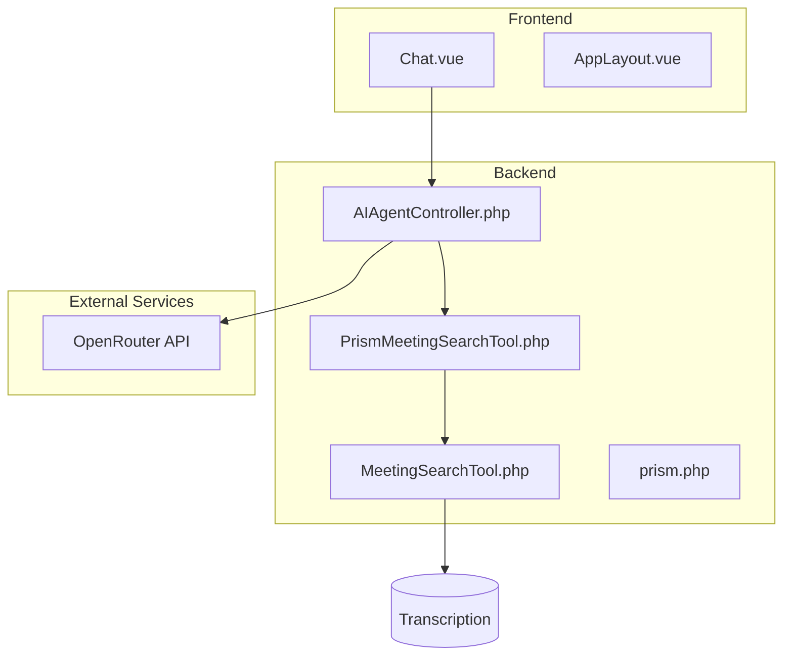
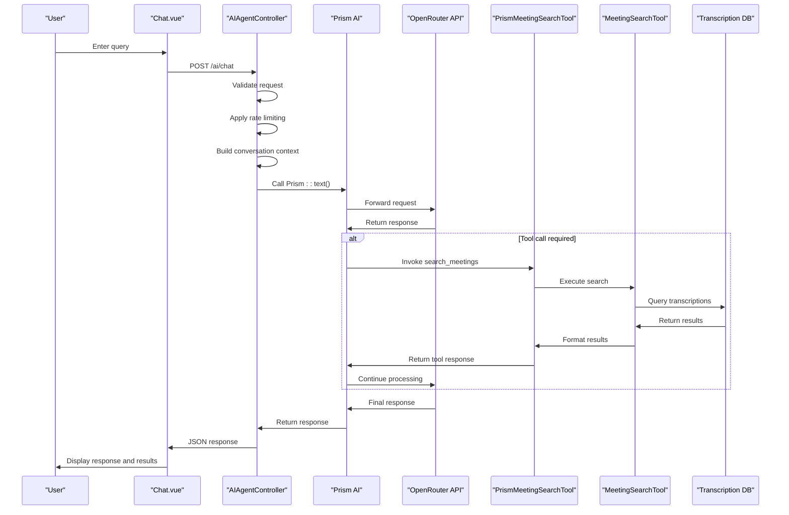
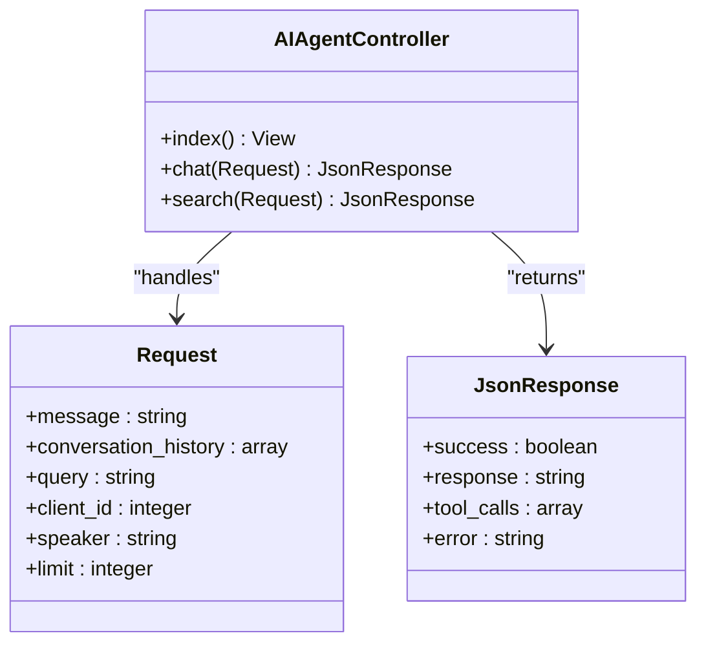
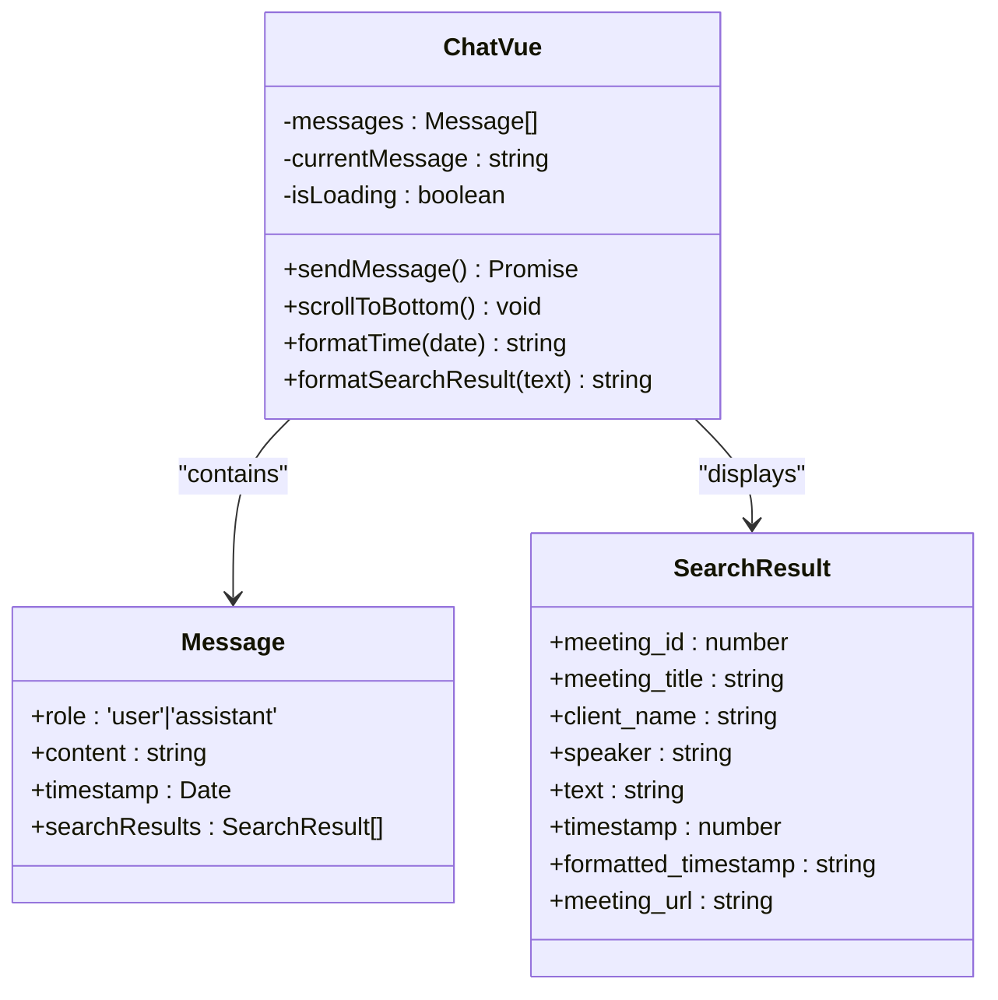
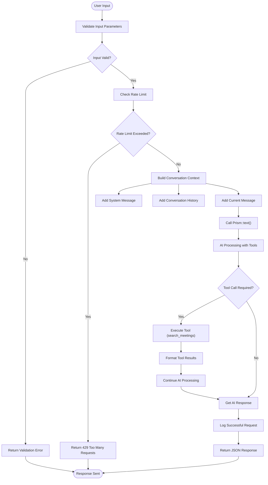
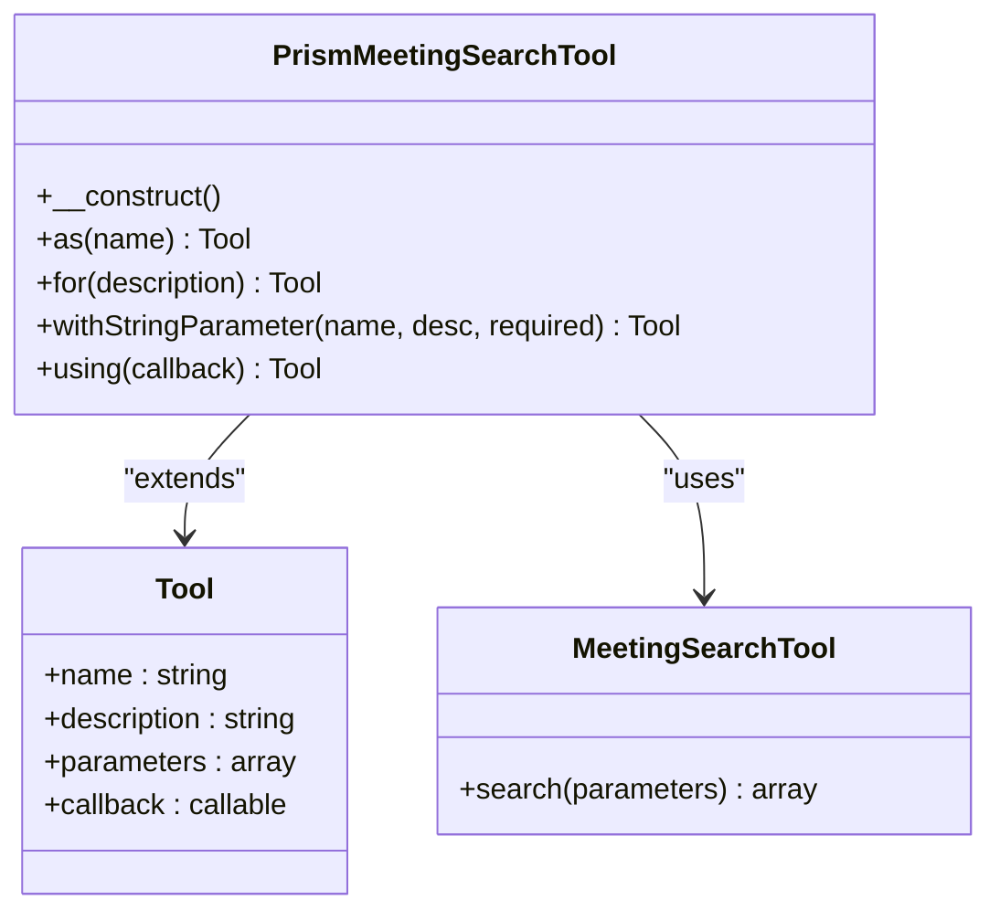
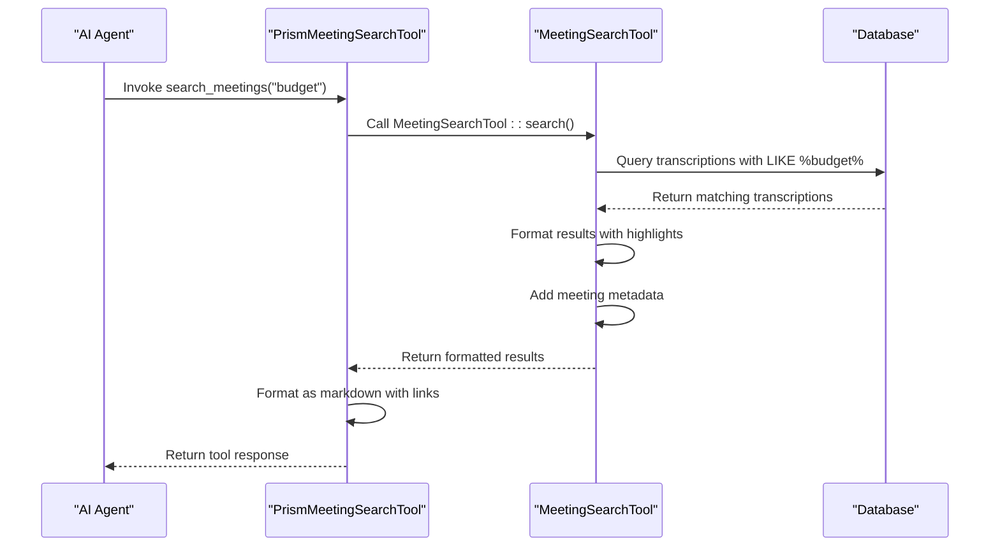
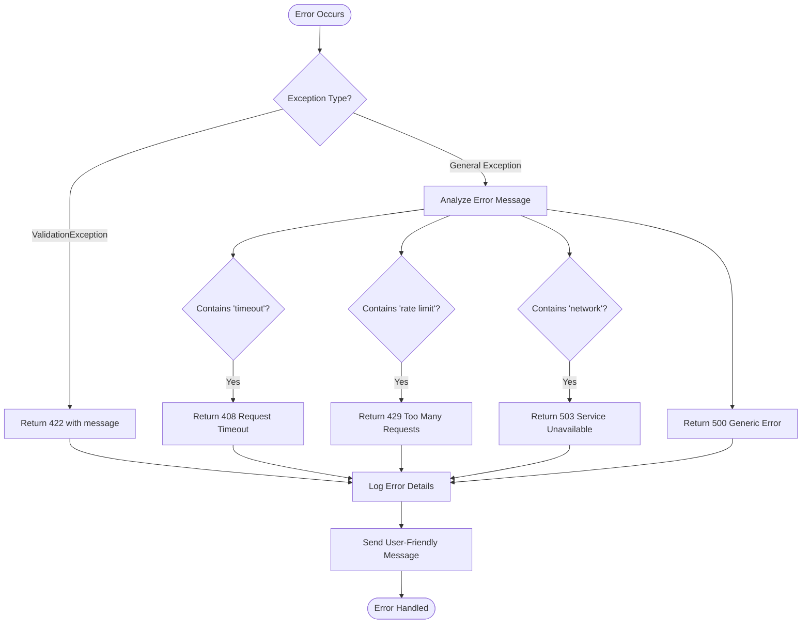
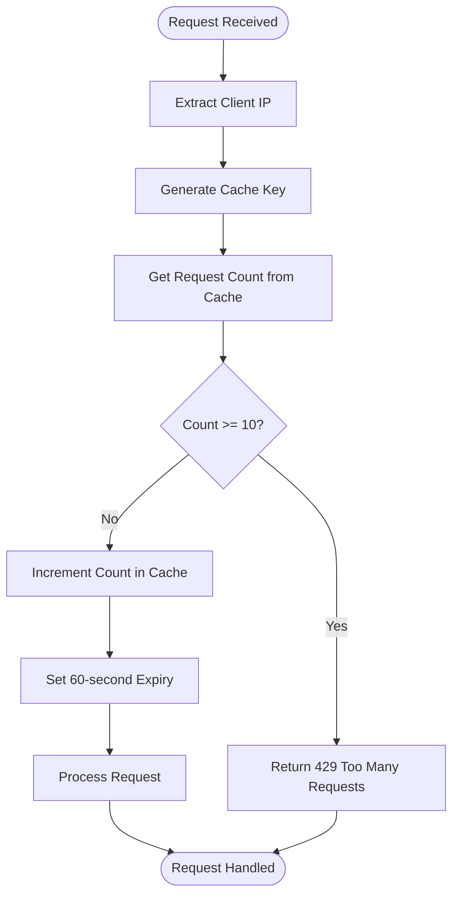

# AI Agent Architecture


## Table of Contents
1. [Introduction](#introduction)
2. [Project Structure](#project-structure)
3. [Core Components](#core-components)
4. [Architecture Overview](#architecture-overview)
5. [Detailed Component Analysis](#detailed-component-analysis)
6. [Request Lifecycle and Processing Flow](#request-lifecycle-and-processing-flow)
7. [Tool Integration and Dynamic Search Capabilities](#tool-integration-and-dynamic-search-capabilities)
8. [Error Handling and Resilience Strategies](#error-handling-and-resilience-strategies)
9. [Configuration and Service Integration](#configuration-and-service-integration)
10. [Performance and Rate Limiting](#performance-and-rate-limiting)
11. [Conclusion](#conclusion)

## Introduction
The AI Agent Architecture in the MeetingAI application enables intelligent search and interaction with meeting transcriptions through a natural language interface. This document details the end-to-end flow from frontend user interaction to backend AI processing and tool-based search execution. The system integrates with the OpenRouter API via the Prism AI framework, allowing dynamic invocation of search tools based on user queries. The architecture emphasizes reliability, error resilience, and seamless user experience through structured request handling, rate limiting, and comprehensive error management.

## Project Structure
The application follows a Laravel-based MVC architecture with a Vue.js frontend. AI-related functionality is centralized in specific components that bridge the frontend interface with backend AI services and data search capabilities.





**Diagram sources**
- [Chat.vue](file://resources/js/pages/AI/Chat.vue)
- [AIAgentController.php](file://app/Http/Controllers/AIAgentController.php)
- [PrismMeetingSearchTool.php](file://app/Tools/PrismMeetingSearchTool.php)
- [MeetingSearchTool.php](file://app/Tools/MeetingSearchTool.php)
- [prism.php](file://config/prism.php)

**Section sources**
- [AIAgentController.php](file://app/Http/Controllers/AIAgentController.php)
- [prism.php](file://config/prism.php)
- [PrismMeetingSearchTool.php](file://app/Tools/PrismMeetingSearchTool.php)
- [Chat.vue](file://resources/js/pages/AI/Chat.vue)

## Core Components
The AI agent system consists of several key components that work together to process natural language queries and return relevant meeting information:

- **AIAgentController**: Backend entry point handling all AI-related requests
- **Chat.vue**: Frontend interface for user interaction with the AI agent
- **PrismMeetingSearchTool**: AI tool enabling dynamic search capability invocation
- **MeetingSearchTool**: Core search implementation for querying transcriptions
- **Prism AI Framework**: Integration layer for OpenRouter and other AI providers
- **prism.php**: Configuration file containing API keys and provider settings

These components form a cohesive system where user queries are processed through a validation pipeline, routed to the AI service, and enhanced with tool-based search results when appropriate.

**Section sources**
- [AIAgentController.php](file://app/Http/Controllers/AIAgentController.php)
- [Chat.vue](file://resources/js/pages/AI/Chat.vue)
- [PrismMeetingSearchTool.php](file://app/Tools/PrismMeetingSearchTool.php)
- [MeetingSearchTool.php](file://app/Tools/MeetingSearchTool.php)
- [prism.php](file://config/prism.php)

## Architecture Overview
The AI agent architecture follows a request-response pattern with tool augmentation capabilities. User queries from the Chat.vue component are sent to AIAgentController, which validates input, constructs a conversation context, and forwards the request to the OpenRouter API via the Prism framework. When search-related queries are detected, the AI agent dynamically invokes the search_meetings tool, which executes the search through MeetingSearchTool and returns formatted results.





**Diagram sources**
- [AIAgentController.php](file://app/Http/Controllers/AIAgentController.php)
- [Chat.vue](file://resources/js/pages/AI/Chat.vue)
- [PrismMeetingSearchTool.php](file://app/Tools/PrismMeetingSearchTool.php)
- [MeetingSearchTool.php](file://app/Tools/MeetingSearchTool.php)

## Detailed Component Analysis

### AIAgentController Analysis
The AIAgentController serves as the primary backend entry point for all AI-related queries. It handles two main endpoints: chat interaction and direct search.





**Key Methods:**

- **chat()**: Processes natural language queries with conversation history
- **search()**: Handles direct search requests without AI processing
- **index()**: Renders the AI chat interface

The controller implements comprehensive validation, rate limiting, and error handling to ensure system stability.

**Diagram sources**
- [AIAgentController.php](file://app/Http/Controllers/AIAgentController.php#L1-L182)

**Section sources**
- [AIAgentController.php](file://app/Http/Controllers/AIAgentController.php#L1-L182)

### Chat.vue Analysis
The Chat.vue component provides the frontend interface for interacting with the AI agent. It manages the conversation state, handles user input, and displays responses with search results.





The component implements retry logic for network errors and provides visual feedback during processing.

**Diagram sources**
- [Chat.vue](file://resources/js/pages/AI/Chat.vue#L1-L307)

**Section sources**
- [Chat.vue](file://resources/js/pages/AI/Chat.vue#L1-L307)

## Request Lifecycle and Processing Flow
The request lifecycle for AI queries follows a structured flow from frontend to backend and back:





**Diagram sources**
- [AIAgentController.php](file://app/Http/Controllers/AIAgentController.php#L1-L182)

**Section sources**
- [AIAgentController.php](file://app/Http/Controllers/AIAgentController.php#L1-L182)

## Tool Integration and Dynamic Search Capabilities
The system implements tool-based interactions through the PrismMeetingSearchTool, allowing the AI agent to dynamically invoke search capabilities when needed.

### PrismMeetingSearchTool Implementation




The tool is configured with the following parameters:
- **query**: The search query to find in meeting transcriptions (required)
- **client_id**: Optional client ID to filter search results
- **speaker**: Optional speaker name to filter results
- **limit**: Maximum number of results to return (default: 10)

**Section sources**
- [PrismMeetingSearchTool.php](file://app/Tools/PrismMeetingSearchTool.php#L1-L50)
- [MeetingSearchTool.php](file://app/Tools/MeetingSearchTool.php#L1-L86)

### Search Execution Flow




**Diagram sources**
- [PrismMeetingSearchTool.php](file://app/Tools/PrismMeetingSearchTool.php#L1-L50)
- [MeetingSearchTool.php](file://app/Tools/MeetingSearchTool.php#L1-L86)

## Error Handling and Resilience Strategies
The system implements comprehensive error handling at multiple levels to ensure reliability and provide meaningful feedback to users.





**Key Error Handling Features:**
- **Validation errors**: 422 status with specific message
- **Rate limiting**: 429 status with retry guidance
- **Timeouts**: 408 status with suggestion to shorten message
- **Network errors**: 503 status with connection check advice
- **Service errors**: 500 status with generic apology message

All errors are logged with context (message, IP, stack trace) for monitoring and debugging.

**Section sources**
- [AIAgentController.php](file://app/Http/Controllers/AIAgentController.php#L1-L182)
- [Chat.vue](file://resources/js/pages/AI/Chat.vue#L1-L307)

## Configuration and Service Integration
The AI agent integrates with external services through configuration files and API clients.

### prism.php Configuration
The configuration file defines API keys and endpoints for various AI providers:


```php
'providers' => [
    'openrouter' => [
        'api_key' => env('OPENROUTER_API_KEY', ''),
        'url' => env('OPENROUTER_URL', 'https://openrouter.ai/api/v1'),
    ],
    // Other providers...
]
```


**Configuration Parameters:**
- **OPENROUTER_API_KEY**: Authentication key for OpenRouter API
- **OPENROUTER_URL**: Base URL for OpenRouter API endpoints
- Provider-specific settings for OpenAI, Anthropic, Mistral, etc.

### AI Service Invocation
The AIAgentController configures the AI request with specific parameters:


```php
$response = Prism::text()
    ->using(Provider::OpenRouter, 'openai/gpt-oss-120b')
    ->withMessages($messages)
    ->withTools([new PrismMeetingSearchTool()])
    ->generate();
```


**Request Configuration:**
- **Provider**: OpenRouter
- **Model**: openai/gpt-oss-120b
- **Messages**: Complete conversation history with system context
- **Tools**: PrismMeetingSearchTool for dynamic search capability

**Section sources**
- [prism.php](file://config/prism.php#L1-L56)
- [AIAgentController.php](file://app/Http/Controllers/AIAgentController.php#L80-L95)

## Performance and Rate Limiting
The system implements performance monitoring and rate limiting to ensure stability and fair usage.

### Rate Limiting Implementation




The rate limiting uses a simple sliding window approach:
- **Limit**: 10 requests per minute per IP
- **Storage**: Laravel cache system
- **Key**: ai_chat_{IP_ADDRESS}

### Performance Monitoring
The system logs key performance metrics for monitoring:


```php
Log::info('AI Chat Success', [
    'message_length' => strlen($request->message),
    'processing_time' => $processingTime,
    'response_length' => strlen($response->text ?? ''),
    'tool_calls_count' => count($response->toolCalls ?? [])
]);
```


**Logged Metrics:**
- Message length (characters)
- Processing time (seconds)
- Response length (characters)
- Number of tool calls executed

**Section sources**
- [AIAgentController.php](file://app/Http/Controllers/AIAgentController.php#L50-L60)
- [AIAgentController.php](file://app/Http/Controllers/AIAgentController.php#L100-L110)

## Conclusion
The AI Agent Architecture in MeetingAI provides a robust and scalable solution for natural language interaction with meeting transcriptions. The system effectively integrates frontend and backend components through well-defined interfaces, with the AIAgentController serving as the central orchestrator of AI requests. Key strengths include:

- **Modular design**: Clear separation of concerns between UI, controller, tools, and data access
- **Resilient error handling**: Comprehensive error detection and user-friendly messaging
- **Dynamic tool integration**: Ability for the AI agent to invoke search capabilities when needed
- **Performance monitoring**: Built-in logging and rate limiting for system stability
- **Secure configuration**: Environment-based API key management

The architecture successfully enables users to search through meeting content using natural language queries, with the AI agent intelligently determining when to invoke search tools and present results in a user-friendly format.

**Referenced Files in This Document**   
- [AIAgentController.php](file://app/Http/Controllers/AIAgentController.php)
- [prism.php](file://config/prism.php)
- [PrismMeetingSearchTool.php](file://app/Tools/PrismMeetingSearchTool.php)
- [Chat.vue](file://resources/js/pages/AI/Chat.vue)
- [MeetingSearchTool.php](file://app/Tools/MeetingSearchTool.php)
- [web.php](file://routes/web.php)