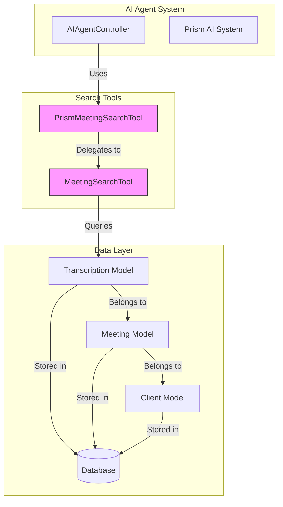
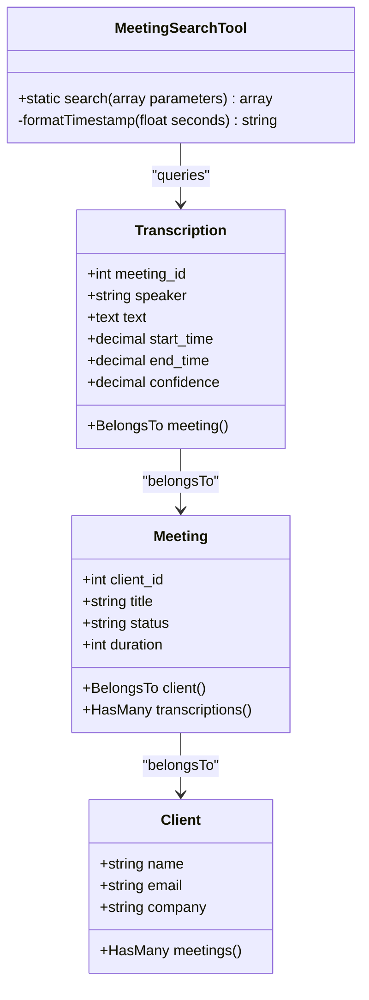
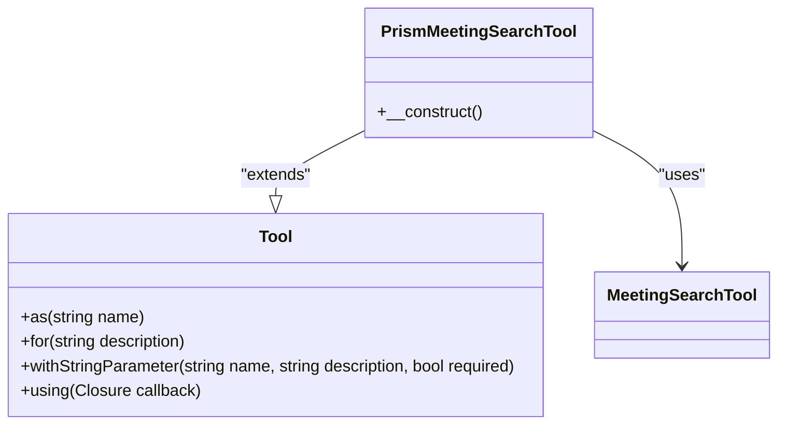
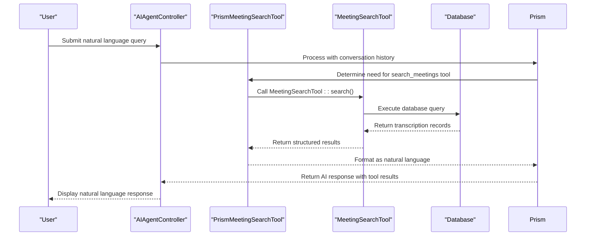
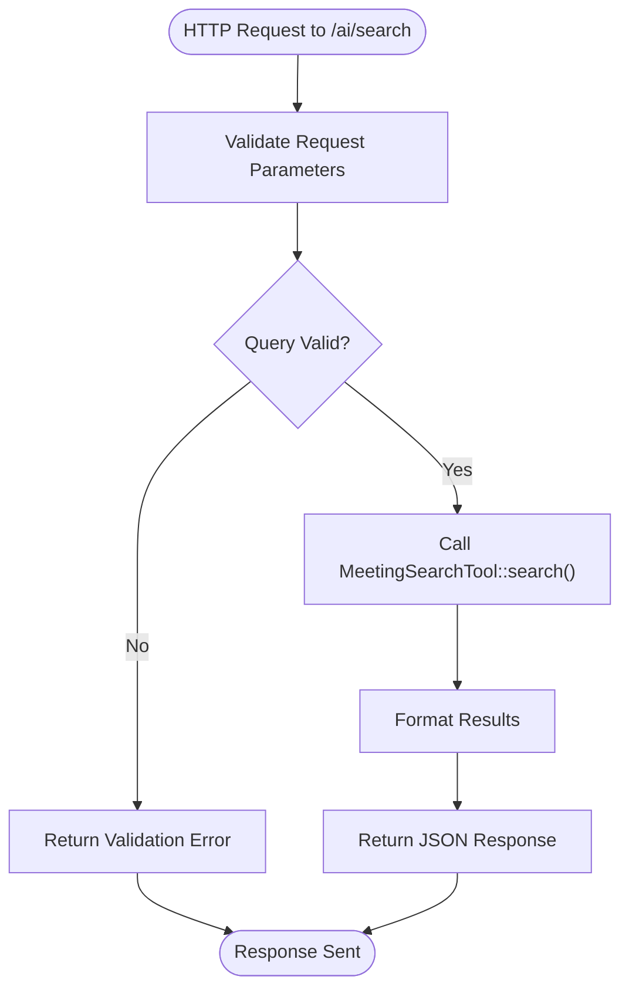
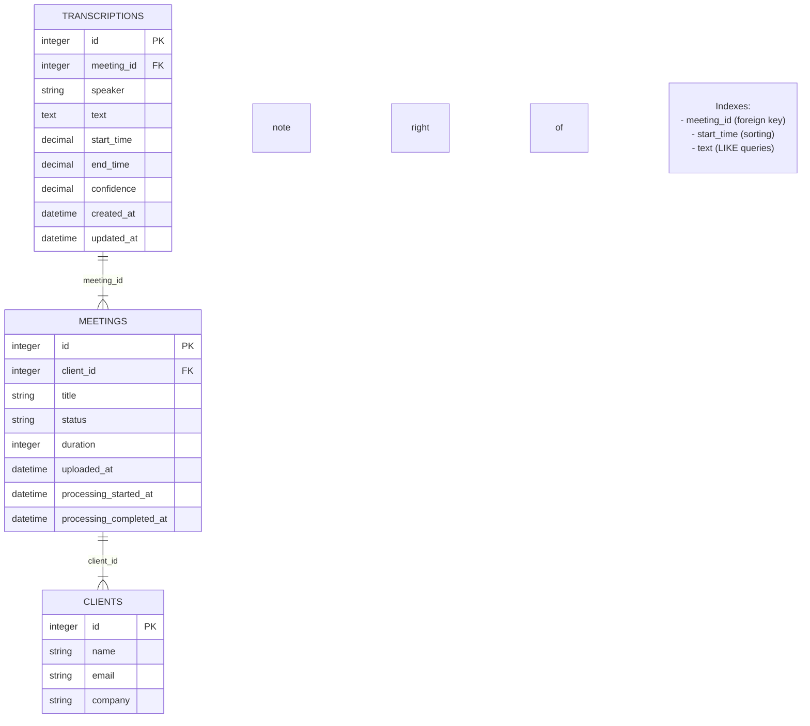

# AI Search Tools


## Table of Contents
1. [Introduction](#introduction)
2. [Core Components](#core-components)
3. [Architecture Overview](#architecture-overview)
4. [Detailed Component Analysis](#detailed-component-analysis)
5. [Data Flow and Integration](#data-flow-and-integration)
6. [Performance Considerations](#performance-considerations)
7. [Conclusion](#conclusion)

## Introduction
The AI Search Tools subsystem enables intelligent search capabilities across transcribed meeting content. This system allows AI agents to perform targeted searches by client, speaker, keyword, or time range, extracting relevant information from large volumes of meeting transcripts. The architecture is built around a structured tool interface that integrates seamlessly with the external Prism AI system, enabling natural language queries to be translated into precise database searches.

## Core Components

The AI search functionality is implemented through two primary components: `MeetingSearchTool` and `PrismMeetingSearchTool`. These tools work together to provide a robust search capability that bridges natural language processing with structured database queries.

**Section sources**
- [MeetingSearchTool.php](file://app/Tools/MeetingSearchTool.php)
- [PrismMeetingSearchTool.php](file://app/Tools/PrismMeetingSearchTool.php)

## Architecture Overview





**Diagram sources**
- [MeetingSearchTool.php](file://app/Tools/MeetingSearchTool.php)
- [PrismMeetingSearchTool.php](file://app/Tools/PrismMeetingSearchTool.php)
- [Transcription.php](file://app/Models/Transcription.php)
- [Meeting.php](file://app/Models/Meeting.php)
- [Client.php](file://app/Models/Client.php)

## Detailed Component Analysis

### MeetingSearchTool Implementation

The `MeetingSearchTool` class provides a structured interface for searching through transcribed meeting content. It implements a static search method that accepts parameters for query, client ID, speaker, and limit.





**Diagram sources**
- [MeetingSearchTool.php](file://app/Tools/MeetingSearchTool.php#L15-L85)
- [Transcription.php](file://app/Models/Transcription.php#L15-L49)
- [Meeting.php](file://app/Models/Meeting.php#L15-L178)
- [Client.php](file://app/Models/Client.php#L15-L27)

**Section sources**
- [MeetingSearchTool.php](file://app/Tools/MeetingSearchTool.php#L15-L85)

#### Tool Parameters and Validation

The `MeetingSearchTool::search()` method accepts the following parameters:

- **query**: Required string parameter containing the search term
- **client_id**: Optional integer parameter to filter by client
- **speaker**: Optional string parameter to filter by speaker name
- **limit**: Optional integer parameter to limit results (default: 10)

The method includes validation to ensure the query parameter is not empty and handles exceptions during database operations. It returns a structured array containing results or error information.


```php
public static function search(array $parameters): array
{
    $query = $parameters['query'] ?? '';
    $clientId = $parameters['client_id'] ?? null;
    $speaker = $parameters['speaker'] ?? null;
    $limit = $parameters['limit'] ?? 10;

    if (empty($query)) {
        return [
            'error' => 'Search query cannot be empty'
        ];
    }
    // ... query execution
}
```


**Section sources**
- [MeetingSearchTool.php](file://app/Tools/MeetingSearchTool.php#L15-L25)

### PrismMeetingSearchTool Integration

The `PrismMeetingSearchTool` extends the `Tool` class from the Prism AI system and wraps the `MeetingSearchTool` functionality for integration with the external AI platform.





**Diagram sources**
- [PrismMeetingSearchTool.php](file://app/Tools/PrismMeetingSearchTool.php#L15-L49)
- [MeetingSearchTool.php](file://app/Tools/MeetingSearchTool.php)

**Section sources**
- [PrismMeetingSearchTool.php](file://app/Tools/PrismMeetingSearchTool.php#L15-L49)

#### Schema Definition and Parameter Configuration

The tool defines its schema using the Prism framework's fluent interface:

- **query**: Required string parameter for the search query
- **client_id**: Optional string parameter for client filtering (converted to integer)
- **speaker**: Optional string parameter for speaker filtering
- **limit**: Optional string parameter for result limit (validated and capped at 50)


```php
$this->as('search_meetings')
    ->for('Search through meeting transcriptions to find specific content, topics, or keywords')
    ->withStringParameter('query', 'The search query to find in meeting transcriptions', true)
    ->withStringParameter('client_id', 'Optional client ID to filter search results to specific client meetings', false)
    ->withStringParameter('speaker', 'Optional speaker name to filter results to specific speaker', false)
    ->withStringParameter('limit', 'Maximum number of results to return (default: 10)', false)
    ->using(function (string $query, $client_id = null, ?string $speaker = null, $limit = 10): string {
        // Implementation
    });
```


The callback function validates and sanitizes input parameters before delegating to `MeetingSearchTool::search()`, then formats the results as a natural language response.

**Section sources**
- [PrismMeetingSearchTool.php](file://app/Tools/PrismMeetingSearchTool.php#L15-L49)

## Data Flow and Integration

### Search Execution Flow

The data flow from AI agent decision to search execution follows a clear sequence:





**Diagram sources**
- [AIAgentController.php](file://app/Http/Controllers/AIAgentController.php#L45-L150)
- [PrismMeetingSearchTool.php](file://app/Tools/PrismMeetingSearchTool.php#L15-L49)
- [MeetingSearchTool.php](file://app/Tools/MeetingSearchTool.php#L15-L85)

**Section sources**
- [AIAgentController.php](file://app/Http/Controllers/AIAgentController.php#L45-L150)

### Direct Search Endpoint

The system also provides a direct search endpoint for non-AI use cases:





**Diagram sources**
- [AIAgentController.php](file://app/Http/Controllers/AIAgentController.php#L155-L182)

**Section sources**
- [AIAgentController.php](file://app/Http/Controllers/AIAgentController.php#L155-L182)

### Example Tool Invocation and SQL Query

When a user asks "Find discussions about Q3 marketing budget", the following process occurs:

**Tool Invocation Payload:**

```json
{
  "name": "search_meetings",
  "arguments": {
    "query": "Q3 marketing budget",
    "limit": "10"
  }
}
```


**Resulting SQL Query:**

```sql
SELECT 
    t.*,
    m.title as meeting_title,
    m.client_id,
    c.name as client_name
FROM transcriptions t
INNER JOIN meetings m ON t.meeting_id = m.id
INNER JOIN clients c ON m.client_id = c.id
WHERE t.text LIKE '%Q3 marketing budget%'
ORDER BY t.start_time ASC
LIMIT 10;
```


**Formatted Result:**

```
Found 2 results for 'Q3 marketing budget':

**Budget Planning Meeting** (Acme Corp)
Speaker: John Doe at 00:30:05
Text: We need to review the **Q3 marketing budget** allocation.
Link: /meetings/123?t=1805.0

**Quarterly Review** (Acme Corp)
Speaker: Jane Smith at 01:15:30
Text: The **Q3 marketing budget** was overspent by 15%.
Link: /meetings/124?t=4530.0
```


**Section sources**
- [PrismMeetingSearchTool.php](file://app/Tools/PrismMeetingSearchTool.php#L20-L45)
- [MeetingSearchTool.php](file://app/Tools/MeetingSearchTool.php#L30-L70)

## Performance Considerations

### Database Indexing Strategy

The transcription table is optimized for search performance with strategic indexing:





**Diagram sources**
- [2025_08_10_135210_create_transcriptions_table.php](file://database/migrations/2025_08_10_135210_create_transcriptions_table.php#L15-L35)

**Section sources**
- [2025_08_10_135210_create_transcriptions_table.php](file://database/migrations/2025_08_10_135210_create_transcriptions_table.php#L15-L35)

The database migration creates the following indexes:
- **meeting_id**: Foreign key index for efficient joins and client-based filtering
- **start_time**: Index for chronological ordering of results
- Note: The comment indicates SQLite limitations with full-text indexes, so LIKE queries are used for text search

### Query Optimization

The `MeetingSearchTool` implements several performance optimizations:

1. **Eager Loading**: Uses `with(['meeting.client'])` to prevent N+1 query problems
2. **Conditional Filtering**: Uses `when()` method to apply filters only when needed
3. **Result Limiting**: Applies `limit()` to prevent excessive data retrieval
4. **Efficient Ordering**: Orders by `start_time` which has a database index


```php
$results = Transcription::query()
    ->with(['meeting.client'])
    ->where('text', 'like', "%{$query}%")
    ->when($clientId, function ($q) use ($clientId) {
        return $q->whereHas('meeting', function ($q) use ($clientId) {
            $q->where('client_id', $clientId);
        });
    })
    ->when($speaker, function ($q) use ($speaker) {
        return $q->where('speaker', 'like', "%{$speaker}%");
    })
    ->orderBy('start_time', 'asc')
    ->limit($limit)
    ->get();
```


**Section sources**
- [MeetingSearchTool.php](file://app/Tools/MeetingSearchTool.php#L30-L45)

### Caching Strategy

While the current implementation does not include explicit caching for frequent search patterns, the architecture allows for easy integration of caching mechanisms. Potential caching strategies include:

1. **Query Result Caching**: Cache results of common search queries
2. **Redis Cache**: Use Redis to store frequently accessed search results
3. **Time-based Expiration**: Implement TTL for cached search results
4. **Cache Key Generation**: Create cache keys based on query parameters

The AIAgentController already uses Laravel's cache system for rate limiting, demonstrating the availability of caching infrastructure:


```php
$cacheKey = 'ai_chat_' . $request->ip();
$requestCount = cache()->get($cacheKey, 0);
cache()->put($cacheKey, $requestCount + 1, 60);
```


**Section sources**
- [AIAgentController.php](file://app/Http/Controllers/AIAgentController.php#L65-L70)

## Conclusion

The AI Search Tools subsystem provides a robust and extensible framework for searching through transcribed meeting content. The architecture separates concerns between the core search functionality (`MeetingSearchTool`) and AI integration (`PrismMeetingSearchTool`), allowing for clean separation of concerns.

Key strengths of the implementation include:
- **Structured Interface**: Clear parameter schema with validation
- **Flexible Filtering**: Support for client, speaker, and keyword filtering
- **Natural Language Integration**: Seamless connection with the Prism AI system
- **Performance Optimized**: Strategic database indexing and query optimization
- **Error Resilient**: Comprehensive error handling and user-friendly error messages

The system effectively bridges natural language queries with structured database searches, enabling users to extract valuable insights from meeting transcripts through conversational AI. Future enhancements could include full-text search capabilities, advanced caching strategies, and more sophisticated result ranking algorithms.

**Referenced Files in This Document**   
- [MeetingSearchTool.php](file://app/Tools/MeetingSearchTool.php)
- [PrismMeetingSearchTool.php](file://app/Tools/PrismMeetingSearchTool.php)
- [Transcription.php](file://app/Models/Transcription.php)
- [Meeting.php](file://app/Models/Meeting.php)
- [Client.php](file://app/Models/Client.php)
- [2025_08_10_135210_create_transcriptions_table.php](file://database/migrations/2025_08_10_135210_create_transcriptions_table.php)
- [AIAgentController.php](file://app/Http/Controllers/AIAgentController.php)
- [prism.php](file://config/prism.php)