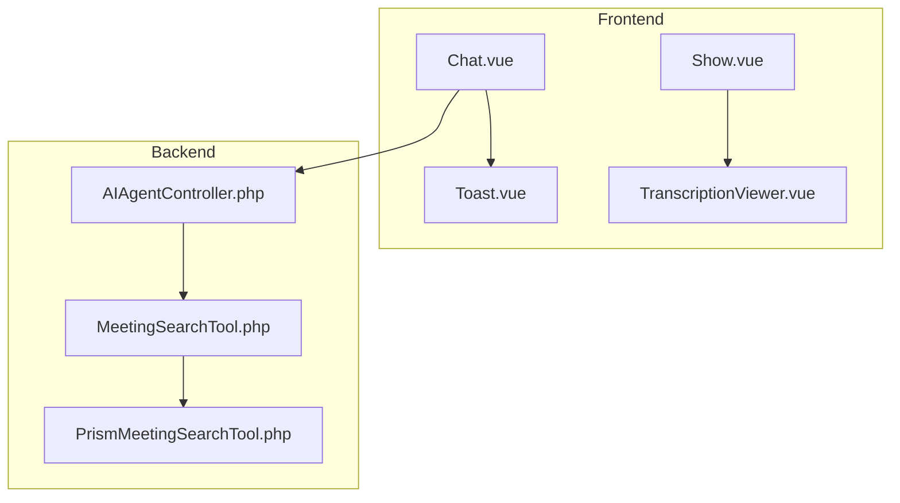
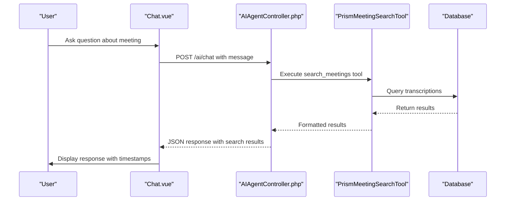
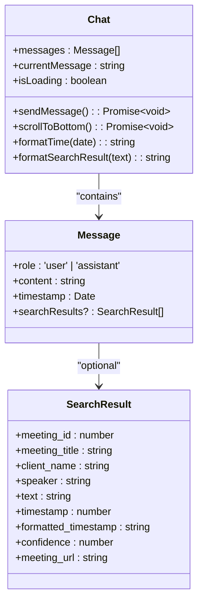
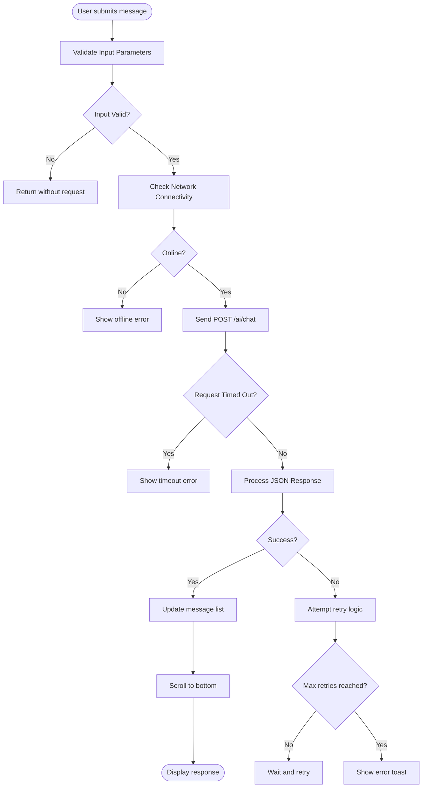
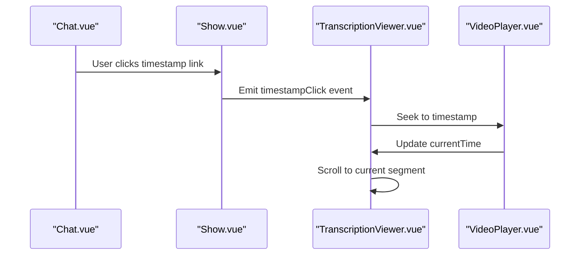
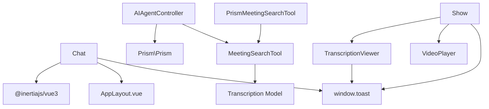
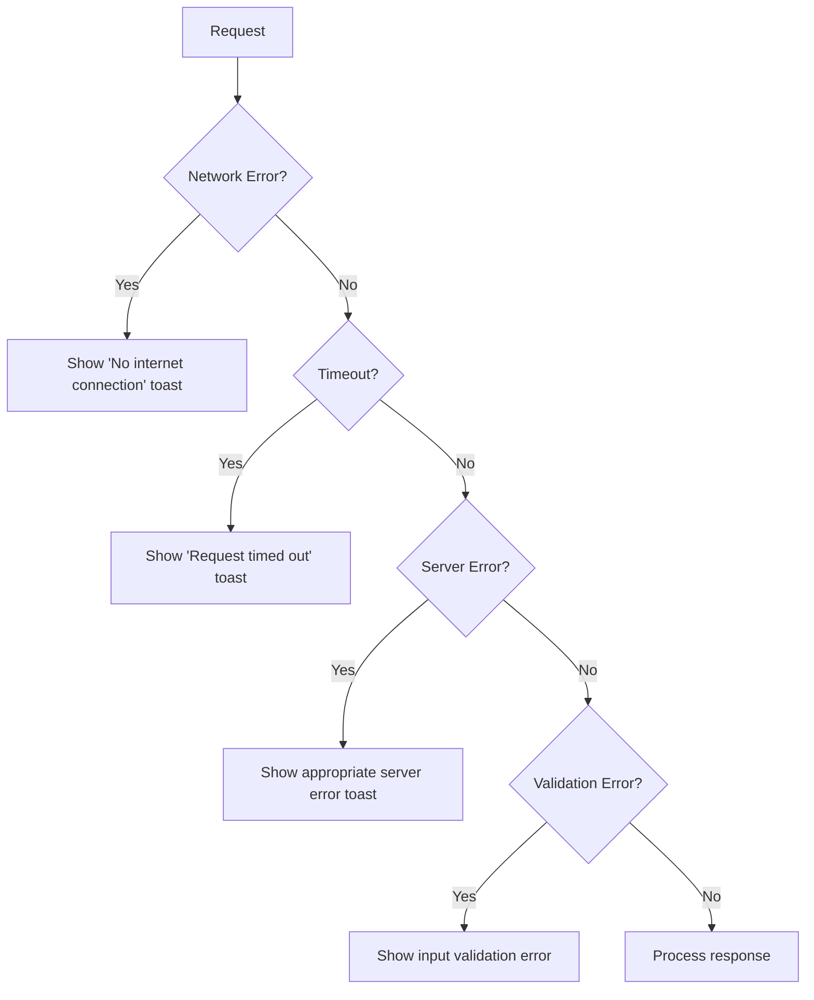

# Frontend AI Interface


## Table of Contents
1. [Introduction](#introduction)
2. [Project Structure](#project-structure)
3. [Core Components](#core-components)
4. [Architecture Overview](#architecture-overview)
5. [Detailed Component Analysis](#detailed-component-analysis)
6. [Dependency Analysis](#dependency-analysis)
7. [Performance Considerations](#performance-considerations)
8. [Troubleshooting Guide](#troubleshooting-guide)
9. [Conclusion](#conclusion)

## Introduction
The Frontend AI Interface enables users to interact naturally with meeting content through a conversational UI. Users can ask questions about meeting transcriptions, and the system responds with real-time streaming answers powered by an AI agent. The interface is built using Vue.js with Inertia.js for seamless integration with the Laravel backend. Key features include natural language query processing, search result highlighting, timestamp navigation, and robust error handling with user feedback via toast notifications.

## Project Structure
The project follows a modular structure with clear separation between frontend and backend components. The AI interface resides in the `resources/js/pages/AI/Chat.vue` component, which communicates with the `AIAgentController.php` backend controller. Supporting components include `TranscriptionViewer.vue` for synchronized playback and `Toast.vue` for user feedback.





**Diagram sources**
- [Chat.vue](file://resources/js/pages/AI/Chat.vue)
- [AIAgentController.php](file://app/Http/Controllers/AIAgentController.php)
- [MeetingSearchTool.php](file://app/Tools/MeetingSearchTool.php)
- [PrismMeetingSearchTool.php](file://app/Tools/PrismMeetingSearchTool.php)
- [TranscriptionViewer.vue](file://resources/js/lib/TranscriptionViewer.vue)
- [Show.vue](file://resources/js/pages/Meetings/Show.vue)
- [Toast.vue](file://resources/js/lib/Toast.vue)

**Section sources**
- [Chat.vue](file://resources/js/pages/AI/Chat.vue)
- [AIAgentController.php](file://app/Http/Controllers/AIAgentController.php)

## Core Components
The core components of the AI interface include:
- **Chat.vue**: Main conversational interface with reactive state management
- **AIAgentController.php**: Backend controller handling AI requests
- **TranscriptionViewer.vue**: Component for synchronized playback navigation
- **Toast.vue**: Global notification system for user feedback

These components work together to provide a seamless experience for querying and navigating meeting content.

**Section sources**
- [Chat.vue](file://resources/js/pages/AI/Chat.vue)
- [AIAgentController.php](file://app/Http/Controllers/AIAgentController.php)
- [TranscriptionViewer.vue](file://resources/js/lib/TranscriptionViewer.vue)
- [Toast.vue](file://resources/js/lib/Toast.vue)

## Architecture Overview
The architecture follows a client-server model with Vue.js frontend components communicating with Laravel backend controllers via API calls. The AI agent uses tool-based function calling to search meeting transcriptions and return relevant results.





**Diagram sources**
- [Chat.vue](file://resources/js/pages/AI/Chat.vue)
- [AIAgentController.php](file://app/Http/Controllers/AIAgentController.php)
- [PrismMeetingSearchTool.php](file://app/Tools/PrismMeetingSearchTool.php)

## Detailed Component Analysis

### Chat Interface Analysis
The Chat.vue component provides a conversational UI for users to ask questions about meeting content. It manages state for messages, loading status, and user input.

#### Reactive State Management




**Diagram sources**
- [Chat.vue](file://resources/js/pages/AI/Chat.vue#L100-L250)

**Section sources**
- [Chat.vue](file://resources/js/pages/AI/Chat.vue)

#### Event Handling and User Interaction
The component handles user input through form submission and manages the conversation flow:

1. User types a question and clicks "Send"
2. Message is added to the conversation with user role
3. Loading state is activated
4. API request is sent to AIAgentController
5. Response is processed and added to conversation
6. Loading state is deactivated
7. View scrolls to bottom

The component includes input validation to prevent empty messages and disables the send button during loading.

### Backend Integration Analysis
The frontend integrates with the backend through API calls to the AIAgentController.

#### API Request Flow




**Diagram sources**
- [Chat.vue](file://resources/js/pages/AI/Chat.vue#L150-L280)

**Section sources**
- [Chat.vue](file://resources/js/pages/AI/Chat.vue)

#### Payload Structure
The frontend sends the following payload to the backend:


```json
{
  "message": "Find mentions of budget in recent meetings",
  "conversation_history": [
    {
      "role": "user",
      "content": "What did John say about the project timeline?"
    },
    {
      "role": "assistant",
      "content": "John mentioned the project timeline would be extended by two weeks."
    }
  ]
}
```


The backend responds with:


```json
{
  "success": true,
  "response": "I found several mentions of budget in recent meetings.",
  "tool_calls": [
    {
      "name": "search_meetings",
      "arguments": {
        "query": "budget",
        "client_id": null,
        "speaker": null,
        "limit": 10
      },
      "result": {
        "results": [
          {
            "meeting_id": 123,
            "meeting_title": "Q3 Planning",
            "client_name": "Acme Corp",
            "speaker": "Sarah Chen",
            "text": "We need to **increase the budget** for marketing by 15%",
            "timestamp": 1245.3,
            "formatted_timestamp": "20:45",
            "confidence": 0.98,
            "meeting_url": "/meetings/123"
          }
        ]
      }
    }
  ]
}
```


### Transcription Viewer Integration
The AI responses include timestamps that link to the TranscriptionViewer component for synchronized playback.

#### Synchronized Navigation




**Diagram sources**
- [Chat.vue](file://resources/js/pages/AI/Chat.vue)
- [Show.vue](file://resources/js/pages/Meetings/Show.vue)
- [TranscriptionViewer.vue](file://resources/js/lib/TranscriptionViewer.vue)

**Section sources**
- [Show.vue](file://resources/js/pages/Meetings/Show.vue)

## Dependency Analysis
The AI interface components have the following dependencies:





**Diagram sources**
- [Chat.vue](file://resources/js/pages/AI/Chat.vue)
- [AIAgentController.php](file://app/Http/Controllers/AIAgentController.php)
- [PrismMeetingSearchTool.php](file://app/Tools/PrismMeetingSearchTool.php)
- [MeetingSearchTool.php](file://app/Tools/MeetingSearchTool.php)
- [Show.vue](file://resources/js/pages/Meetings/Show.vue)
- [TranscriptionViewer.vue](file://resources/js/lib/TranscriptionViewer.vue)

**Section sources**
- [Chat.vue](file://resources/js/pages/AI/Chat.vue)
- [AIAgentController.php](file://app/Http/Controllers/AIAgentController.php)
- [PrismMeetingSearchTool.php](file://app/Tools/PrismMeetingSearchTool.php)
- [MeetingSearchTool.php](file://app/Tools/MeetingSearchTool.php)

## Performance Considerations
The AI interface implements several performance optimizations:

1. **Rate Limiting**: The backend implements rate limiting (10 requests per minute) to prevent abuse
2. **Request Timeout**: Frontend requests timeout after 30 seconds to prevent hanging
3. **Retry Logic**: Failed requests are retried up to 3 times with exponential backoff
4. **Caching**: Conversation history is limited to 50 messages to prevent excessive payload sizes
5. **Efficient Rendering**: Virtual scrolling and efficient Vue reactivity minimize DOM updates

The system also includes loading states and progress indicators to provide feedback during AI processing.

## Troubleshooting Guide
The application includes comprehensive error handling and user feedback mechanisms.

### Error Handling Flow




**Diagram sources**
- [Chat.vue](file://resources/js/pages/AI/Chat.vue#L200-L270)
- [Toast.vue](file://resources/js/lib/Toast.vue)

**Section sources**
- [Chat.vue](file://resources/js/pages/AI/Chat.vue)
- [Toast.vue](file://resources/js/lib/Toast.vue)

### Common Issues and Solutions
1. **No Response from AI**: Check internet connection and retry
2. **Slow Responses**: Large queries may take longer; try shorter, more specific questions
3. **No Results Found**: Verify the search query and try different keywords
4. **Session Expired**: Refresh the page to re-authenticate
5. **Rate Limited**: Wait a moment and try again; avoid rapid successive requests

The toast notification system provides actionable feedback, including retry options for failed requests.

## Conclusion
The Frontend AI Interface provides a robust and user-friendly way to interact with meeting content through natural language queries. The system integrates Vue.js frontend components with a Laravel backend to deliver real-time AI responses with search results and timestamp navigation. Key strengths include responsive UI, comprehensive error handling, and seamless integration with the transcription viewer for synchronized playback. The architecture supports scalability and maintainability through clear separation of concerns and well-defined component interfaces.

**Referenced Files in This Document**   
- [Chat.vue](file://resources/js/pages/AI/Chat.vue)
- [TranscriptionViewer.vue](file://resources/js/lib/TranscriptionViewer.vue)
- [AIAgentController.php](file://app/Http/Controllers/AIAgentController.php)
- [MeetingSearchTool.php](file://app/Tools/MeetingSearchTool.php)
- [PrismMeetingSearchTool.php](file://app/Tools/PrismMeetingSearchTool.php)
- [Show.vue](file://resources/js/pages/Meetings/Show.vue)
- [Toast.vue](file://resources/js/lib/Toast.vue)