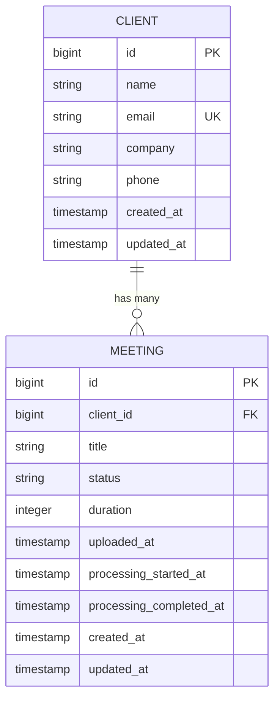
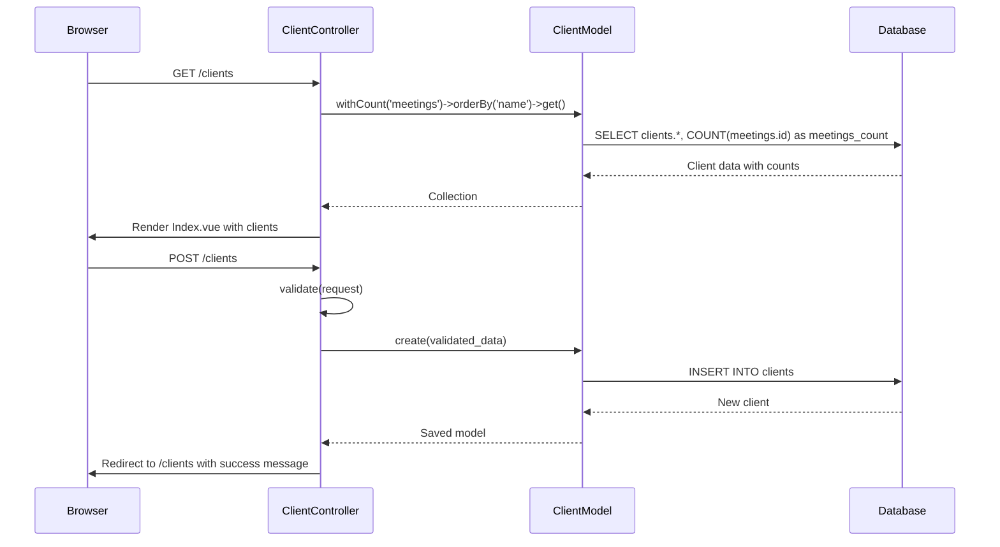

# Client Management


## Table of Contents
1. [Introduction](#introduction)
2. [Client Model and Database Schema](#client-model-and-database-schema)
3. [CRUD Operations in ClientController](#crud-operations-in-clientcontroller)
4. [Frontend Components for Client Management](#frontend-components-for-client-management)
5. [Client-Meeting Relationship and Filtering](#client-meeting-relationship-and-filtering)
6. [Validation and Error Handling](#validation-and-error-handling)
7. [Security and Data Integrity](#security-and-data-integrity)
8. [Usage Examples](#usage-examples)

## Introduction
The **Client Management** feature enables organizations or entities to be represented as Clients within the system. Each Client can own multiple Meetings, establishing a one-to-many relationship. This documentation details the implementation of CRUD operations, frontend components, data model structure, and integration points that allow users to create, view, edit, and delete clients, as well as associate meetings with them. The system ensures data integrity through validation and referential constraints, and supports filtering of meetings by client both in the UI and AI-powered search functionality.

## Client Model and Database Schema

### Client Model Structure
The `Client` model defines the core attributes and relationships for client entities. It uses Eloquent ORM and includes the following key elements:

- **Fillable attributes**: `name`, `email`, `company`, `phone`
- **Relationship**: One-to-many with `Meeting` via the `meetings()` method
- **Factory usage**: Uses Laravel's `HasFactory` trait for test and seed data generation


```php
class Client extends Model
{
    use HasFactory;
    
    protected $fillable = [
        'name',
        'email',
        'company',
        'phone',
    ];

    public function meetings(): HasMany
    {
        return $this->hasMany(Meeting::class);
    }
}
```


### Database Schema
The `clients` table is defined in the migration file and includes the following columns:

- `id`: Primary key (auto-incrementing)
- `name`: Required string (255 chars)
- `email`: Nullable, unique string
- `company`: Nullable string
- `phone`: Nullable string
- `created_at` and `updated_at`: Timestamps for record tracking


```php
Schema::create('clients', function (Blueprint $table) {
    $table->id();
    $table->string('name');
    $table->string('email')->unique()->nullable();
    $table->string('company')->nullable();
    $table->string('phone')->nullable();
    $table->timestamps();
});
```


### Meeting Model and Foreign Key
The `Meeting` model contains a `client_id` foreign key that references the `clients` table. The migration enforces referential integrity using `onDelete('cascade')`, ensuring that if a client is deleted, all associated meetings are also removed.


```php
$table->foreignId('client_id')->constrained()->onDelete('cascade');
```





**Diagram sources**
- [2025_08_10_135157_create_clients_table.php](file://database/migrations/2025_08_10_135157_create_clients_table.php)
- [2025_08_10_135205_create_meetings_table.php](file://database/migrations/2025_08_10_135205_create_meetings_table.php)
- [Client.php](file://app/Models/Client.php)
- [Meeting.php](file://app/Models/Meeting.php)

**Section sources**
- [Client.php](file://app/Models/Client.php#L1-L28)
- [Meeting.php](file://app/Models/Meeting.php#L1-L179)
- [2025_08_10_135157_create_clients_table.php](file://database/migrations/2025_08_10_135157_create_clients_table.php#L1-L32)
- [2025_08_10_135205_create_meetings_table.php](file://database/migrations/2025_08_10_135205_create_meetings_table.php#L1-L41)

## CRUD Operations in ClientController

The `ClientController` implements full CRUD functionality using Inertia.js for seamless frontend integration.

### Index Operation
Retrieves all clients with their meeting counts, sorted alphabetically by name.


```php
public function index(): Response
{
    $clients = Client::withCount('meetings')
        ->orderBy('name')
        ->get();

    return Inertia::render('Clients/Index', [
        'clients' => $clients
    ]);
}
```


### Create and Store Operations
- `create()`: Renders the client creation form
- `store()`: Validates input and creates a new client

Validation rules:
- `name`: Required, max 255 chars
- `email`: Optional, must be unique if provided
- `company`, `phone`: Optional


```php
$validated = $request->validate([
    'name' => 'required|string|max:255',
    'email' => 'nullable|email|unique:clients,email',
    'company' => 'nullable|string|max:255',
    'phone' => 'nullable|string|max:255',
]);
```


### Show and Edit Operations
- `show(Client $client)`: Loads client with associated meetings (most recent first)
- `edit(Client $client)`: Prepares client data for editing

### Update Operation
Applies validation similar to `store()`, but allows the current client's email to remain unchanged.


```php
'email' => [
    'nullable',
    'email',
    Rule::unique('clients', 'email')->ignore($client->id)
],
```


### Destroy Operation
Prevents deletion if the client has associated meetings.


```php
if ($client->meetings()->count() > 0) {
    return redirect()->route('clients.index')
        ->with('error', 'Cannot delete client with existing meetings.');
}
```





**Diagram sources**
- [ClientController.php](file://app/Http/Controllers/ClientController.php#L1-L95)

**Section sources**
- [ClientController.php](file://app/Http/Controllers/ClientController.php#L1-L95)

## Frontend Components for Client Management

### Index.vue
Displays a table of all clients with:
- Name (linked to Show page)
- Company, email, phone
- Meeting count badge
- Edit and Delete actions
- Delete button disabled if meetings exist

Uses Inertia Link and router for navigation and deletion.

### Create.vue and Edit.vue
Form components with:
- Input fields for name, email, company, phone
- Real-time error display
- Form processing state (e.g., "Creating...")
- Cancel and submit buttons

Uses `useForm()` from Inertia for state management.

### Show.vue
Displays detailed client information and associated meetings:
- Client details (name, company, contact info)
- List of meetings with status badges
- "Add Meeting" button pre-filled with client ID
- Status-based styling (green for completed, yellow for processing, etc.)


```mermaid
flowchart TD
A[User visits /clients] --> B[Index.vue loads clients]
B --> C[Display client table]
C --> D{User action?}
D --> |Add Client| E[Navigate to /clients/create]
D --> |View Client| F[Navigate to /clients/{id}]
D --> |Edit Client| G[Navigate to /clients/{id}/edit]
D --> |Delete Client| H[Confirm and delete if no meetings]
E --> I[Create.vue form]
I --> J[Submit to ClientController@store]
F --> K[Show.vue loads client + meetings]
G --> L[Edit.vue pre-fills form]
L --> M[Submit to ClientController@update]
```


**Diagram sources**
- [Index.vue](file://resources/js/pages/Clients/Index.vue#L1-L121)
- [Create.vue](file://resources/js/pages/Clients/Create.vue#L1-L127)
- [Edit.vue](file://resources/js/pages/Clients/Edit.vue#L1-L130)
- [Show.vue](file://resources/js/pages/Clients/Show.vue#L1-L184)

**Section sources**
- [Index.vue](file://resources/js/pages/Clients/Index.vue#L1-L121)
- [Create.vue](file://resources/js/pages/Clients/Create.vue#L1-L127)
- [Edit.vue](file://resources/js/pages/Clients/Edit.vue#L1-L130)
- [Show.vue](file://resources/js/pages/Clients/Show.vue#L1-L184)

## Client-Meeting Relationship and Filtering

### UI-Based Filtering
The `ClientSelector.vue` component allows users to filter meetings by client in various parts of the application.

Key features:
- Dropdown with client names and optional company in parentheses
- Supports v-model binding via `update:modelValue`
- Displays error and help text
- Accessible with proper labels

Used in meeting creation and search interfaces to associate or filter by client.

### AI Search Integration
Although not fully visible in the provided code, the `MeetingSearchTool` and `PrismMeetingSearchTool` likely use the `client_id` field to filter meetings by client in AI-powered search queries. The structured relationship enables natural language queries like "show me all meetings for Acme Corp."

### Meeting Association
When creating a new meeting, the `Show.vue` component includes a pre-filled "Add Meeting" link:

```vue
<Link :href="route('meetings.create', { client_id: client.id })">
```

This automatically sets the client context when creating a new meeting.

**Section sources**
- [ClientSelector.vue](file://resources/js/lib/ClientSelector.vue#L1-L63)
- [Show.vue](file://resources/js/pages/Clients/Show.vue#L1-L184)

## Validation and Error Handling

### Backend Validation
- **Name**: Required, string, max 255 characters
- **Email**: Must be valid format and unique across clients
- **Company/Phone**: Optional strings, max 255 characters
- **Update uniqueness**: Email uniqueness check ignores current client ID

### Frontend Validation Feedback
- Input fields highlight in red when errors exist
- Error messages displayed below respective fields
- Delete action blocked via UI when meetings exist
- Confirmation dialog before deletion

### Error Responses
- **Store/Update**: Returns validation errors to the form
- **Destroy**: Redirects with error message if client has meetings
- Success messages use Laravel's session flash system


```php
->with('success', 'Client created successfully.')
->with('error', 'Cannot delete client with existing meetings.')
```


**Section sources**
- [ClientController.php](file://app/Http/Controllers/ClientController.php#L1-L95)
- [Create.vue](file://resources/js/pages/Clients/Create.vue#L1-L127)
- [Edit.vue](file://resources/js/pages/Clients/Edit.vue#L1-L130)

## Security and Data Integrity

### Referential Integrity
- Database enforces `client_id` foreign key constraint
- `onDelete('cascade')` ensures data consistency
- Prevents orphaned meetings

### Input Sanitization
- Laravel automatically escapes output in Blade templates
- Vue.js handles XSS protection for dynamic content
- Server-side validation prevents malformed data

### Business Rule Enforcement
- Clients cannot be deleted if they have meetings
- Email uniqueness constraint prevents duplicates
- All client operations require proper authentication (inherited from base Controller)

**Section sources**
- [ClientController.php](file://app/Http/Controllers/ClientController.php#L1-L95)
- [2025_08_10_135205_create_meetings_table.php](file://database/migrations/2025_08_10_135205_create_meetings_table.php#L1-L41)

## Usage Examples

### Creating a Client
1. Navigate to **Add Client**
2. Fill in name (required), email, company, phone
3. Click **Create Client**
4. System validates and saves, redirecting to client list

### Associating Meetings
1. View a client's detail page
2. Click **Add Meeting**
3. Meeting form opens with client context pre-filled
4. Save meeting to associate with client

### Managing Client Data
- **Edit**: Click "Edit" on any client to update details
- **View**: See all meetings associated with the client
- **Delete**: Only allowed if no meetings exist; otherwise, blocked with error message

Example workflow:

```php
// Create client
POST /clients
{
  "name": "Acme Corporation",
  "email": "contact@acme.com",
  "company": "Acme Corp",
  "phone": "+1-555-0123"
}

// Result: Client created with ID 1
// Meetings can now be associated with client_id = 1
```


**Section sources**
- [ClientController.php](file://app/Http/Controllers/ClientController.php#L1-L95)
- [Create.vue](file://resources/js/pages/Clients/Create.vue#L1-L127)
- [Show.vue](file://resources/js/pages/Clients/Show.vue#L1-L184)

**Referenced Files in This Document**   
- [ClientController.php](file://app/Http/Controllers/ClientController.php)
- [Client.php](file://app/Models/Client.php)
- [Meeting.php](file://app/Models/Meeting.php)
- [2025_08_10_135157_create_clients_table.php](file://database/migrations/2025_08_10_135157_create_clients_table.php)
- [2025_08_10_135205_create_meetings_table.php](file://database/migrations/2025_08_10_135205_create_meetings_table.php)
- [Index.vue](file://resources/js/pages/Clients/Index.vue)
- [Create.vue](file://resources/js/pages/Clients/Create.vue)
- [Edit.vue](file://resources/js/pages/Clients/Edit.vue)
- [Show.vue](file://resources/js/pages/Clients/Show.vue)
- [ClientSelector.vue](file://resources/js/lib/ClientSelector.vue)