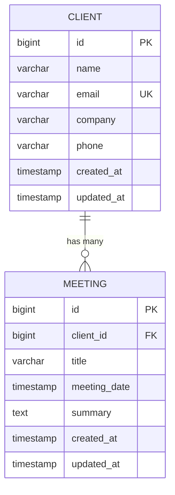

# Client Data Model


## Table of Contents
1. [Introduction](#introduction)
2. [Eloquent Model Structure](#eloquent-model-structure)
3. [Database Schema](#database-schema)
4. [Relationships](#relationships)
5. [Data Validation Rules](#data-validation-rules)
6. [Factories and Seeding](#factories-and-seeding)
7. [Sample Data Records](#sample-data-records)
8. [Data Integrity and Deletion Constraints](#data-integrity-and-deletion-constraints)
9. [Performance Considerations](#performance-considerations)

## Introduction
This document provides comprehensive documentation for the **Client** entity within the MeetingAI application. It details the Eloquent model structure, database schema, validation rules, factory usage, and data integrity constraints. The Client model serves as a foundational entity that represents individuals or organizations associated with meetings in the system. This documentation is designed to be accessible to both technical and non-technical stakeholders, offering clear explanations of how client data is structured, validated, and maintained throughout the application.

## Eloquent Model Structure

The `Client` model is implemented as an Eloquent ORM class in Laravel, extending the base `Model` class and utilizing Laravel's `HasFactory` trait for test and seed data generation.

### Fillable Attributes
The model defines the following attributes as mass-assignable via the `$fillable` property:
- **name**: Required string representing the client's name
- **email**: Optional email address
- **company**: Optional company name
- **phone**: Optional phone number

These fields are explicitly whitelisted to prevent unauthorized mass assignment during create or update operations.

### Attribute Casting
The model uses the `$casts` property to automatically convert certain attributes to specific PHP types:
- **email_verified_at**: Cast to `datetime` object when accessed

This ensures consistent type handling for date/time fields, although no such field is currently populated in the model logic.


```php
protected $fillable = [
    'name',
    'email',
    'company',
    'phone',
];

protected $casts = [
    'email_verified_at' => 'datetime',
];
```


**Section sources**
- [Client.php](file://app/Models/Client.php#L10-L20)

## Database Schema

The `clients` table is defined in a Laravel migration file that specifies the structure, constraints, and indexing strategy.

### Field Definitions
| Field | Type | Constraints | Description |
|------|------|-------------|-------------|
| **id** | BIGINT UNSIGNED | PRIMARY KEY, AUTO_INCREMENT | Unique identifier |
| **name** | VARCHAR(255) | NOT NULL | Client's full name |
| **email** | VARCHAR(255) | UNIQUE, NULLABLE | Contact email address |
| **company** | VARCHAR(255) | NULLABLE | Associated company name |
| **phone** | VARCHAR(255) | NULLABLE | Contact phone number |
| **created_at** | TIMESTAMP | NULLABLE | Record creation time |
| **updated_at** | TIMESTAMP | NULLABLE | Last update time |

### Indexing and Constraints
- **Primary Key**: The `id` field serves as the primary key with automatic indexing.
- **Unique Constraint**: The `email` field has a unique index to prevent duplicate email addresses across clients.
- **Soft Deletes**: Not implemented — the model does not use `SoftDeletes` trait, meaning deletion is permanent unless prevented by business logic.


```php
Schema::create('clients', function (Blueprint $table) {
    $table->id();
    $table->string('name');
    $table->string('email')->unique()->nullable();
    $table->string('company')->nullable();
    $table->string('phone')->nullable();
    $table->timestamps();
});
```


**Section sources**
- [2025_08_10_135157_create_clients_table.php](file://database/migrations/2025_08_10_135157_create_clients_table.php#L10-L18)

## Relationships

The `Client` model establishes a one-to-many relationship with the `Meeting` model, indicating that a single client can have multiple associated meetings.

### One-to-Many Relationship

```php
public function meetings(): HasMany
{
    return $this->hasMany(Meeting::class);
}
```


This relationship enables:
- Eager loading of meeting counts using `withCount('meetings')`
- Retrieval of all meetings for a client via `$client->meetings`
- Reverse lookup from `Meeting` to its associated `Client`

The foreign key constraint is managed at the application level rather than the database level (no explicit foreign key index in migration), but Laravel's Eloquent handles referential integrity through model relationships.

**Section sources**
- [Client.php](file://app/Models/Client.php#L22-L26)

## Data Validation Rules

Validation is enforced at both the controller and model levels to ensure data consistency and integrity.

### Controller-Level Validation
The `ClientController` applies strict validation rules during create and update operations:

#### Create Operation (`store`)

```php
$validated = $request->validate([
    'name' => 'required|string|max:255',
    'email' => 'nullable|email|unique:clients,email',
    'company' => 'nullable|string|max:255',
    'phone' => 'nullable|string|max:255',
]);
```


#### Update Operation (`update`)

```php
$validated = $request->validate([
    'name' => 'required|string|max:255',
    'email' => [
        'nullable',
        'email',
        Rule::unique('clients', 'email')->ignore($client->id)
    ],
    'company' => 'nullable|string|max:255',
    'phone' => 'nullable|string|max:255',
]);
```


### Validation Rule Summary
| Field | Rules | Purpose |
|------|-------|---------|
| **name** | required, string, max:255 | Ensures non-empty, properly formatted name |
| **email** | nullable, email, unique (excluding self on update) | Prevents invalid or duplicate emails |
| **company** | nullable, string, max:255 | Allows optional company with length limit |
| **phone** | nullable, string, max:255 | Allows optional phone number |

**Section sources**
- [ClientController.php](file://app/Http/Controllers/ClientController.php#L30-L36)
- [ClientController.php](file://app/Http/Controllers/ClientController.php#L65-L73)

## Factories and Seeding

Laravel factories and seeders are used to generate realistic test and sample data.

### Client Factory
The `ClientFactory` defines default fake data using Laravel's `Faker` service:

```php
return [
    'name' => fake()->name(),
    'email' => fake()->unique()->safeEmail(),
    'company' => fake()->company(),
    'phone' => fake()->phoneNumber(),
];
```


It also includes state modifiers for testing edge cases:
- `withoutEmail()`: Sets email to null
- `withoutCompany()`: Sets company to null
- `withoutPhone()`: Sets phone to null

These allow flexible test scenarios where optional fields may be missing.

### Seeding Strategy
The `ClientSeeder` populates the database with representative sample data:
- Three fully populated clients with realistic names, emails, companies, and phone numbers
- One minimal client with only the required `name` field set (others are null)

This approach ensures both complete and partial data cases are represented in development and testing environments.

**Section sources**
- [ClientFactory.php](file://database/factories/ClientFactory.php#L20-L35)
- [ClientSeeder.php](file://database/seeders/ClientSeeder.php#L10-L40)

## Sample Data Records

The following sample records are created by the `ClientSeeder` and represent typical client entries:

| Name | Email | Company | Phone |
|------|-------|---------|-------|
| Acme Corporation | contact@acme.com | Acme Corp | +1 (555) 123-4567 |
| John Smith | john@example.com | Smith Consulting | +1 (555) 987-6543 |
| Sarah Johnson | sarah@techstartup.com | Tech Startup Inc | +1 (555) 456-7890 |
| Basic Client | *null* | *null* | *null* |

These records demonstrate:
- Corporate vs. individual client naming patterns
- Valid email formats
- Standardized phone number formatting
- Handling of optional fields

## Data Integrity and Deletion Constraints

Data integrity is maintained through application-level constraints, particularly around deletion.

### Deletion Protection
Clients cannot be deleted if they have associated meetings:

```php
if ($client->meetings()->count() > 0) {
    return redirect()->route('clients.index')
        ->with('error', 'Cannot delete client with existing meetings.');
}
```


This prevents orphaned meetings and maintains referential integrity, even though there is no database-level foreign key constraint.

### Integrity Enforcement
- **Email Uniqueness**: Enforced via database unique index and controller validation
- **Required Fields**: Name is required; others are optional
- **Type Safety**: Attribute casting ensures proper data types
- **Mass Assignment Protection**: Only whitelisted fields are fillable

While soft deletes are not implemented, the application prevents accidental deletion through business logic checks.

**Section sources**
- [ClientController.php](file://app/Http/Controllers/ClientController.php#L85-L92)

## Performance Considerations

Efficient querying and data loading are critical for user experience, especially when dealing with client lists and meeting associations.

### Query Optimization
- **Eager Loading**: The index page uses `withCount('meetings')` to avoid N+1 query problems when displaying meeting counts.
- **Indexing**: The `email` field is indexed uniquely, enabling fast lookups during validation and authentication contexts.
- **Sorting**: Clients are ordered by `name` in the index view for consistent presentation.

### AI Search Context
Although not currently implemented, potential AI search features could leverage:
- Full-text indexing on `name`, `company`, and `email` fields
- Caching of frequently accessed client records
- Pagination for large client datasets

Future enhancements might include:
- Database-level foreign key constraints for better performance
- Soft deletes to allow recovery of mistakenly deleted clients
- Additional indexes on `company` for filtering





**Diagram sources**
- [Client.php](file://app/Models/Client.php#L1-L28)
- [2025_08_10_135157_create_clients_table.php](file://database/migrations/2025_08_10_135157_create_clients_table.php#L1-L32)

**Referenced Files in This Document**   
- [Client.php](file://app/Models/Client.php#L1-L28)
- [2025_08_10_135157_create_clients_table.php](file://database/migrations/2025_08_10_135157_create_clients_table.php#L1-L32)
- [ClientFactory.php](file://database/factories/ClientFactory.php#L1-L59)
- [ClientController.php](file://app/Http/Controllers/ClientController.php#L1-L95)
- [ClientSeeder.php](file://database/seeders/ClientSeeder.php#L1-L44)