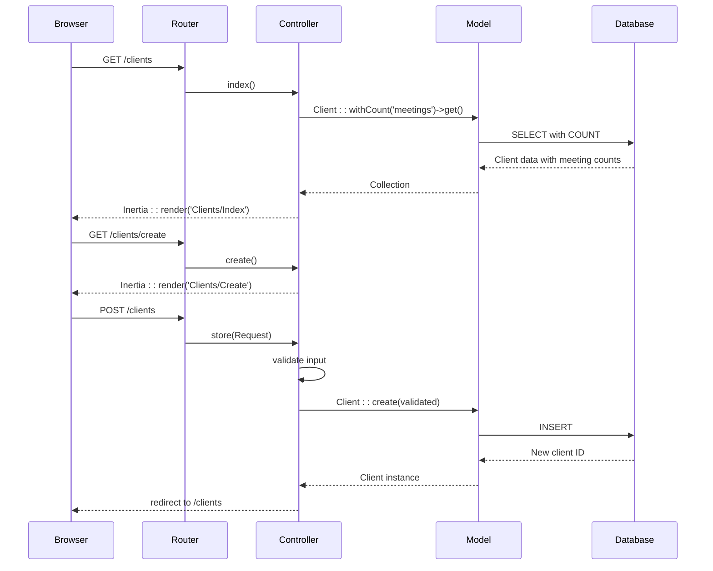
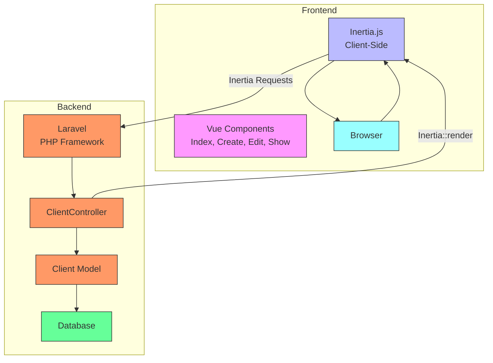
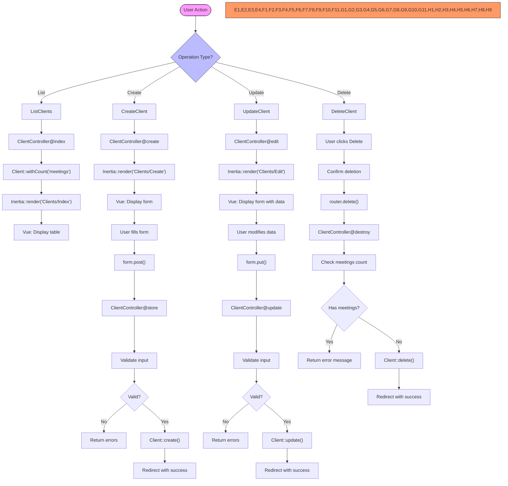

# Client CRUD Operations


## Table of Contents
1. [Client CRUD Operations Overview](#client-crud-operations-overview)
2. [Backend Implementation](#backend-implementation)
   - [HTTP Routes and Controller Methods](#http-routes-and-controller-methods)
   - [Request Validation and Error Handling](#request-validation-and-error-handling)
   - [Authorization and Business Logic](#authorization-and-business-logic)
3. [Frontend Implementation with Inertia.js](#frontend-implementation-with-inertiajs)
   - [Server-Side Rendering with Inertia](#server-side-rendering-with-inertia)
   - [Vue Component Structure and Data Flow](#vue-component-structure-and-data-flow)
   - [Form Handling and Validation Feedback](#form-handling-and-validation-feedback)
4. [Security and Data Integrity](#security-and-data-integrity)
5. [Practical Usage Examples](#practical-usage-examples)
6. [Architecture and Integration Diagrams](#architecture-and-integration-diagrams)

## Client CRUD Operations Overview

The Client CRUD (Create, Read, Update, Delete) functionality provides a complete interface for managing client records within the meeting management system. This feature enables users to organize meetings by client accounts, track engagement, and maintain contact information. The implementation follows a modern full-stack architecture using Laravel as the backend framework and Vue.js with Inertia.js for the frontend, enabling server-side rendering of single-page application components.

The system supports five primary operations: listing all clients, creating new clients, viewing client details, editing existing clients, and deleting clients. Each operation is secured through route middleware and includes appropriate validation and error handling. Special business logic prevents deletion of clients who have associated meetings, ensuring data integrity across the application.

**Section sources**
- [ClientController.php](file://app/Http/Controllers/ClientController.php#L1-L95)
- [web.php](file://routes/web.php#L1-L47)

## Backend Implementation

### HTTP Routes and Controller Methods

The ClientController implements RESTful CRUD operations with seven methods that correspond to standard HTTP verbs and routes. These routes are automatically registered using Laravel's resource routing system, which maps conventional HTTP methods to controller actions.





**Diagram sources**
- [ClientController.php](file://app/Http/Controllers/ClientController.php#L1-L95)
- [web.php](file://routes/web.php#L1-L47)

**Section sources**
- [ClientController.php](file://app/Http/Controllers/ClientController.php#L1-L95)
- [web.php](file://routes/web.php#L1-L47)

The following table details each method, its HTTP route, and purpose:

| Method | HTTP Verb | Route | Purpose |
|--------|---------|-------|---------|
| index | GET | /clients | Display list of all clients with meeting counts |
| create | GET | /clients/create | Show form for creating a new client |
| store | POST | /clients | Process form submission and create client |
| show | GET | /clients/{client} | Display details of a specific client |
| edit | GET | /clients/{client}/edit | Show form for editing an existing client |
| update | PUT/PATCH | /clients/{client} | Process form submission and update client |
| destroy | DELETE | /clients/{client} | Delete a client record |

The `web.php` route file uses Laravel's `Route::resource()` method to automatically register these routes, following RESTful conventions. This approach reduces boilerplate code and ensures consistent URL patterns across the application.

### Request Validation and Error Handling

The backend implements robust validation for client creation and updates, ensuring data integrity and providing meaningful error messages to users. Validation rules are defined within the controller methods using Laravel's validation system.

For client creation (`store` method), the validation rules are:
- `name`: required, string, maximum 255 characters
- `email`: optional, must be valid email format, must be unique in clients table
- `company`: optional, string, maximum 255 characters
- `phone`: optional, string, maximum 255 characters


```php
$validated = $request->validate([
    'name' => 'required|string|max:255',
    'email' => 'nullable|email|unique:clients,email',
    'company' => 'nullable|string|max:255',
    'phone' => 'nullable|string|max:255',
]);
```


For client updates (`update` method), the email validation includes a rule to ignore the current client's ID when checking uniqueness, preventing false positives when a client retains their current email address:


```php
'email' => [
    'nullable',
    'email',
    Rule::unique('clients', 'email')->ignore($client->id)
],
```


When validation fails, Laravel automatically redirects back to the previous page with error messages stored in the session. These errors are then made available to the frontend through the HandleInertiaRequests middleware, which shares session flash data and validation errors with Inertia components.

**Section sources**
- [ClientController.php](file://app/Http/Controllers/ClientController.php#L1-L95)

### Authorization and Business Logic

The ClientController implements authorization and business logic through route model binding and custom validation. Laravel's route model binding automatically injects the Client model instance into methods that accept a client parameter, providing convenient access to the requested client record.

The `destroy` method contains specific business logic to prevent deletion of clients who have associated meetings:


```php
public function destroy(Client $client): RedirectResponse
{
    // Check if client has meetings
    if ($client->meetings()->count() > 0) {
        return redirect()->route('clients.index')
            ->with('error', 'Cannot delete client with existing meetings.');
    }

    $client->delete();

    return redirect()->route('clients.index')
        ->with('success', 'Client deleted successfully.');
}
```


This logic ensures referential integrity by preventing orphaned meeting records. Instead of allowing deletion and potentially breaking relationships, the system displays an informative error message and redirects the user back to the clients index.

All controller methods return either a Response (for rendering views) or RedirectResponse (for form submissions), following Laravel's response pattern. Success and error messages are passed via session flash data using the `with()` method, which makes them available for display in the subsequent request.

**Section sources**
- [ClientController.php](file://app/Http/Controllers/ClientController.php#L1-L95)
- [Client.php](file://app/Models/Client.php#L1-L28)

## Frontend Implementation with Inertia.js

### Server-Side Rendering with Inertia

Inertia.js enables server-side rendering of Vue components by acting as a bridge between Laravel and Vue.js. Instead of returning traditional Blade views, the ClientController returns Inertia responses that specify which Vue component to render and what data to pass to it.

The HandleInertiaRequests middleware configures how data is shared between the backend and frontend. It provides several important pieces of shared data:


```php
public function share(Request $request): array
{
    return array_merge(parent::share($request), [
        'flash' => [
            'success' => fn () => $request->session()->get('success'),
            'error' => fn () => $request->session()->get('error'),
            'warning' => fn () => $request->session()->get('warning'),
            'info' => fn () => $request->session()->get('info'),
        ],
        'errors' => function () use ($request) {
            return $request->session()->get('errors')
                ? $request->session()->get('errors')->getBag('default')->getMessages()
                : (object) [];
        },
        'csrf_token' => fn () => csrf_token(),
        'app' => [
            'name' => config('app.name'),
            'url' => config('app.url'),
            'environment' => config('app.env'),
        ],
        'ziggy' => [
            ...(new Ziggy)->toArray(),
            'location' => $request->url(),
        ],
        'user' => fn () => $request->user()
            ? $request->user()->only('id', 'name', 'email')
            : null,
    ]);
}
```


This shared data includes flash messages, validation errors, CSRF tokens, application configuration, route information (via Ziggy), and user authentication data. This approach eliminates the need for separate API endpoints to retrieve this information, improving performance and simplifying the frontend code.

The `app.blade.php` layout file serves as the root template for Inertia, containing the basic HTML structure and mounting point for Vue components:


```html
<!DOCTYPE html>
<html lang="{{ str_replace('_', '-', app()->getLocale()) }}">
    <head>
        <title inertia>{{ config('app.name', 'Laravel') }}</title>
        @routes
        @vite(['resources/js/app.ts', "resources/js/pages/{$page['component']}.vue"])
        @inertiaHead
    </head>
    <body class="font-sans antialiased">
        @inertia
    </body>
</html>
```


**Diagram sources**
- [HandleInertiaRequests.php](file://app/Http/Middleware/HandleInertiaRequests.php#L1-L68)
- [app.blade.php](file://resources/views/app.blade.php#L1-L22)

**Section sources**
- [HandleInertiaRequests.php](file://app/Http/Middleware/HandleInertiaRequests.php#L1-L68)
- [app.blade.php](file://resources/views/app.blade.php#L1-L22)

### Vue Component Structure and Data Flow

The frontend implementation consists of four Vue components that correspond to the CRUD operations: Index.vue, Create.vue, Edit.vue, and Show.vue. These components use the Composition API with TypeScript and leverage Inertia's integration with Vue 3.

The data flow follows a consistent pattern across components:
1. The backend controller passes data via Inertia::render()
2. The Vue component receives props defined in the script setup
3. The template renders the data using Vue directives
4. User interactions trigger Inertia requests to the backend
5. Responses update the UI or redirect to new pages

For example, the Index.vue component receives a list of clients as a prop:


```vue
<script setup lang="ts">
import { Link, router } from '@inertiajs/vue3'
import AppLayout from '@/lib/AppLayout.vue'
import type { Client } from '@/types'

interface Props {
  clients: Client[]
}

defineProps<Props>()
</script>
```


The template then iterates over the clients to display them in a table. When a user clicks "Delete", the `deleteClient` function is called, which uses Inertia's router to send a DELETE request:


```javascript
const deleteClient = (client: Client) => {
  if ((client.meetings_count ?? 0) > 0) {
    alert('Cannot delete client with existing meetings.')
    return
  }

  if (confirm(`Are you sure you want to delete ${client.name}?`)) {
    router.delete(route('clients.destroy', client.id))
  }
}
```


This approach maintains the SPA-like experience while leveraging server-side rendering for initial page loads and form submissions.

**Section sources**
- [Index.vue](file://resources/js/pages/Clients/Index.vue#L1-L121)
- [Create.vue](file://resources/js/pages/Clients/Create.vue#L1-L127)
- [Edit.vue](file://resources/js/pages/Clients/Edit.vue#L1-L130)
- [Show.vue](file://resources/js/pages/Clients/Show.vue#L1-L184)

### Form Handling and Validation Feedback

The frontend implements sophisticated form handling using Inertia's useForm helper, which provides a reactive form object with built-in features for processing states, error handling, and submission.

In the Create.vue component, the form is initialized as:


```javascript
const form = useForm({
  name: '',
  email: '',
  company: '',
  phone: '',
})
```


The form submission is handled by the submit function:


```javascript
const submit = () => {
  form.post(route('clients.store'))
}
```


The useForm helper automatically manages several important states:
- `form.processing`: Indicates when a request is in progress (used to disable submit button)
- `form.errors`: Contains validation error messages returned from the server
- `form.clearErrors()`: Method to clear error messages

The template provides immediate visual feedback for validation errors:


```vue
<input
  id="name"
  v-model="form.name"
  type="text"
  required
  class="w-full rounded-md border-gray-300 shadow-sm focus:border-blue-500 focus:ring-blue-500"
  :class="{ 'border-red-300': form.errors.name }"
  placeholder="Acme Corp contact"
/>
<p v-if="form.errors.name" class="mt-1 text-sm text-red-600">
  {{ form.errors.name }}
</p>
```


This implementation shows a red border around invalid fields and displays the specific error message below the field. The error messages originate from the backend validation and are automatically populated in the form.errors object by Inertia.

The Edit.vue component demonstrates how to initialize a form with existing data:


```javascript
const form = useForm({
  name: props.client.name,
  email: props.client.email || '',
  company: props.client.company || '',
  phone: props.client.phone || '',
})
```


And uses a PUT request for updates:


```javascript
const submit = () => {
  form.put(route('clients.update', props.client.id))
}
```


**Section sources**
- [Create.vue](file://resources/js/pages/Clients/Create.vue#L1-L127)
- [Edit.vue](file://resources/js/pages/Clients/Edit.vue#L1-L130)

## Security and Data Integrity

The Client CRUD implementation incorporates several security measures to protect data and prevent common vulnerabilities.

**Mass Assignment Protection**: The Client model specifies fillable attributes explicitly, preventing unauthorized field updates:


```php
protected $fillable = [
    'name',
    'email',
    'company',
    'phone',
];
```


This white-list approach ensures that only designated fields can be mass-assigned during model creation or updates, protecting against parameter tampering attacks.

**Route Middleware Enforcement**: All client routes are protected by authentication middleware (implied by the application structure), ensuring that only authenticated users can access client management functionality. The HandleInertiaRequests middleware also shares user authentication data securely.

**Input Validation**: Comprehensive validation on both backend and frontend prevents invalid data from being stored. The backend validation is authoritative, while frontend validation provides immediate user feedback.

**Referential Integrity**: The destroy method enforces business rules by preventing deletion of clients with associated meetings. This prevents orphaned records and maintains data consistency.

**CSRF Protection**: Inertia automatically includes CSRF tokens in all requests, protecting against cross-site request forgery attacks. The token is shared via the HandleInertiaRequests middleware.

**Error Handling**: The system provides appropriate error feedback without exposing sensitive information. Validation errors are user-friendly, and server errors are handled gracefully.

**Section sources**
- [Client.php](file://app/Models/Client.php#L1-L28)
- [ClientController.php](file://app/Http/Controllers/ClientController.php#L1-L95)
- [HandleInertiaRequests.php](file://app/Http/Middleware/HandleInertiaRequests.php#L1-L68)

## Practical Usage Examples

### Creating a New Client

1. Navigate to the Clients page and click "Add Client"
2. Fill in the client information in the form:
   - Name: "Acme Corporation"
   - Email: "contact@acmecorp.com"
   - Company: "Acme Corporation"
   - Phone: "+1 (555) 123-4567"
3. Click "Create Client"
4. If validation passes, the system creates the client and redirects to the clients list with a success message
5. If validation fails (e.g., duplicate email), error messages appear below the relevant fields

The backend process:

```php
// POST /clients
// Data: {name: "Acme Corporation", email: "contact@acmecorp.com", ...}
// Validation passes → Client::create() → Redirect with success message
```


### Updating an Existing Client

1. From the clients list, click "Edit" on the desired client
2. Modify the information (e.g., update phone number)
3. Click "Update Client"
4. The system sends a PUT request with the updated data
5. Upon success, the user is redirected to the clients list with a confirmation message

The frontend uses the useForm helper to manage the PUT request:

```javascript
form.put(route('clients.update', client.id))
```


### Deleting a Client

1. From the clients list, click "Delete" on a client without meetings
2. Confirm the deletion in the browser dialog
3. The system sends a DELETE request to /clients/{id}
4. The backend checks for associated meetings
5. If no meetings exist, the client is deleted and a success message is displayed

If the client has meetings, the deletion is blocked:

```php
if ($client->meetings()->count() > 0) {
    return redirect()->route('clients.index')
        ->with('error', 'Cannot delete client with existing meetings.');
}
```


The frontend also prevents deletion by disabling the delete button and showing an alert:

```javascript
if ((client.meetings_count ?? 0) > 0) {
    alert('Cannot delete client with existing meetings.')
    return
}
```


**Section sources**
- [ClientController.php](file://app/Http/Controllers/ClientController.php#L1-L95)
- [Index.vue](file://resources/js/pages/Clients/Index.vue#L1-L121)
- [Create.vue](file://resources/js/pages/Clients/Create.vue#L1-L127)
- [Edit.vue](file://resources/js/pages/Clients/Edit.vue#L1-L130)

## Architecture and Integration Diagrams





**Diagram sources**
- [ClientController.php](file://app/Http/Controllers/ClientController.php#L1-L95)
- [Client.php](file://app/Models/Client.php#L1-L28)
- [Index.vue](file://resources/js/pages/Clients/Index.vue#L1-L121)





**Diagram sources**
- [ClientController.php](file://app/Http/Controllers/ClientController.php#L1-L95)
- [Index.vue](file://resources/js/pages/Clients/Index.vue#L1-L121)
- [Create.vue](file://resources/js/pages/Clients/Create.vue#L1-L127)
- [Edit.vue](file://resources/js/pages/Clients/Edit.vue#L1-L130)

**Referenced Files in This Document**   
- [ClientController.php](file://app/Http/Controllers/ClientController.php#L1-L95)
- [web.php](file://routes/web.php#L1-L47)
- [Client.php](file://app/Models/Client.php#L1-L28)
- [Index.vue](file://resources/js/pages/Clients/Index.vue#L1-L121)
- [Create.vue](file://resources/js/pages/Clients/Create.vue#L1-L127)
- [Edit.vue](file://resources/js/pages/Clients/Edit.vue#L1-L130)
- [Show.vue](file://resources/js/pages/Clients/Show.vue#L1-L184)
- [HandleInertiaRequests.php](file://app/Http/Middleware/HandleInertiaRequests.php#L1-L68)