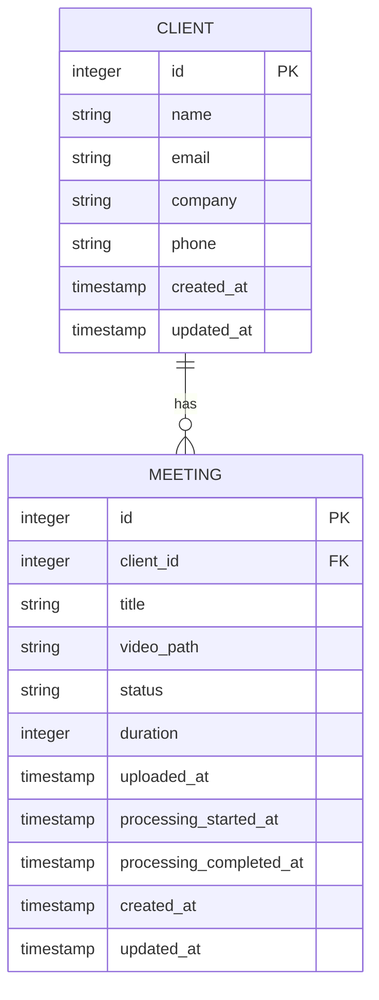

# Client-Meeting Integration


## Table of Contents
1. [Introduction](#introduction)
2. [Database Schema and Foreign Key Relationship](#database-schema-and-foreign-key-relationship)
3. [Model-Level Implementation](#model-level-implementation)
4. [Meeting Creation Workflow](#meeting-creation-workflow)
5. [Client-Based Filtering in UI and Backend](#client-based-filtering-in-ui-and-backend)
6. [AI Search with Client Context](#ai-search-with-client-context)
7. [Query Examples and Performance Considerations](#query-examples-and-performance-considerations)

## Introduction
This document details the integration between Clients and Meetings in the MeetingAI system. It explains how meetings are associated with clients through a foreign key relationship, how this relationship is enforced at both database and application levels, and how client context is used throughout the system for filtering and AI operations. The documentation covers the full lifecycle from meeting creation to filtering and searching within client boundaries.

## Database Schema and Foreign Key Relationship

The relationship between Clients and Meetings is established through a foreign key constraint in the database schema. The `meetings` table contains a `client_id` column that references the primary key of the `clients` table.





**Diagram sources**
- [create_clients_table.php](file://database/migrations/2025_08_10_135157_create_clients_table.php#L1-L31)
- [create_meetings_table.php](file://database/migrations/2025_08_10_135205_create_meetings_table.php#L1-L40)

The foreign key is defined using Laravel's `foreignId()` method with the `constrained()` and `onDelete('cascade')` options, which creates a referential integrity constraint that automatically deletes all meetings when a client is deleted.


```php
$table->foreignId('client_id')->constrained()->onDelete('cascade');
```


Additionally, an index is created on the `client_id` column to optimize query performance for client-based filtering:


```php
$table->index('client_id');
```


**Section sources**
- [create_meetings_table.php](file://database/migrations/2025_08_10_135205_create_meetings_table.php#L15-L16)

## Model-Level Implementation

The relationship is implemented in the Eloquent models with proper relationship methods that enable easy navigation between related records.

### Client Model
The `Client` model defines a one-to-many relationship to `Meeting` using the `hasMany()` method:


```php
public function meetings(): HasMany
{
    return $this->hasMany(Meeting::class);
}
```


This allows accessing a client's meetings through the relationship property.

**Section sources**
- [Client.php](file://app/Models/Client.php#L19-L23)

### Meeting Model
The `Meeting` model defines the inverse relationship using `belongsTo()`:


```php
public function client(): BelongsTo
{
    return $this->belongsTo(Client::class);
}
```


This enables accessing the associated client from a meeting instance. The `client_id` field is included in the `$fillable` array, allowing it to be mass-assigned during model creation.


```php
protected $fillable = [
    'client_id',
    'title',
    'video_path',
    'status',
    // ... other attributes
];
```


**Section sources**
- [Meeting.php](file://app/Models/Meeting.php#L13-L17)

## Meeting Creation Workflow

The process of creating a meeting involves selecting an existing client and establishing the relationship at the time of creation.

### Create Meeting Form
The frontend form implemented in `Create.vue` provides a dropdown selector for choosing a client from the list of existing clients:


```vue
<select id="client_id" v-model="form.client_id" required>
  <option value="">Select a client</option>
  <option v-for="client in clients" :key="client.id" :value="client.id">
    {{ client.name }}
  </option>
</select>
```


The form is pre-populated with all available clients retrieved from the backend:


```php
public function create(): Response
{
    $clients = Client::orderBy('name')->get(['id', 'name']);
    
    return Inertia::render('Meetings/Create', [
        'clients' => $clients
    ]);
}
```


When navigating from a specific client's page, the form can be pre-filled with that client:


```vue
onMounted(() => {
  const params = new URLSearchParams(window.location.search)
  const qClientId = params.get('client_id')
  if (qClientId) {
    form.client_id = qClientId
  }
})
```


### Validation and Storage
The `store` method in `MeetingController` validates that the provided `client_id` exists in the database:


```php
$validated = $request->validate([
    'title' => 'required|string|max:255',
    'client_id' => 'required|exists:clients,id',
    // ... other validation rules
]);
```


After validation, the meeting is created with the specified `client_id`:


```php
$meeting = Meeting::create([
    'title' => $validated['title'],
    'client_id' => $validated['client_id'],
    'status' => 'pending',
    'uploaded_at' => now(),
    'video_path' => '',
]);
```


The video file is stored in a client-specific directory structure:


```php
$storagePath = "meetings/{$validated['client_id']}/{$meeting->id}";
```


**Section sources**
- [MeetingController.php](file://app/Http/Controllers/MeetingController.php#L83-L131)
- [Create.vue](file://resources/js/pages/Meetings/Create.vue#L1-L439)

## Client-Based Filtering in UI and Backend

The system provides robust filtering capabilities that allow users to view meetings by client through both the user interface and backend query logic.

### Frontend Filtering Interface
The meetings index page includes a client filter dropdown that allows users to filter meetings by client:


```vue
<select id="client_id" v-model="filterForm.client_id">
  <option value="">All Clients</option>
  <option v-for="client in clients" :key="client.id" :value="client.id">
    {{ client.name }}
  </option>
</select>
```


When a client is selected and filters are applied, the frontend sends a request to the server with the `client_id` parameter.

### Backend Query Implementation
The `index` method in `MeetingController` implements the filtering logic by conditionally adding a `where` clause when a `client_id` parameter is provided:


```php
public function index(Request $request): Response
{
    $query = Meeting::query()->with('client');

    if ($request->filled('client_id')) {
        $query->where('client_id', $request->client_id);
    }
    
    // ... other filters
    
    $meetings = $query->paginate(15)->withQueryString();
    
    return Inertia::render('Meetings/Index', [
        'meetings' => $meetings,
        'clients' => $clients,
        'filters' => $request->only(['client_id', 'status', 'date_from', 'date_to', 'sort', 'direction']),
    ]);
}
```


The query uses `with('client')` to eager load the client relationship, preventing N+1 query problems when displaying client names in the meeting list.

For sorting by client name, a join is performed with the clients table:


```php
if ($sort === 'client') {
    $query->select('meetings.*')
        ->leftJoin('clients', 'clients.id', '=', 'meetings.client_id')
        ->orderBy('clients.name', $direction)
        ->orderBy('meetings.created_at', 'desc');
}
```


**Section sources**
- [MeetingController.php](file://app/Http/Controllers/MeetingController.php#L21-L70)
- [Index.vue](file://resources/js/pages/Meetings/Index.vue#L1-L357)

## AI Search with Client Context

The system preserves client context during AI search operations to ensure results are limited to specific organizational boundaries.

### Meeting Search Tool
The `MeetingSearchTool` class provides a search functionality that can be scoped to a specific client:


```php
public static function search(array $parameters): array
{
    $query = $parameters['query'] ?? '';
    $clientId = $parameters['client_id'] ?? null;
    
    // ...
    
    $results = Transcription::query()
        ->with(['meeting.client'])
        ->where('text', 'like', "%{$query}%")
        ->when($clientId, function ($q) use ($clientId) {
            return $q->whereHas('meeting', function ($q) use ($clientId) {
                $q->where('client_id', $clientId);
            });
        })
        // ... rest of query
}
```


The `when` method conditionally applies the client filter only when a `client_id` parameter is provided.

### Prism AI Integration
The `PrismMeetingSearchTool` wraps the search functionality for use with the AI system and explicitly documents the client_id parameter:


```php
->withStringParameter('client_id', 'Optional client ID to filter search results to specific client meetings', false)
```


When invoked, it passes the client_id parameter to the underlying search tool:


```php
$result = MeetingSearchTool::search([
    'query' => $query,
    'client_id' => $client_id,
    'speaker' => $speaker,
    'limit' => $limit
]);
```


This ensures that AI-powered searches can be constrained to a specific client's meetings when client context is provided.

**Section sources**
- [MeetingSearchTool.php](file://app/Tools/MeetingSearchTool.php#L11-L27)
- [PrismMeetingSearchTool.php](file://app/Tools/PrismMeetingSearchTool.php#L15-L24)

## Query Examples and Performance Considerations

### Query Examples
To retrieve all meetings for a specific client:


```sql
SELECT * FROM meetings WHERE client_id = 123;
```


Using Eloquent:


```php
$meetings = Meeting::where('client_id', $clientId)->get();
```


To retrieve meetings for a client with client data:


```php
$meetings = Meeting::with('client')->where('client_id', $clientId)->get();
```


To count meetings per client:


```php
$meetingsCount = Client::withCount('meetings')->get();
```


### Performance Considerations
The system includes several optimizations for client-based filtering at scale:

1. **Database Indexing**: The `client_id` column is indexed to speed up WHERE queries:
   
```php
   $table->index('client_id');
   ```


2. **Eager Loading**: The client relationship is eager loaded in the index view to prevent N+1 queries:
   
```php
   $query = Meeting::query()->with('client');
   ```


3. **Pagination**: Results are paginated to limit the amount of data transferred:
   
```php
   $meetings = $query->paginate(15);
   ```


4. **Conditional Query Building**: Filters are only applied when parameters are present, keeping queries efficient when no filtering is needed.

5. **Combined Indexing**: While not currently implemented, a composite index on `(client_id, status, uploaded_at)` could further improve performance for common filter combinations.

At scale, additional considerations include:
- Implementing caching strategies for frequently accessed client meeting lists
- Using database partitioning by client_id for very large datasets
- Implementing more sophisticated search with full-text indexing
- Monitoring query performance and adjusting indexes based on actual usage patterns

**Section sources**
- [create_meetings_table.php](file://database/migrations/2025_08_10_135205_create_meetings_table.php#L26)
- [MeetingController.php](file://app/Http/Controllers/MeetingController.php#L21-L70)

**Referenced Files in This Document**   
- [Client.php](file://app/Models/Client.php)
- [Meeting.php](file://app/Models/Meeting.php)
- [MeetingController.php](file://app/Http/Controllers/MeetingController.php)
- [Create.vue](file://resources/js/pages/Meetings/Create.vue)
- [Index.vue](file://resources/js/pages/Meetings/Index.vue)
- [MeetingSearchTool.php](file://app/Tools/MeetingSearchTool.php)
- [PrismMeetingSearchTool.php](file://app/Tools/PrismMeetingSearchTool.php)
- [create_clients_table.php](file://database/migrations/2025_08_10_135157_create_clients_table.php)
- [create_meetings_table.php](file://database/migrations/2025_08_10_135205_create_meetings_table.php)