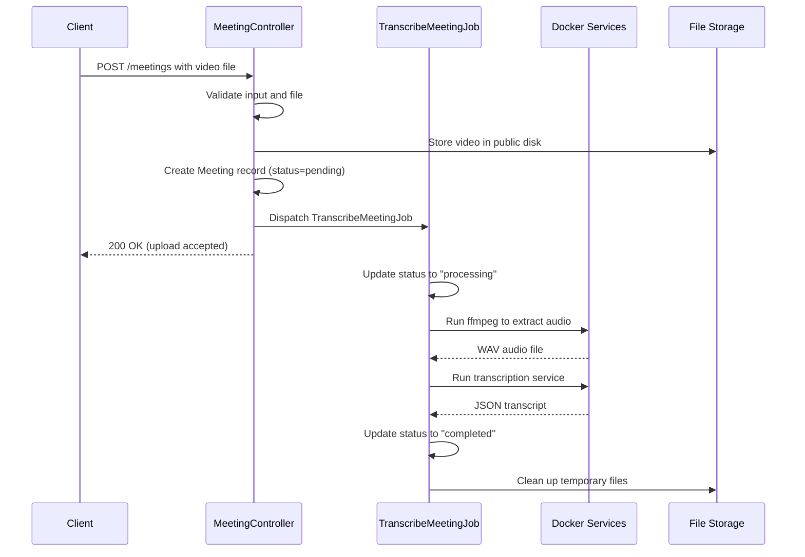
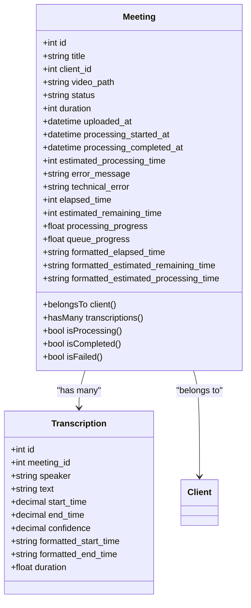
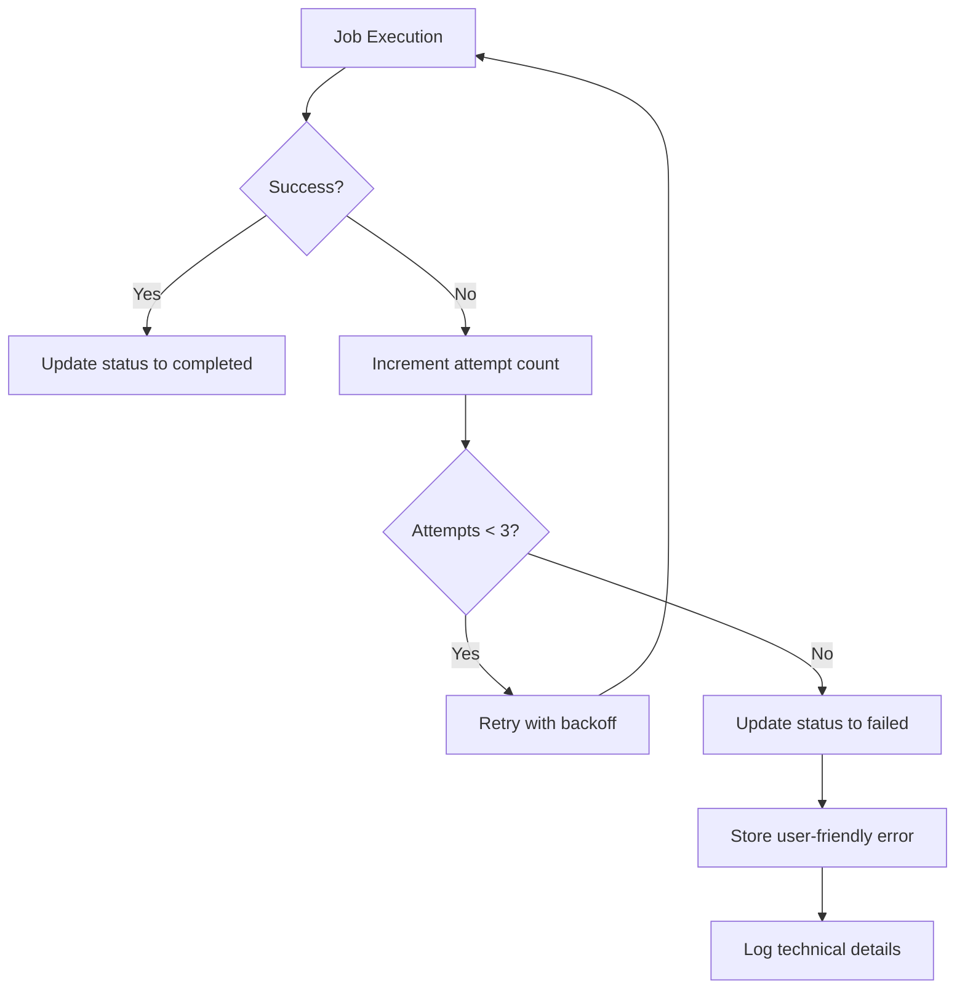

# Meeting Management API


## Table of Contents
1. [Introduction](#introduction)
2. [API Endpoints Overview](#api-endpoints-overview)
3. [Request and Response Schemas](#request-and-response-schemas)
4. [File Upload and Processing Flow](#file-upload-and-processing-flow)
5. [Meeting Model and Field Mapping](#meeting-model-and-field-mapping)
6. [Asynchronous Processing and Status Polling](#asynchronous-processing-and-status-polling)
7. [Error Handling and Recovery](#error-handling-and-recovery)
8. [Usage Examples](#usage-examples)
9. [Performance and Constraints](#performance-and-constraints)

## Introduction
The Meeting Management API enables users to upload video recordings of meetings, retrieve meeting details including transcriptions, and list meetings with filtering capabilities. The system supports asynchronous transcription processing using Dockerized services and provides real-time status updates. This document details the RESTful endpoints, request/response structures, processing workflow, and error handling mechanisms.

**Section sources**
- [MeetingController.php](file://app/Http/Controllers/MeetingController.php#L0-L304)

## API Endpoints Overview

### POST /meetings (Upload Meeting)
Uploads a new meeting video for transcription processing.

### GET /meetings (List Meetings)
Retrieves a paginated list of meetings with optional filtering by client, status, and date range.

### GET /meetings/{id} (Retrieve Meeting Details)
Fetches detailed information about a specific meeting, including metadata and transcription segments.

### GET /meetings/{id}/status (Poll Processing Status)
Returns real-time processing status for a meeting, including progress, elapsed time, and estimated completion.

**Section sources**
- [MeetingController.php](file://app/Http/Controllers/MeetingController.php#L0-L304)

## Request and Response Schemas

### Upload Meeting Request (POST /meetings)

```json
{
  "title": "Client Strategy Meeting",
  "client_id": 123,
  "video": "file"
}
```


**Validation Rules:**
- `title`: required, string, max 255 characters
- `client_id`: required, must reference existing client
- `video`: required, file type MP4, MOV, AVI, or WebM, size between 1MB and 500MB

### List Meetings Request (GET /meetings)
**Query Parameters:**
- `client_id`: filter by client ID
- `status`: filter by processing status (pending, processing, completed, failed)
- `date_from`: filter meetings uploaded on or after this date
- `date_to`: filter meetings uploaded on or before this date
- `sort`: field to sort by (uploaded_at, title, status, duration, client)
- `direction`: sort direction (asc, desc)

### Meeting Response Schema

```json
{
  "id": 1,
  "title": "Client Strategy Meeting",
  "client_id": 123,
  "client": {
    "id": 123,
    "name": "Acme Corp"
  },
  "status": "completed",
  "duration": 1800,
  "uploaded_at": "2025-08-10T14:30:00Z",
  "processing_started_at": "2025-08-10T14:31:00Z",
  "processing_completed_at": "2025-08-10T14:45:00Z",
  "estimated_processing_time": 900,
  "video_path": "meetings/123/1/video.mp4",
  "error_message": null,
  "technical_error": null,
  "elapsed_time": 900,
  "estimated_remaining_time": 0,
  "processing_progress": 100,
  "queue_progress": 100,
  "formatted_elapsed_time": "15:00",
  "formatted_estimated_remaining_time": "00:00",
  "formatted_estimated_processing_time": "15:00",
  "transcriptions": [
    {
      "id": 1,
      "meeting_id": 1,
      "speaker": "Speaker A",
      "text": "Let's discuss the quarterly results and our performance metrics.",
      "start_time": 0,
      "end_time": 25.5,
      "confidence": 0.95,
      "formatted_start_time": "00:00.00",
      "formatted_end_time": "00:25.50",
      "duration": 25.5
    }
  ]
}
```


**Section sources**
- [Meeting.php](file://app/Models/Meeting.php#L0-L178)
- [Transcription.php](file://app/Models/Transcription.php#L0-L50)

## File Upload and Processing Flow





**Diagram sources**
- [MeetingController.php](file://app/Http/Controllers/MeetingController.php#L100-L199)
- [TranscribeMeetingJob.php](file://app/Jobs/TranscribeMeetingJob.php#L50-L200)

## Meeting Model and Field Mapping

### Core Fields
- **id**: Unique identifier for the meeting
- **title**: Meeting title (max 255 characters)
- **client_id**: Foreign key to client record
- **video_path**: Storage path to uploaded video file
- **status**: Processing status (pending, processing, completed, failed)
- **duration**: Video duration in seconds
- **uploaded_at**: Timestamp when meeting was uploaded
- **processing_started_at**: Timestamp when transcription began
- **processing_completed_at**: Timestamp when transcription finished

### Computed Attributes (Appended)
- **elapsed_time**: Seconds since processing started
- **estimated_remaining_time**: Estimated seconds until completion
- **processing_progress**: Percentage of processing completed (0-100)
- **queue_progress**: Simulated progress for pending meetings
- **formatted_elapsed_time**: Human-readable elapsed time (MM:SS)
- **formatted_estimated_remaining_time**: Human-readable remaining time (MM:SS)
- **formatted_estimated_processing_time**: Human-readable estimated duration (MM:SS)

### Error Fields
- **error_message**: User-friendly error description
- **technical_error**: Detailed technical error message





**Diagram sources**
- [Meeting.php](file://app/Models/Meeting.php#L0-L178)
- [Transcription.php](file://app/Models/Transcription.php#L0-L50)

**Section sources**
- [Meeting.php](file://app/Models/Meeting.php#L0-L178)
- [Transcription.php](file://app/Models/Transcription.php#L0-L50)

## Asynchronous Processing and Status Polling

The system uses Laravel's queue system to process meetings asynchronously. Clients should poll the status endpoint to track progress.

### Processing States
- **pending**: Meeting uploaded, waiting in queue
- **processing**: Transcription in progress
- **completed**: Transcription finished successfully
- **failed**: Transcription failed (see error fields)

### Status Polling Endpoint
GET /meetings/{id}/status

**Response:**

```json
{
  "success": true,
  "data": {
    "id": 1,
    "status": "processing",
    "elapsed_time": 45,
    "estimated_remaining_time": 455,
    "processing_progress": 9.0,
    "formatted_elapsed_time": "00:45",
    "formatted_estimated_remaining_time": "07:35",
    "queue_progress": 100,
    "formatted_estimated_processing_time": "08:20"
  }
}
```


Clients should poll this endpoint every 2-5 seconds during processing. The response includes both actual processing metrics and formatted time strings for display.

**Section sources**
- [MeetingController.php](file://app/Http/Controllers/MeetingController.php#L250-L285)
- [Meeting.php](file://app/Models/Meeting.php#L70-L170)

## Error Handling and Recovery

### Validation Errors
- Invalid file type: "The video must be a file of type: MP4, MOV, AVI, or WebM."
- File too large: "The video file size cannot exceed 500MB."
- File too small: "The video file must be at least 1MB."
- Missing title: "Please enter a meeting title."
- Invalid client: "The selected client is invalid."

### Processing Errors
- **Video file not found**: "The video file could not be found. It may have been moved or deleted."
- **WAV conversion failure**: "Failed to process the video file. The file may be corrupted or in an unsupported format."
- **Docker service unavailable**: "Transcription service is temporarily unavailable. Please try again later."
- **Timeout**: "Transcription took too long to complete. This may happen with very large files."
- **Insufficient storage**: "Insufficient storage space available for processing."

When a job fails after 3 attempts, the meeting status is set to "failed" and error details are stored in the database.





**Diagram sources**
- [TranscribeMeetingJob.php](file://app/Jobs/TranscribeMeetingJob.php#L300-L400)

**Section sources**
- [TranscribeMeetingJob.php](file://app/Jobs/TranscribeMeetingJob.php#L300-L400)

## Usage Examples

### Upload a Meeting

```bash
curl -X POST https://api.example.com/meetings \
  -H "Authorization: Bearer YOUR_TOKEN" \
  -H "Content-Type: multipart/form-data" \
  -F "title=Client Kickoff" \
  -F "client_id=123" \
  -F "video=@/path/to/meeting.mp4"
```


### List Meetings for a Client

```bash
curl -X GET "https://api.example.com/meetings?client_id=123&status=completed" \
  -H "Authorization: Bearer YOUR_TOKEN"
```


### Retrieve Meeting Details

```bash
curl -X GET https://api.example.com/meetings/1 \
  -H "Authorization: Bearer YOUR_TOKEN"
```


### Poll Processing Status

```bash
curl -X GET https://api.example.com/meetings/1/status \
  -H "Authorization: Bearer YOUR_TOKEN"
```


**Section sources**
- [MeetingController.php](file://app/Http/Controllers/MeetingController.php#L0-L304)

## Performance and Constraints

### File Requirements
- **Accepted formats**: MP4, MOV, AVI, WebM
- **Maximum size**: 500MB
- **Minimum size**: 1MB
- **Storage**: Files stored in public disk at `storage/app/public/meetings/{client_id}/{meeting_id}/video.{ext}`

### Processing Constraints
- **Job timeout**: 1 hour
- **Retry attempts**: 3
- **Retry backoff**: 1, 5, 15 minutes
- **Estimated processing time**: ~1 second per minute of video
- **Docker services**: ffmpeg for audio extraction, custom transcription service for speech-to-text

### Authentication
All endpoints require Bearer token authentication. Include the Authorization header with all requests.

### Rate Limiting
Clients should poll the status endpoint no more than once every 2 seconds to avoid overwhelming the server.

**Section sources**
- [MeetingController.php](file://app/Http/Controllers/MeetingController.php#L100-L199)
- [TranscribeMeetingJob.php](file://app/Jobs/TranscribeMeetingJob.php#L0-L50)
- [create_meetings_table.php](file://database/migrations/2025_08_10_135205_create_meetings_table.php#L0-L40)

**Referenced Files in This Document**   
- [MeetingController.php](file://app/Http/Controllers/MeetingController.php#L0-L304)
- [Meeting.php](file://app/Models/Meeting.php#L0-L178)
- [Transcription.php](file://app/Models/Transcription.php#L0-L50)
- [TranscribeMeetingJob.php](file://app/Jobs/TranscribeMeetingJob.php#L0-L400)
- [create_meetings_table.php](file://database/migrations/2025_08_10_135205_create_meetings_table.php#L0-L40)
- [add_estimated_processing_time_to_meetings_table.php](file://database/migrations/2025_08_10_145951_add_estimated_processing_time_to_meetings_table.php#L0-L28)
- [add_error_fields_to_meetings_table.php](file://database/migrations/2025_08_10_160251_add_error_fields_to_meetings_table.php#L0-L28)