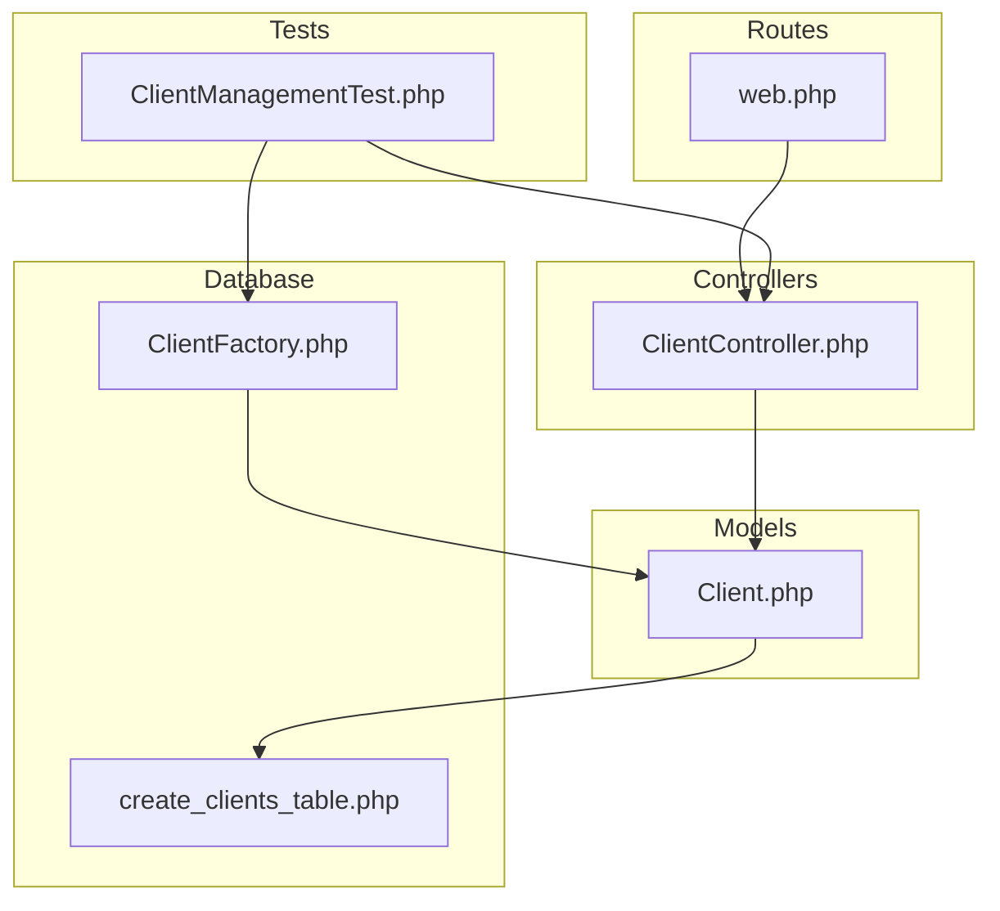
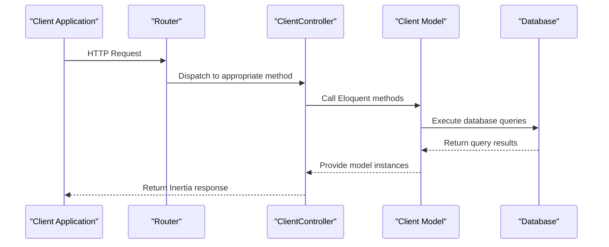
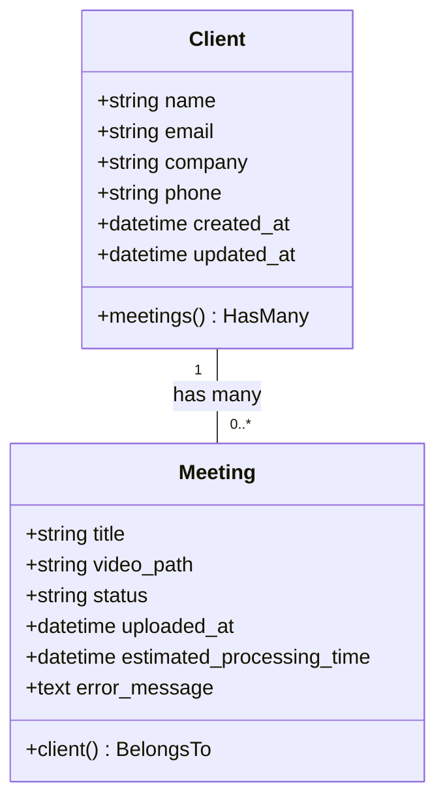
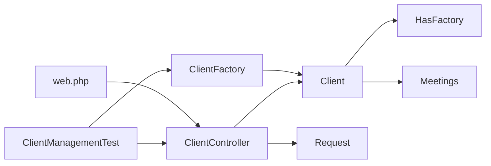

# Client Management API


## Table of Contents
1. [Introduction](#introduction)
2. [Project Structure](#project-structure)
3. [Core Components](#core-components)
4. [Architecture Overview](#architecture-overview)
5. [Detailed Component Analysis](#detailed-component-analysis)
6. [Dependency Analysis](#dependency-analysis)
7. [Performance Considerations](#performance-considerations)
8. [Troubleshooting Guide](#troubleshooting-guide)
9. [Conclusion](#conclusion)

## Introduction
This document provides comprehensive RESTful API documentation for the Client Management system in the MeetingAI application. It details all endpoints for creating, retrieving, updating, and deleting client records, including request and response schemas, validation rules, authentication requirements, and usage examples. The system is built using Laravel with Inertia.js for frontend integration and follows REST conventions for resource management.

The Client Management API enables users to organize clients, associate meetings, and manage contact information. All operations are protected by authentication, ensuring only authorized users can modify client data. This documentation includes practical examples using curl, error handling scenarios, and integration with other system components such as meetings.

## Project Structure
The project follows a standard Laravel MVC architecture with clear separation of concerns. Client-related functionality is distributed across controllers, models, routes, factories, and tests. The structure emphasizes maintainability and testability, with dedicated directories for each component type.





**Diagram sources**
- [ClientController.php](file://app/Http/Controllers/ClientController.php#L0-L94)
- [Client.php](file://app/Models/Client.php#L0-L27)
- [create_clients_table.php](file://database/migrations/2025_08_10_135157_create_clients_table.php#L0-L31)
- [web.php](file://routes/web.php#L0-L46)
- [ClientFactory.php](file://database/factories/ClientFactory.php#L0-L58)
- [ClientManagementTest.php](file://tests/Feature/ClientManagementTest.php#L0-L117)

**Section sources**
- [ClientController.php](file://app/Http/Controllers/ClientController.php#L0-L94)
- [web.php](file://routes/web.php#L0-L46)

## Core Components
The core components of the Client Management system include the Client model, ClientController, database migration, route definitions, factory for test data, and feature tests. These components work together to provide a complete CRUD interface for client entities with proper validation and error handling.

The Client model defines the data structure and relationship with meetings. The ClientController handles HTTP requests and responses. The migration ensures consistent database schema. The factory enables predictable test data generation. The feature tests validate expected behavior across all operations.

**Section sources**
- [Client.php](file://app/Models/Client.php#L0-L27)
- [ClientController.php](file://app/Http/Controllers/ClientController.php#L0-L94)
- [create_clients_table.php](file://database/migrations/2025_08_10_135157_create_clients_table.php#L0-L31)
- [ClientFactory.php](file://database/factories/ClientFactory.php#L0-L58)
- [ClientManagementTest.php](file://tests/Feature/ClientManagementTest.php#L0-L117)

## Architecture Overview
The Client Management system follows a traditional server-side MVC pattern with Laravel. Requests flow from the router to the controller, which interacts with the model and returns responses via Inertia.js for server-side rendering. The architecture emphasizes simplicity and maintainability.





**Diagram sources**
- [ClientController.php](file://app/Http/Controllers/ClientController.php#L0-L94)
- [Client.php](file://app/Models/Client.php#L0-L27)
- [web.php](file://routes/web.php#L0-L46)

## Detailed Component Analysis

### Client Model Analysis
The Client model represents the core data entity for client management. It defines the fillable attributes, casts, and relationships with other models in the system.





**Diagram sources**
- [Client.php](file://app/Models/Client.php#L0-L27)
- [Meeting.php](file://app/Models/Meeting.php#L0-L30)

**Section sources**
- [Client.php](file://app/Models/Client.php#L0-L27)

### Client Controller Analysis
The ClientController implements all CRUD operations for client management. Each method handles a specific HTTP verb and returns appropriate responses.

#### RESTful Endpoints Implementation

```mermaid
flowchart TD
A[HTTP Request] --> B{Method}
B --> |GET /clients| C[index]
B --> |POST /clients| D[store]
B --> |GET /clients/{id}| E[show]
B --> |PUT /clients/{id}| F[update]
B --> |DELETE /clients/{id}| G[destroy]
C --> H[Return clients list with meetings count]
D --> I[Validate input, create client, redirect]
E --> J[Load client with meetings, return view]
F --> K[Validate input, update client, redirect]
G --> L[Check meetings count, delete or reject]
```


**Diagram sources**
- [ClientController.php](file://app/Http/Controllers/ClientController.php#L0-L94)

**Section sources**
- [ClientController.php](file://app/Http/Controllers/ClientController.php#L0-L94)

## Dependency Analysis
The Client Management system depends on several Laravel components and follows dependency injection patterns for testability and maintainability.





**Diagram sources**
- [ClientController.php](file://app/Http/Controllers/ClientController.php#L0-L94)
- [Client.php](file://app/Models/Client.php#L0-L27)
- [ClientFactory.php](file://database/factories/ClientFactory.php#L0-L58)
- [ClientManagementTest.php](file://tests/Feature/ClientManagementTest.php#L0-L117)
- [web.php](file://routes/web.php#L0-L46)

**Section sources**
- [ClientController.php](file://app/Http/Controllers/ClientController.php#L0-L94)
- [Client.php](file://app/Models/Client.php#L0-L27)

## Performance Considerations
The Client Management API includes several performance optimizations:
- Eager loading of meetings count using `withCount()` to prevent N+1 queries
- Database indexing on email field for unique constraint enforcement
- Efficient validation using Laravel's built-in rules
- Caching of relationship counts at query time

No major performance bottlenecks were identified in the current implementation. The use of `withCount()` in the index method ensures that the meetings count is calculated at the database level rather than in PHP, minimizing memory usage and execution time.

## Troubleshooting Guide
Common issues and their solutions for the Client Management API:

**Section sources**
- [ClientController.php](file://app/Http/Controllers/ClientController.php#L0-L94)
- [ClientManagementTest.php](file://tests/Feature/ClientManagementTest.php#L0-L117)

### Error: Cannot delete client with existing meetings
**Cause**: The system prevents deletion of clients that have associated meetings to maintain data integrity.
**Solution**: Remove or reassign all meetings belonging to the client before attempting deletion.

### Error: Email must be unique
**Cause**: The email address provided already exists in the database.
**Solution**: Use a different email address or update the existing client record.

### Error: Name is required
**Cause**: The name field was omitted or empty in the request.
**Solution**: Ensure the name field is provided and contains a non-empty string value.

### Validation Failure Response
When validation fails, the system redirects back with error messages in the session. For API usage, consider implementing JSON response format for better machine readability.

## Conclusion
The Client Management API provides a robust and secure interface for managing client records within the MeetingAI application. It follows REST conventions, implements proper validation, and maintains data integrity through relationship constraints. The system is well-tested and includes comprehensive error handling for common scenarios.

Key strengths include:
- Clear separation of concerns following MVC pattern
- Comprehensive validation rules for data integrity
- Protection against deletion of clients with associated meetings
- Efficient database queries using Eloquent relationships
- Complete test coverage for all operations

For future improvements, consider adding API rate limiting, JSON API endpoints for external consumers, and soft deletes instead of hard deletes for better data recovery options.

**Referenced Files in This Document**   
- [ClientController.php](file://app/Http/Controllers/ClientController.php#L0-L94)
- [Client.php](file://app/Models/Client.php#L0-L27)
- [create_clients_table.php](file://database/migrations/2025_08_10_135157_create_clients_table.php#L0-L31)
- [web.php](file://routes/web.php#L0-L46)
- [ClientFactory.php](file://database/factories/ClientFactory.php#L0-L58)
- [ClientManagementTest.php](file://tests/Feature/ClientManagementTest.php#L0-L117)
- [User.php](file://app/Models/User.php#L0-L48)