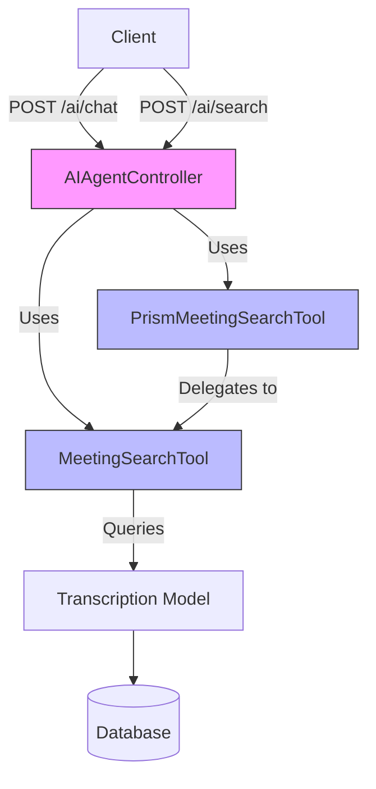
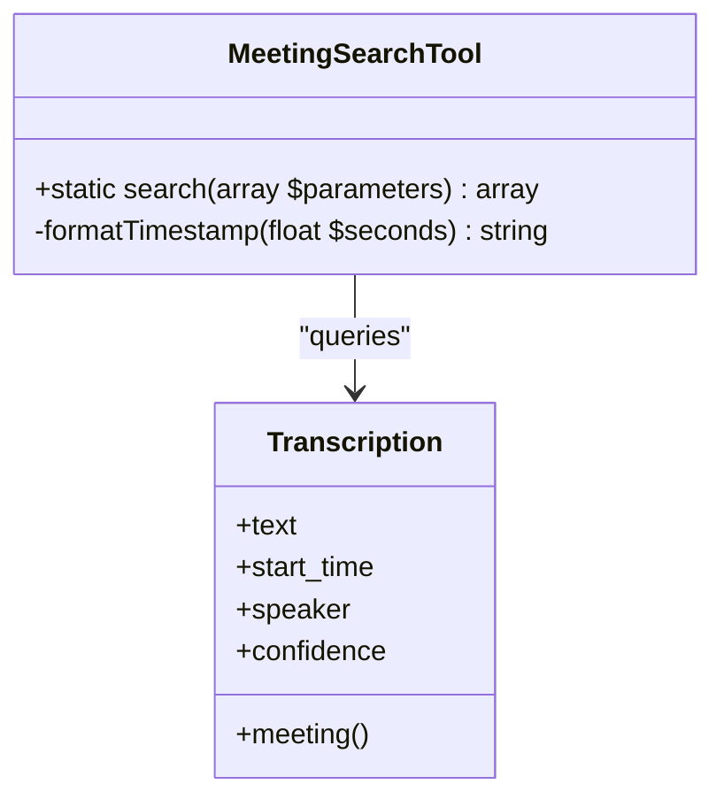
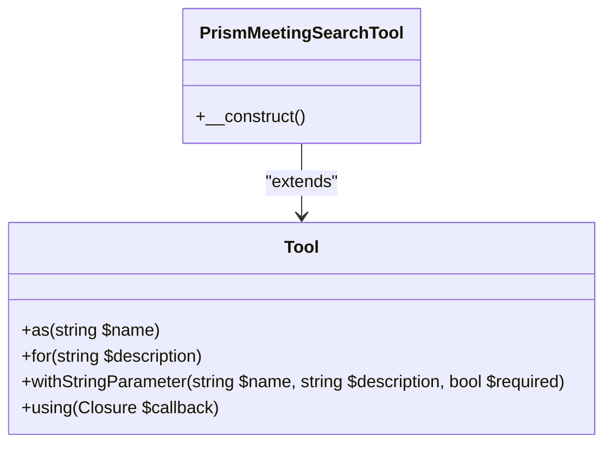
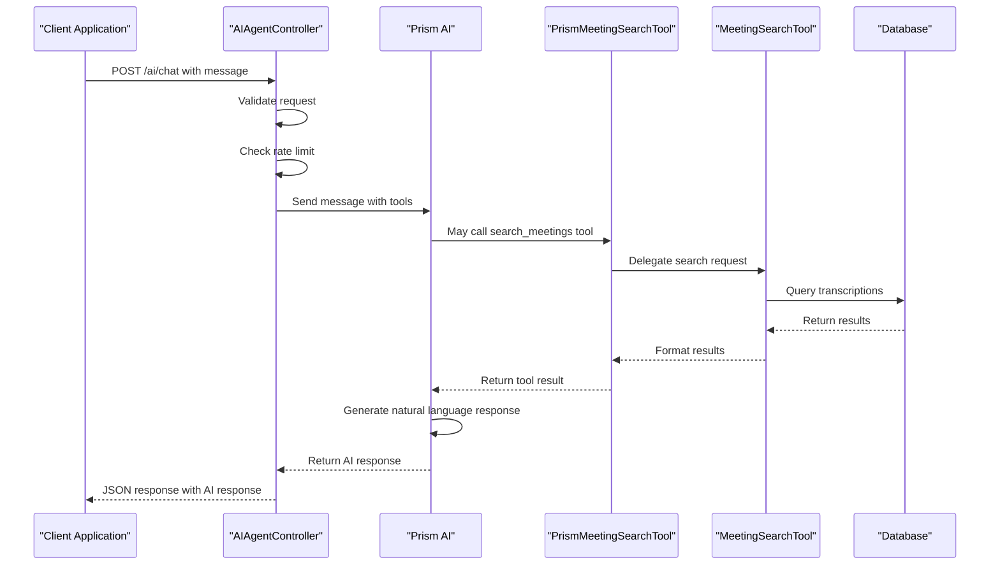
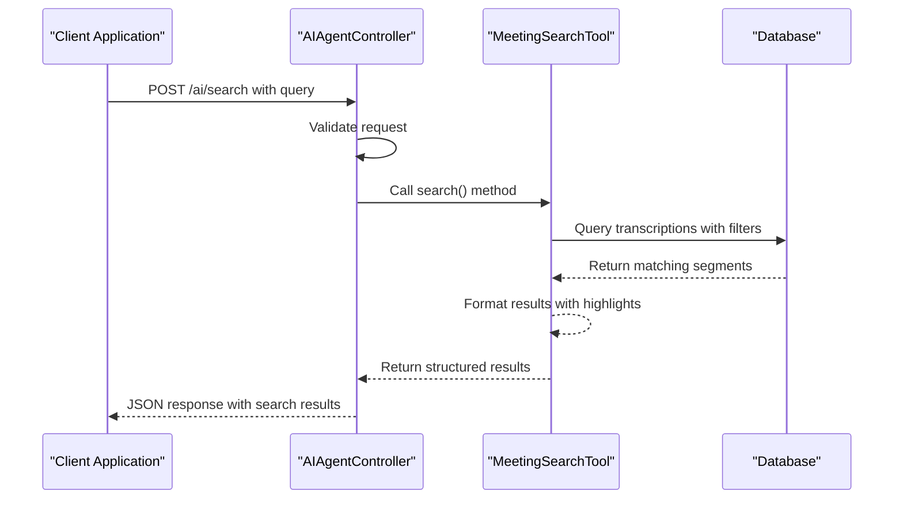

# AI Agent Interaction API


## Table of Contents
1. [Introduction](#introduction)
2. [API Endpoints Overview](#api-endpoints-overview)
3. [POST /ai/chat - Natural Language Query](#post-aichat---natural-language-query)
4. [POST /ai/search - Direct Transcript Search](#post-aisearch---direct-transcript-search)
5. [Prism AI Integration and Tool System](#prism-ai-integration-and-tool-system)
6. [Rate Limiting and Performance](#rate-limiting-and-performance)
7. [Error Handling](#error-handling)
8. [Usage Examples](#usage-examples)
9. [Architecture Flow](#architecture-flow)

## Introduction
The AI Agent Interaction API provides two primary endpoints for interacting with meeting transcriptions: a conversational AI interface and a direct search functionality. The system leverages the Prism AI framework to enable natural language queries while also supporting direct programmatic access to transcript data. This documentation details both endpoints, their request/response formats, underlying implementation, and usage patterns.

**Section sources**
- [AIAgentController.php](file://app/Http/Controllers/AIAgentController.php#L1-L182)
- [web.php](file://routes/web.php#L1-L47)

## API Endpoints Overview
The AI Agent system exposes two RESTful endpoints for accessing meeting transcription data:

- **POST /ai/chat**: Process natural language queries using an AI agent with semantic search capabilities
- **POST /ai/search**: Perform direct keyword search across meeting transcripts with filtering options

Both endpoints return structured JSON responses and are protected by rate limiting to ensure system stability.





**Diagram sources**
- [AIAgentController.php](file://app/Http/Controllers/AIAgentController.php#L1-L182)
- [MeetingSearchTool.php](file://app/Tools/MeetingSearchTool.php#L1-L86)
- [PrismMeetingSearchTool.php](file://app/Tools/PrismMeetingSearchTool.php#L1-L50)

**Section sources**
- [AIAgentController.php](file://app/Http/Controllers/AIAgentController.php#L1-L182)
- [web.php](file://routes/web.php#L1-L47)

## POST /ai/chat - Natural Language Query

### Request Format
The `/ai/chat` endpoint accepts natural language queries and returns AI-generated responses that may include relevant transcript information.

**Endpoint**: `POST /ai/chat`

**Request Body Parameters**:
- `message`: Required string (max 1000 characters) - The user's natural language query
- `conversation_history`: Optional array (max 50 items) - Previous messages in the conversation for context

**Example Request Body**:

```json
{
  "message": "What was discussed about the marketing budget in recent meetings?",
  "conversation_history": [
    {
      "role": "user",
      "content": "Can you help me find information about our marketing plans?"
    },
    {
      "role": "assistant",
      "content": "I can search through your meeting transcriptions. What specifically would you like to know about marketing?"
    }
  ]
}
```


### Response Format
The endpoint returns a JSON object with the AI's response and any tool calls made during processing.

**Response Structure**:

```json
{
  "success": true,
  "response": "In the Budget Planning Meeting with Test Client, Jane Smith mentioned that the marketing budget should be increased by 20%.",
  "tool_calls": [
    {
      "name": "search_meetings",
      "arguments": {
        "query": "marketing budget",
        "client_id": null,
        "speaker": null,
        "limit": 10
      }
    }
  ]
}
```


**Response Fields**:
- `success`: Boolean indicating request success
- `response`: String containing the AI-generated response
- `tool_calls`: Array of tool invocations made by the AI agent during processing

**Note**: Currently, the endpoint does not support streaming responses despite the documentation objective mentioning streaming JSON. The implementation uses a standard JSON response after complete processing.

**Section sources**
- [AIAgentController.php](file://app/Http/Controllers/AIAgentController.php#L40-L125)
- [Chat.vue](file://resources/js/pages/AI/Chat.vue#L1-L307)

## POST /ai/search - Direct Transcript Search

### Request Parameters
The `/ai/search` endpoint provides direct access to meeting transcript search functionality with filtering options.

**Endpoint**: `POST /ai/search`

**Query Parameters**:
- `query`: Required string (max 500 characters) - Search term to find in transcripts
- `client_id`: Optional integer - Filter results to a specific client's meetings
- `speaker`: Optional string (max 255 characters) - Filter results to a specific speaker
- `limit`: Optional integer (1-50) - Maximum number of results to return (default: 10)

### Response Structure
The endpoint returns a structured response containing matching transcript segments.

**Response Format**:

```json
{
  "success": true,
  "data": {
    "results": [
      {
        "meeting_id": 123,
        "meeting_title": "Budget Planning Meeting",
        "client_name": "Test Client",
        "speaker": "John Doe",
        "text": "We need to discuss the **budget** allocation for next quarter",
        "timestamp": 30.5,
        "formatted_timestamp": "00:30:30",
        "confidence": 0.95,
        "meeting_url": "http://localhost/meetings/123?t=30.5"
      }
    ],
    "total_found": 1,
    "search_query": "budget",
    "client_filter": null,
    "speaker_filter": null
  }
}
```


**Result Fields**:
- `meeting_id`: Unique identifier for the meeting
- `meeting_title`: Title of the meeting containing the transcript
- `client_name`: Name of the client associated with the meeting
- `speaker`: Name of the person speaking in the transcript segment
- `text`: Transcript text with the search term highlighted using `**` markers
- `timestamp`: Start time of the transcript segment in seconds
- `formatted_timestamp`: Human-readable time format (HH:MM:SS or MM:SS)
- `confidence`: Speech recognition confidence score (0-1)
- `meeting_url`: Direct link to the meeting at the specific timestamp

**Section sources**
- [AIAgentController.php](file://app/Http/Controllers/AIAgentController.php#L127-L182)
- [MeetingSearchTool.php](file://app/Tools/MeetingSearchTool.php#L1-L86)
- [AIAgentTest.php](file://tests/Feature/AIAgentTest.php#L1-L142)

## Prism AI Integration and Tool System

### MeetingSearchTool Implementation
The `MeetingSearchTool` class provides the core functionality for searching through meeting transcripts.





**Diagram sources**
- [MeetingSearchTool.php](file://app/Tools/MeetingSearchTool.php#L1-L86)

**Section sources**
- [MeetingSearchTool.php](file://app/Tools/MeetingSearchTool.php#L1-L86)

### PrismMeetingSearchTool Integration
The `PrismMeetingSearchTool` integrates with the Prism AI framework, exposing the search functionality as an AI tool.





**Key Features**:
- Registers as `search_meetings` tool with Prism AI
- Defines parameters: `query` (required), `client_id`, `speaker`, `limit` (all optional)
- Uses `MeetingSearchTool::search()` internally to perform the actual search
- Formats results as natural language text for the AI agent

**Section sources**
- [PrismMeetingSearchTool.php](file://app/Tools/PrismMeetingSearchTool.php#L1-L50)
- [MeetingSearchTool.php](file://app/Tools/MeetingSearchTool.php#L1-L86)

## Rate Limiting and Performance

### Rate Limiting Implementation
The API implements rate limiting to prevent abuse and ensure fair usage of AI resources.

**Rate Limiting Rules**:
- 10 requests per minute per IP address
- Implemented using Laravel's cache system
- Returns HTTP 429 status when limit is exceeded

**Implementation Details**:

```php
$cacheKey = 'ai_chat_' . $request->ip();
$requestCount = cache()->get($cacheKey, 0);

if ($requestCount >= 10) {
    return response()->json([
        'success' => false,
        'error' => 'Too many requests. Please wait a moment before sending another message.'
    ], 429);
}

cache()->put($cacheKey, $requestCount + 1, 60);
```


**Section sources**
- [AIAgentController.php](file://app/Http/Controllers/AIAgentController.php#L45-L55)

## Error Handling

### Error Types and Responses
The API provides comprehensive error handling for various failure scenarios.

**Client-Side Validation Errors**:
- HTTP 422 Unprocessable Entity
- Returned for invalid input (missing message, too long message, etc.)

**Rate Limiting Errors**:
- HTTP 429 Too Many Requests
- Triggered when request limit is exceeded

**Server-Side Errors**:
- HTTP 500 Internal Server Error
- Generic server error
- HTTP 408 Request Timeout
- When AI service request times out
- HTTP 503 Service Unavailable
- When network connectivity issues occur

**Error Response Format**:

```json
{
  "success": false,
  "error": "Descriptive error message"
}
```


**Section sources**
- [AIAgentController.php](file://app/Http/Controllers/AIAgentController.php#L100-L125)
- [AIAgentController.php](file://app/Http/Controllers/AIAgentController.php#L155-L182)

## Usage Examples

### Example 1: Natural Language Query

```bash
curl -X POST https://api.example.com/ai/chat \
  -H "Content-Type: application/json" \
  -H "X-CSRF-TOKEN: {csrf_token}" \
  -d '{
    "message": "Find all discussions about project timeline from Alice Johnson",
    "conversation_history": [
      {
        "role": "user",
        "content": "I need information about our project schedule"
      }
    ]
  }'
```


### Example 2: Direct Transcript Search

```bash
curl -X POST https://api.example.com/ai/search \
  -H "Content-Type: application/json" \
  -H "X-CSRF-TOKEN: {csrf_token}" \
  -d '{
    "query": "project timeline",
    "client_id": 456,
    "speaker": "Alice Johnson",
    "limit": 5
  }'
```


### Example 3: Simple Search

```bash
curl -X POST https://api.example.com/ai/search \
  -H "Content-Type: application/json" \
  -d '{
    "query": "budget"
  }'
```


**Section sources**
- [AIAgentController.php](file://app/Http/Controllers/AIAgentController.php#L1-L182)
- [Chat.vue](file://resources/js/pages/AI/Chat.vue#L1-L307)

## Architecture Flow

### AI Chat Request Flow




**Diagram sources**
- [AIAgentController.php](file://app/Http/Controllers/AIAgentController.php#L1-L182)
- [PrismMeetingSearchTool.php](file://app/Tools/PrismMeetingSearchTool.php#L1-L50)
- [MeetingSearchTool.php](file://app/Tools/MeetingSearchTool.php#L1-L86)

### Direct Search Flow




**Diagram sources**
- [AIAgentController.php](file://app/Http/Controllers/AIAgentController.php#L127-L182)
- [MeetingSearchTool.php](file://app/Tools/MeetingSearchTool.php#L1-L86)

**Section sources**
- [AIAgentController.php](file://app/Http/Controllers/AIAgentController.php#L1-L182)
- [MeetingSearchTool.php](file://app/Tools/MeetingSearchTool.php#L1-L86)

**Referenced Files in This Document**   
- [AIAgentController.php](file://app/Http/Controllers/AIAgentController.php)
- [MeetingSearchTool.php](file://app/Tools/MeetingSearchTool.php)
- [PrismMeetingSearchTool.php](file://app/Tools/PrismMeetingSearchTool.php)
- [web.php](file://routes/web.php)
- [Chat.vue](file://resources/js/pages/AI/Chat.vue)
- [AIAgentTest.php](file://tests/Feature/AIAgentTest.php)
- [prism.php](file://config/prism.php)